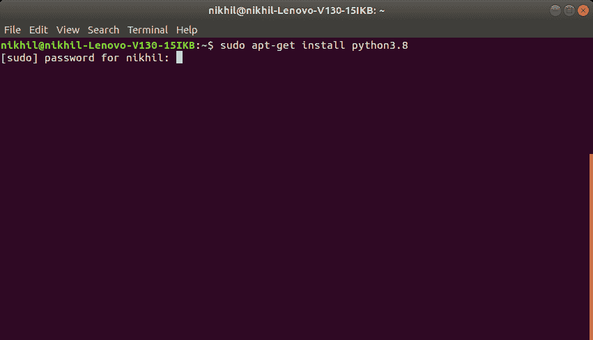
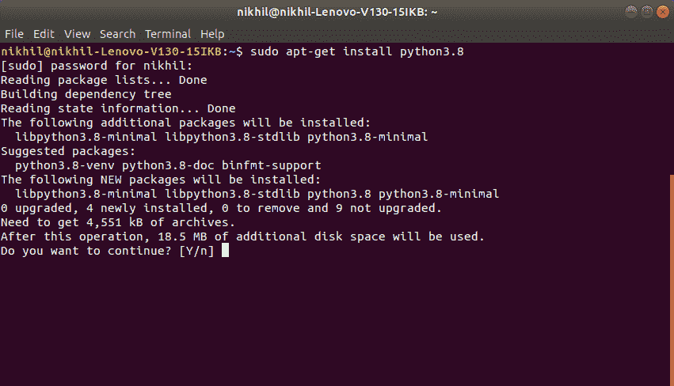
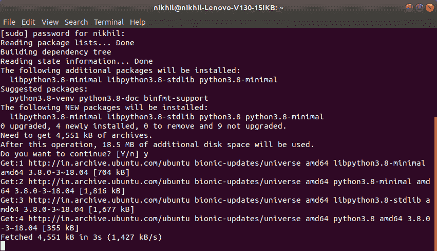
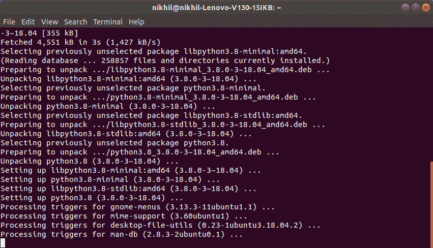
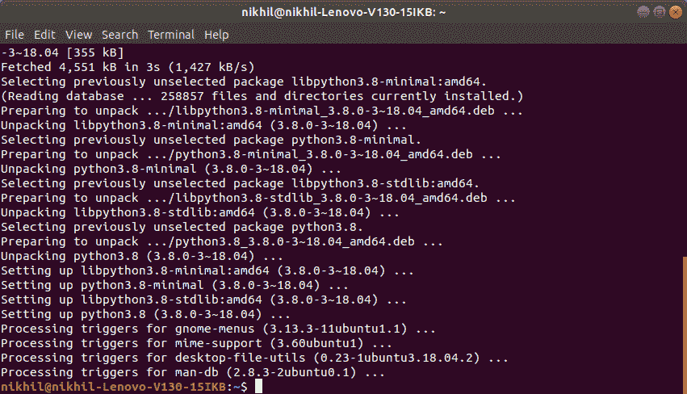
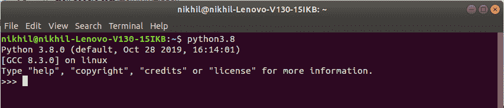
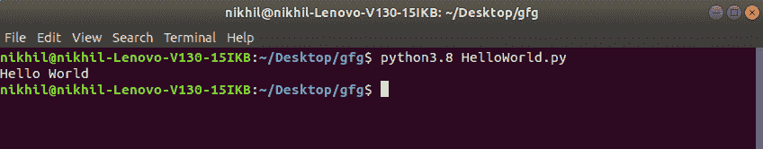

# 如何在 Linux 上安装 Python？

> 原文:[https://www . geesforgeks . org/如何在 linux 上安装 python/](https://www.geeksforgeeks.org/how-to-install-python-on-linux/)

**先决条件:** [Python 语言介绍](https://www.geeksforgeeks.org/python-language-introduction/)

在开始介绍如何在 Linux 上安装 Python3 之前，我们先来看一下 Python 的基本介绍。 [Python](https://www.geeksforgeeks.org/python-programming-language/) 是一种广泛使用的通用高级编程语言。Python 是一种编程语言，可以让您快速工作并更高效地集成系统。有两个主要的 Python 版本——Python 2 和 [Python 3](https://www.geeksforgeeks.org/python-tutorial-learn-python-3-with-examples/) 。两者截然不同。

#### Python 入门

Python 更容易编码和学习。Python 程序可以写在任何纯文本编辑器上，如****记事本++*** 或任何类似的东西。人们也可以使用一个[在线 ide 来编写 Python 代码](https://ide.geeksforgeeks.org/index.php)或者甚至可以在他们的系统上安装一个，使编写这些代码更加可行，因为 IDE 提供了很多功能，比如直观的代码编辑器、调试器、编译器等。
首先，编写 Python 代码并执行各种有趣而有用的操作，必须在他们的系统上安装 Python。这可以通过遵循下面提供的逐步说明来完成:*

#### *如果 Python 已经存在了呢？让我们检查一下*

*大部分的 Linux 操作系统都预装了 Python。要检查您的设备是否预装了 Python，只需使用 **`Ctrl+Alt+T`** 进入终端*

*现在为蟒蛇 2 运行以下命令:* 

```
***python --version*** 
```

*****为蟒 3.x*****

```
***python3.x --version*** 
```

***如果已经安装了 Python，它将生成一条消息，其中包含可用的 Python 版本。***

******

### ***下载并安装 Python:***

***在开始安装过程之前，您需要下载它。为此，Linux 的所有 Python 版本都可以在[python.org](https://www.python.org/)上获得。
T3】***

***下载所需版本，并按照进一步的说明进行安装。***

*****开始安装。*****

***几乎对于每个 Linux 系统，下面的命令都可以用来直接安装 Python:***

```
***$ sudo apt-get install python3.8*** 
```

*   *****入门:**
    ***
*   *****分配磁盘空间:**
    ***
*   *****取装包:**
    ***
*   *****完成安装流程:**
    ***
*   *****安装完毕:**
    ***

***要验证安装，请在终端中输入以下命令。***

```
***python3.8*** 
```

******

***让我们考虑一个简单的 Hello World 程序。***

```
***# Python program to print
# Hello World

print("Hello World")***
```

*****Output:*****