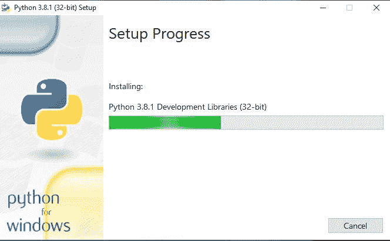
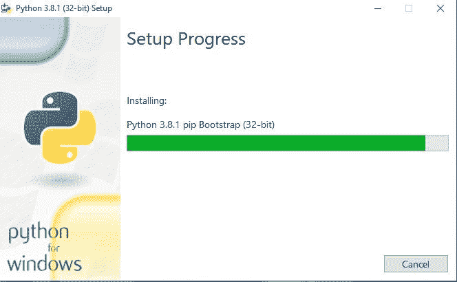
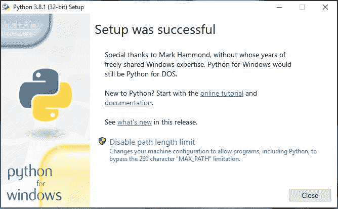
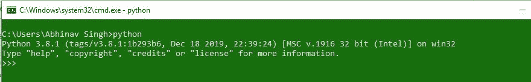
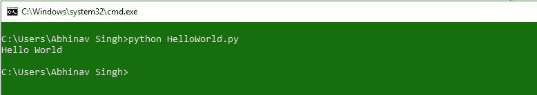

# 如何在 Windows 上安装 Python？

> 原文:[https://www . geesforgeks . org/如何在 windows 上安装 python/](https://www.geeksforgeeks.org/how-to-install-python-on-windows/)

**先决条件:** [Python 语言介绍](https://www.geeksforgeeks.org/python-language-introduction/)

在开始介绍如何在 Windows 上安装 Python3 之前，我们先来看一下 Python 的基本介绍。 [Python](https://www.geeksforgeeks.org/python-programming-language/) 是一种广泛使用的通用高级编程语言。Python 是一种编程语言，可以让您快速工作并更高效地集成系统。有两个主要的 Python 版本——Python 2 和 [Python 3](https://www.geeksforgeeks.org/python-tutorial-learn-python-3-with-examples/) 。两者截然不同。

#### Python 入门

Python 更容易编码和学习。Python 程序可以写在任何纯文本编辑器上，如****记事本++*** 或任何类似的东西。人们也可以使用一个[在线 ide 来编写 Python 代码](https://ide.geeksforgeeks.org/index.php)或者甚至可以在他们的系统上安装一个，使编写这些代码更加可行，因为 IDE 提供了很多功能，比如直观的代码编辑器、调试器、编译器等。
首先，编写 Python 代码并执行各种有趣而有用的操作，必须在他们的系统上安装 Python。这可以通过遵循下面提供的逐步说明来完成:*

#### *如果 Python 已经存在了呢？让我们检查一下*

*要检查您的设备是否预装了 Python，只需进入**命令行**(在运行对话框中搜索**cmd**(<link rel="stylesheet" href="https://maxcdn.bootstrapcdn.com/font-awesome/4.6.1/css/font-awesome.min.css">***+R**)。
现在运行以下命令:**

```
**python --version** 
```

**如果已经安装了 Python，它将生成一条消息，其中包含可用的 Python 版本。
**

### **下载并安装 Python:**

**在开始安装过程之前，您需要下载它。为此，视窗系统的所有 Python 版本都可以在[python.org](https://www.python.org/)上获得。
T3】**

**下载所需版本，并按照进一步的说明进行安装。**

****开始安装。****

*   ****入门:**
    **
*   ****安装库:**
    **
*   ****安装 pip 等功能:**
    **
*   ****完成安装:**
    **

**要验证安装，请在终端中输入以下命令。**

```
**python** 
```

****

**让我们考虑一个简单的 Hello World 程序。**

```
**# Python program to print
# Hello World

print("Hello World")**
```

****Output:****