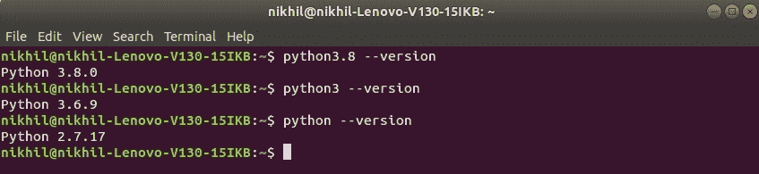
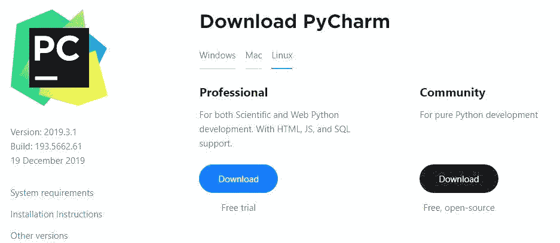
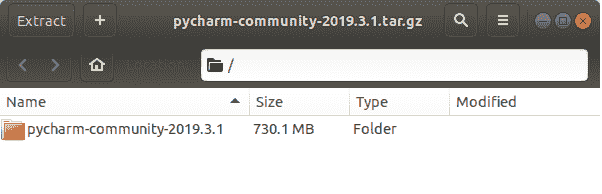
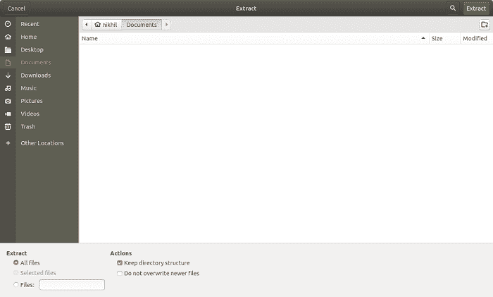
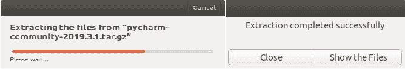
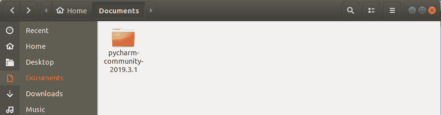
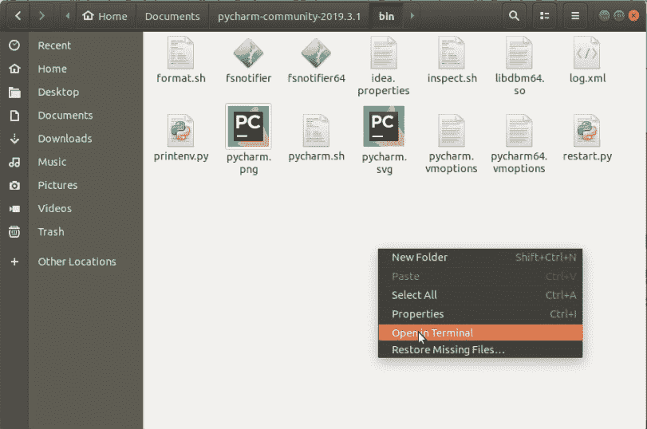
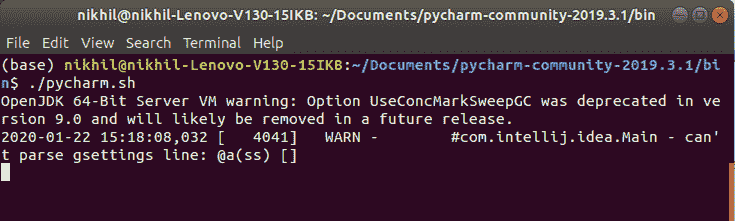
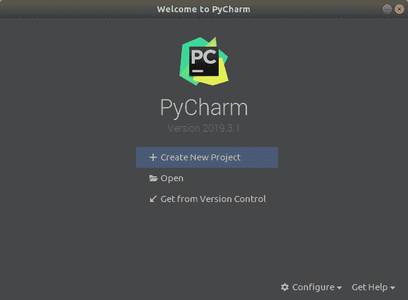

# 如何在 Linux 上安装 Python Pycharm？

> 原文:[https://www . geesforgeks . org/how-install-python-py charm-on-Linux/](https://www.geeksforgeeks.org/how-to-install-python-pycharm-on-linux/)

**先决条件:** [Python 语言简介](https://www.geeksforgeeks.org/python-language-introduction/)

Python 是一种广泛使用的通用高级编程语言。它最初由吉多·范·罗苏姆在 1991 年设计，由 Python 软件基金会开发。它主要是为了强调代码的可读性而开发的，它的语法允许程序员用更少的代码行来表达概念。
Python 是一种编程语言，可以让你快速工作，更高效地集成系统。
我们需要一个解释器来解释和运行我们的程序。网上有一些像 [GFG-IDE](https://ide.geeksforgeeks.org/) 、 [IDEONE](http://ideone.com/) 或 [CodePad](http://codepad.org/) 等的翻译。在离线解释器上运行 Python 代码比使用在线 IDE 兼容得多。

PyCharm 是 JetBrains 开发的最流行的 Python-IDE 之一，用于执行 Python 语言的脚本编写。PyCharm 提供了一些非常有用的特性，比如代码完成和检查、调试过程、对各种编程框架的支持，比如 Flask 和 Django、包管理等。PyCharm 为 Python 中的生产性开发提供了各种工具。

**安装 Python:**

大部分 Linux OS 都预装了 Python。要检查您的设备是否预装了 Python，只需使用 **`Ctrl+Alt+T`** 进入终端

现在为蟒蛇 2 运行以下命令:

```
python --version 
```

****为蟒 3.x****

```
python3.x --version 
```

**如果已经安装了 Python，它将生成一条消息，其中包含可用的 Python 版本。**

****

**如果 Python 不存在，请通过[如何在 Linux 上安装 Python？](https://www.geeksforgeeks.org/how-to-install-python-on-linux/)并按照提供的说明操作。**

### **下载和安装 PyCharm:**

**在开始安装过程之前，需要下载 PyCharm。为此，PyCharm 在[jetbrains.com](https://www.jetbrains.com/pycharm/download/#section=windows)上提供。

下载 PyCharm 并按照进一步的说明进行设置。**

****开始设置 PyCharm:****

*   ****下载 PyCharm 的 tar.gz 文件:**
    **
*   ****将文件提取到文件夹:**
    **
*   ****提取过程:**
    **
*   ****为 PyCharm 提取的文件:**
    **
*   ****在 bin 文件夹中打开终端:**
    转到**首页- > nikhil - >文档->py charm-community-2019 . 3 . 1->bin**打开终端窗口
    **
*   ****Command to Start PyCharm:**
    In the terminal window, type the following command to start PyCharm.

    ```
    ./pycharm.sh
    ```

    ** 
*   ****完成设置:**
    **