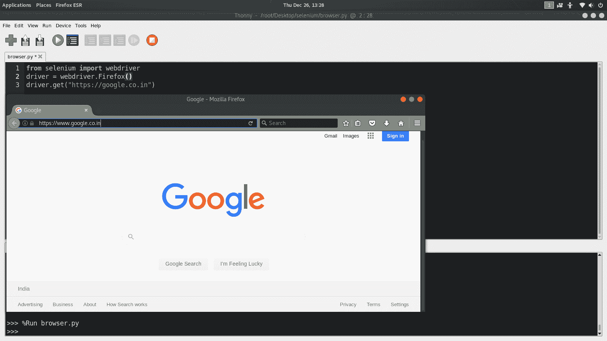

# 如何在 Python 中安装硒？

> 原文:[https://www . geesforgeks . org/如何安装 python 中的硒/](https://www.geeksforgeeks.org/how-to-install-selenium-in-python/)

Selenium Scripts 是为了完成一些繁琐的任务而构建的，这些任务可以使用**无头网络浏览器**自动完成。

例如，在不同的搜索引擎上搜索一些问题，并通过访问每个链接将结果存储在一个文件中。对于一个正常人来说，这项任务可能需要很长时间，但是在 selenium 脚本的帮助下，人们可以轻松完成这项任务

现在，你们中的一些人可能想知道什么是无头网络浏览器。它只不过是一个浏览器，可以使用这些硒脚本进行自动化控制(网络任务)。硒脚本可以使用各种语言进行编程，如 JavaScript、Java、Python 等。

**如何在**Python****Linux**环境下使用硒。**

Python 应该已经安装了。可以是 2。*或 3。*版本。
步骤:

1.  安装硒
2.  安装网络驱动程序(无头)
3.  创建简单代码

#### 安装硒

无论您使用什么操作系统，Python 命令对于安装硒库都是一样的。

**第一种方法**

打开终端/Cmd 并写下如下命令

```
python -m pip install selenium
```

**第二种方法**

或者，您可以在这里下载源代码分发[，将其取消归档，并运行以下命令:](https://pypi.python.org/pypi/selenium)

```
python setup.py install
```

#### 安装网络驱动程序

一个人可以安装火狐、Chromium、PhantomJs(现已弃用)等。

*   要使用火狐，你可能需要安装 GeckoDriver
*   要使用 Chrome，您可能需要安装 Chrome

在本文中，使用了火狐，因此可以按照下面的步骤进行安装:-

【Linux 的步骤:-

1.转到[壁虎释放页面](https://github.com/mozilla/geckodriver/releases)。为您的平台找到最新版本的驱动程序并下载。

例如:

```
wget https://github.com/mozilla/geckodriver/releases/download/v0.24.0/geckodriver-v0.24.0-linux64.tar.gz

```

2.使用以下命令提取文件:

```
tar -xvzf geckodriver*

```

3.使其可执行:

```
chmod +x geckodriver

```

4.将文件移动到 usr/local/bin

```
sudo mv geckodriver /usr/local/bin/

```

**窗户的步骤:-**

1.与 Linux 中的步骤 1 相同下载[壁虎河](https://github.com/mozilla/geckodriver/releases)

2.使用 WinRar 或您可能拥有的任何应用程序提取它。

3.使用命令提示符将其添加到路径中

```
setx path "%path%;GeckoDriver Path"

```

例如:-

```
setx path "%path%;c:/user/eliote/Desktop/geckodriver-v0.26.0-win64/geckodriver.exe"

```

#### 创建简单代码

```
# Python program to demonstrate
# selenium

from selenium import webdriver

driver = webdriver.Firefox()
driver.get("https://google.co.in")
```

**输出:**

