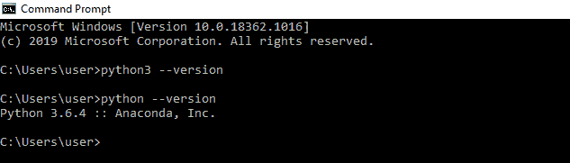
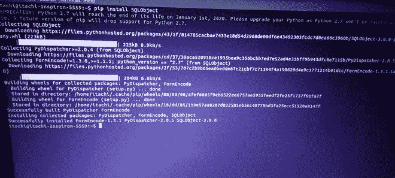
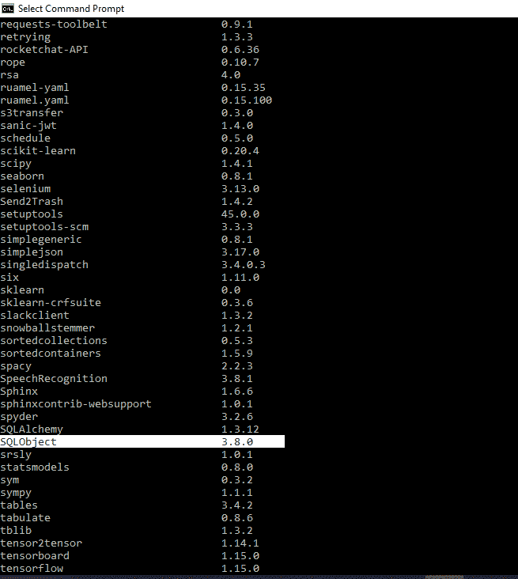
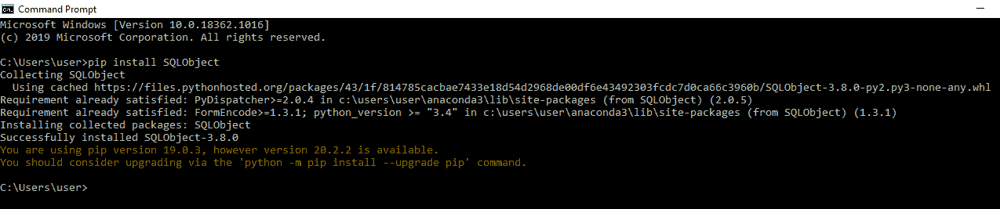

# 如何在 Windows 和 Linux 上安装 SQLObject 包？

> 原文:[https://www . geesforgeks . org/how-install-sqlobject-package-on-windows 和-linux/](https://www.geeksforgeeks.org/how-to-install-sqlobject-package-on-windows-and-linux/)

对象关系映射是两个世界之间的桥梁。 **SQLObject** 是一个流行对象关系管理器，用于提供数据库的对象接口，其中表作为类，行作为实例，列作为属性。使用对象关系映射并不意味着您不需要知道关系数据库是如何工作的，但是它确实让您不必编写 SQL。 **SQLObject** 程序可以写在任何纯文本编辑器上，比如记事本、notepad++，或者任何类似的东西上，并以. py 扩展名保存。本文向您展示如何安装 **SQLObject。**

**先决条件:**

*   Python >=2.7，！=3.0.*, !=3.1.*, !=3.2.*, !=3.3.*
*   点

**我们来检查 python 版本是否存在:**

要检查 python 是否存在，请在命令行界面上运行以下命令。

**命令:**

```
python3 --version

```

**输出:**



要安装 Python，请访问:如何在 [Windows](https://www.geeksforgeeks.org/how-to-install-python-on-windows/) 或 [Linux](https://www.geeksforgeeks.org/how-to-install-python-on-linux/) 上安装 Python？

### Linux 操作系统

Python SQLObject 可以通过多种方式安装在 Linux 上，使用 pip 的**就是其中之一。**

**命令:**

```
pip install SQLObject

```

**输出:**



要检查已安装的 **SQLObject，**在命令行界面上运行以下命令。

**命令:**

```
pip list

```

该命令将显示您的 Python 环境中所有已安装的包。

**输出:**



### Windows 操作系统

要使用 **pip 在 Windows 上安装 **SQLObject** ，请在命令行界面上运行下面的命令。**

**命令:**

```
pip install SQLObject

```

**输出:**



现在，这个包已成功安装在您的 Python 环境中。