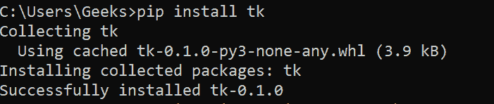
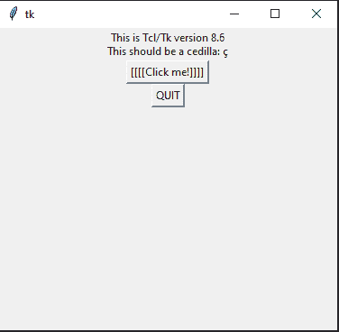
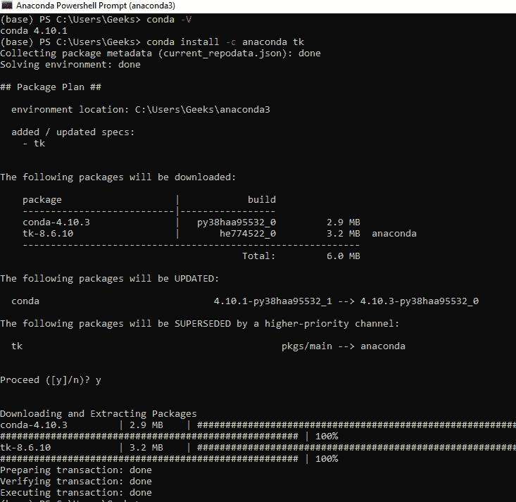

# 如何在 Windows 中安装 Tkinter？

> 原文:[https://www . geesforgeks . org/how-install-tkinter-in-window/](https://www.geeksforgeeks.org/how-to-install-tkinter-in-windows/)

在本文中，我们将探讨在 Windows 机器上安装 [Tkinter](https://www.geeksforgeeks.org/python-tkinter-tutorial/) 的各种方法。

**注意:** Python 已经和 Tkinter 捆绑在一起了。但是如果您仍然面临 Tkinter 的任何错误，请跟随文章进行手动安装。

### **先决条件:**

*   [蟒蛇](https://www.geeksforgeeks.org/how-to-download-and-install-python-latest-version-on-windows/)
*   [PIP](https://www.geeksforgeeks.org/how-to-install-pip-on-windows/) 或 [conda](https://www.geeksforgeeks.org/how-to-install-conda-in-windows/) (取决于您的喜好)

### 对于画中画用户:

打开命令提示符，使用以下命令安装 Tkinter:

```
pip install tk
```

安装完成后，将显示以下消息:



要验证安装，使用 tk。_test()函数。使用以下截图作为参考:

## 蟒蛇 3

```
import tkinter
tkinter._test()
```

**输出:**



### 对于 conda 用户:

Conda 用户可以打开 Anaconda 电源外壳，使用以下命令安装 Tkinter:

```
conda install -c anaconda tk
```

安装完成后，您将收到以下消息:



要验证安装，请运行以下代码:

## 蟒蛇 3

```
import tkinter
tkinter._test()
```

**输出:**

