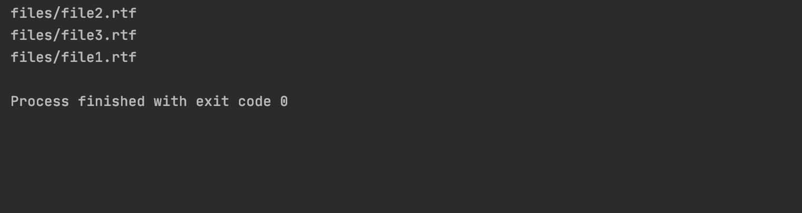

# 如何用 Python 迭代目录中的文件？

> 原文:[https://www . geesforgeks . org/如何使用 python 迭代目录中的文件/](https://www.geeksforgeeks.org/how-to-iterate-over-files-in-directory-using-python/)

[目录](https://www.geeksforgeeks.org/create-a-directory-in-python/) 有时也称为文件夹，是系统文件系统中用于存储和定位文件或多个文件夹的单位组织结构。Python 作为一种脚本语言，提供了各种方法来迭代目录中的文件。

下面是使用 python 在目录中迭代文件的各种方法:

**方法 1:**[**OS . listdir()**](https://www.geeksforgeeks.org/python-os-listdir-method/)

该函数返回给定目录中存在的*文件*和*子目录*的列表。我们可以使用 *os.path.isfile()* 函数过滤列表，只获取文件:

**示例:**

## 蟒蛇 3

```py
# import required module
import os
# assign directory
directory = 'files'

# iterate over files in
# that directory
for filename in os.listdir(directory):
    f = os.path.join(directory, filename)
    # checking if it is a file
    if os.path.isfile(f):
        print(f)
```

**输出:**



**方法二:** [**os.scandir()**](https://www.geeksforgeeks.org/python-os-scandir-method/)

这个方法用来获取 *os 的迭代器。目录条目*对应于目录中由指定路径给出的条目的对象。

**示例:**

## 蟒蛇 3

```py
# import required module
import os

# assign directory
directory = 'files'

# iterate over files in
# that directory
for filename in os.scandir(directory):
    if filename.is_file():
        print(filename.path)
```

**输出:**


**方法三:** [**路径库模块**](https://www.geeksforgeeks.org/pathlib-module-in-python/)

我们可以使用 *Path.glob()* 函数迭代目录中的文件，该函数在给定的目录中搜索指定的模式并产生匹配的文件。 *Path.glob('*')* 生成给定目录中的所有文件

**示例:**

## 蟒蛇 3

```py
# import required module
from pathlib import Path

# assign directory
directory = 'files'

# iterate over files in
# that directory
files = Path(directory).glob('*')
for file in files:
    print(file)
```

**输出:**


**方法 4:** [**os.walk()**](https://www.geeksforgeeks.org/os-walk-python/)

我们也可以使用这个方法搜索子目录，因为它产生了一个三元组*(目录路径，目录名，文件名)*。

*   *根目录*:只打印你指定的目录。
*   *目录*:从根目录打印出子目录。
*   *文件*:从根目录和目录中打印出所有文件。

## 蟒蛇 3

```py
# import required module
import os

# assign directory
directory = 'files'

# iterate over files in
# that directory
for root, dirs, files in os.walk(directory):
    for filename in files:
        print(os.path.join(root, filename))
```

**输出:**


**方法 5:** [**glob 模块**](https://www.geeksforgeeks.org/glob-filename-pattern-matching/)

*glob.iglob()* 函数返回与给定模式匹配的路径名列表的迭代器。

**示例:**

## 蟒蛇 3

```py
# import required module
import glob

# assign directory
directory = 'files'

# iterate over files in
# that directory
for filename in glob.iglob(f'{directory}/*'):
    print(filename)
```

**输出:**

