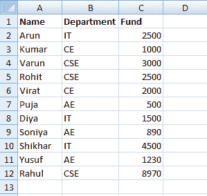
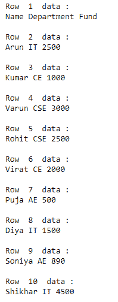
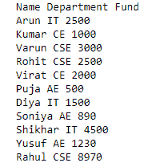

# 如何在 Python 中迭代 Excel 行？

> 原文:[https://www . geesforgeks . org/如何迭代 excel-row-in-python/](https://www.geeksforgeeks.org/how-to-iterate-through-excel-rows-in-python/)

在本文中，我们将讨论如何在 Python 中迭代 Excel 行。为了执行这个任务，我们将使用 python 中的 **Openpyxl** 模块。Openpyxl 是一个用于读写 Excel(扩展名为 xlsx/xlsm/xltx/xltm)文件的 Python 库。openpyxl 模块允许 Python 程序读取和修改 Excel 文件。

我们将在以下示例中使用此 excel 工作表:



**方法#1:**

我们将创建一个 openpyxl 对象，然后从上到下遍历所有行。

## 蟒蛇 3

```py
# import module
import openpyxl

# load excel with its path
wrkbk = openpyxl.load_workbook("Book1.xlsx")

sh = wrkbk.active

# iterate through excel and display data
for i in range(1, sh.max_row+1):
    print("\n")
    print("Row ", i, " data :")

    for j in range(1, sh.max_column+1):
        cell_obj = sh.cell(row=i, column=j)
        print(cell_obj.value, end=" ")
```

**输出:**



**接近#2**

我们将创建一个 openpyxl 的对象，然后使用 iter_rows()方法遍历所有行。

## 蟒蛇 3

```py
# import module
import openpyxl

# load excel with its path
wrkbk = openpyxl.load_workbook("Book1.xlsx")

sh = wrkbk.active

# iterate through excel and display data
for row in sh.iter_rows(min_row=1, min_col=1, max_row=12, max_col=3):
    for cell in row:
        print(cell.value, end=" ")
    print()
```

**输出:**

