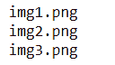
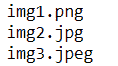

# 如何迭代 Python 中一个文件夹的图像？

> 原文:[https://www . geesforgeks . org/如何迭代文件夹中的图像-python/](https://www.geeksforgeeks.org/how-to-iterate-through-images-in-a-folder-python/)

在本文中，我们将学习如何在 Python 中遍历文件夹中的图像。

## 方法一:**使用** [**os.listdir**](https://www.geeksforgeeks.org/python-os-listdir-method/)

### **示例 1:迭代通过。仅限巴布亚新几内亚**

*   首先我们导入了 ***os*** 模块与操作系统进行交互。
*   然后我们从 ***os*** 中导入 ***listdir()*** 函数来访问引号中给出的文件夹。
*   然后借助 ***os.listdir()*** 函数，我们遍历图像，按顺序打印名字。
*   这里我们只提到了 ***。使用 ***endswith()*** 功能加载 png*** 文件。

## 蟒蛇 3

```py
# import the modules
import os
from os import listdir

# get the path/directory
folder_dir = "C:/Users/RIJUSHREE/Desktop/Gfg images"
for images in os.listdir(folder_dir):

    # check if the image ends with png
    if (images.endswith(".png")):
        print(images)
```

**输出**:



### **例 2:迭代各种图像**

这里我们已经提到 ***。**png*、*T5】。jpg****。使用 ***endswith()*** 功能加载的 jpeg*** 文件。

## 蟒蛇 3

```py
# import the modules
import os
from os import listdir

# get the path or directory
folder_dir = "C:/Users/RIJUSHREE/Desktop/Gfg images"
for images in os.listdir(folder_dir):

    # check if the image end swith png or jpg or jpeg
    if (images.endswith(".png") or images.endswith(".jpg")\
        or images.endswith(".jpeg")):
        # display
        print(images)
```

**输出:**



## **方法二:使用** [**路径库模块**](https://www.geeksforgeeks.org/pathlib-module-in-python/)

*   首先，我们从 ***路径*** 导入了 ***路径库*** 模块。
*   然后我们通过 ***路径()*** 函数里面的目录/文件夹，使用了它 ***。glob('*。png')*** 函数迭代此文件夹中存在的所有图像。

## 蟒蛇 3

```py
# import required module
from pathlib import Path

# get the path/directory
folder_dir = 'Gfg images'

# iterate over files in
# that directory
images = Path(folder_dir).glob('*.png')
for image in images:
    print(image)
```

**输出:**


## **方法三:使用** [**glob.iglob()**](https://www.geeksforgeeks.org/how-to-use-glob-function-to-find-files-recursively-in-python/)

*   首先我们导入了 ***glob*** 模块。
*   然后在 ***glob.iglob()*** 函数的帮助下，我们遍历图像并按顺序打印名字。
*   这里我们已经提到 ***。使用 ***endswith()*** 功能加载 png*** 文件。

## 蟒蛇 3

```py
# import required module
import glob

# get the path/directory
folder_dir = 'Gfg images'

# iterate over files in
# that directory
for images in glob.iglob(f'{folder_dir}/*'):

    # check if the image ends with png
    if (images.endswith(".png")):
        print(images)
```

**输出**:

