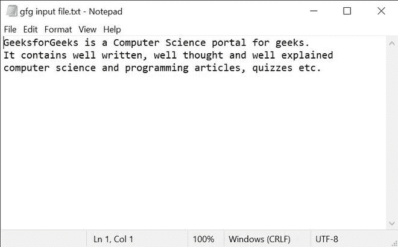
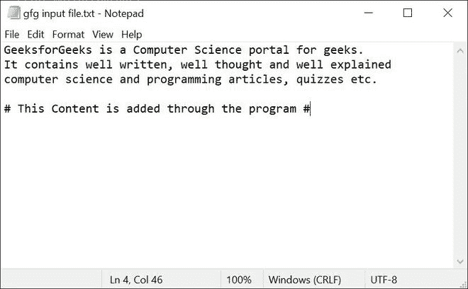

# 用 Python 写文件时如何保留旧内容？

> 原文:[https://www . geeksforgeeks . org/如何在编写 python 文件时保留旧内容/](https://www.geeksforgeeks.org/how-to-keep-old-content-when-writing-to-files-in-python/)

在本文中，我们将讨论在用 Python 编写文件时保留旧内容的各种方法。

在 python 中使用 write 时，我们可以通过以追加模式打开文件来保留旧内容。要以追加模式打开文件，我们可以使用“ **a** 或“ **a+** 作为访问模式。这些访问模式的定义如下:

*   **仅追加(' a'):** 打开文件进行写入。如果文件不存在，则创建该文件。句柄位于文件的顶部。正在写入的数据将被插入到主要数据之后的顶部。
*   **附加 Read ('a+'):** 打开文件进行读写。如果文件不存在，则创建该文件。句柄位于文件的顶部。正在写入的数据将被插入到主要数据之后的顶部。

**进场:**

*   我们将首先以追加模式打开文件，即使用“a”或“a+”访问模式打开文件。
*   现在，我们将简单地在文件的底部添加内容，从而保留文件的旧内容。
*   然后，我们将关闭程序中打开的文件。

我们将使用下面的文本文件来执行所有方法:



**以下是上述方法的完整实现:**

**示例 1:** 向文件中添加新内容，同时保留以“a”作为访问模式的旧内容。

## 蟒蛇 3

```
# Python program to keep the old content of the file
# when using write.

# Opening the file with append mode
file = open("gfg input file.txt", "a")

# Content to be added
content = "\n\n# This Content is added through the program #"

# Writing the file
file.write(content)

# Closing the opened file
file.close()
```

**输出:**



**示例 2:** 向文件中添加新内容，同时保留旧内容，以‘a+’作为访问模式。

## 蟒蛇 3

```
# Python program to keep the old content of the file
# when using write.

# Opening the file with append mode
file = open("gfg input file.txt", "a+")

# reach at first
file.seek(0)

# Reading the file
content = file.read()

# view file content
print(content)

# Content to be added
content = "\n\n# This Content is added through the program #"

# Writing the file
file.write(content)

# Closing the opened file
file.close()
```

**输出:**

> 极客的计算机科学门户。它包含写得好、想得好、解释得好的计算机科学和编程文章、测验等。

