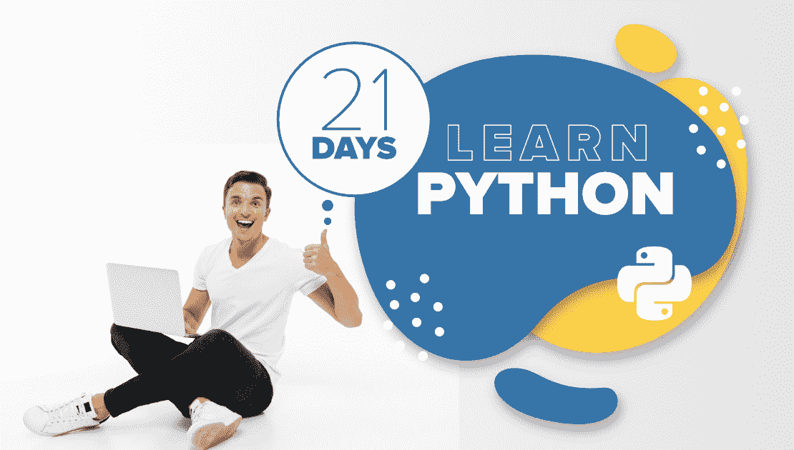

# 如何在 21 天内学会 Python？

> 原文:[https://www . geesforgeks . org/21 天学习 python 的方法/](https://www.geeksforgeeks.org/how-to-learn-python-in-21-days/)

目前，Python 是 IT 世界中用途最广、需求最大的编程语言之一。据统计，全球约有**800-900 万**的 Python 开发人员，而且这个数字还在快速增长。同时，印度一个**入门级 Python 开发者**的平均工资在 **4-6 LPA** 左右，其丰富的功能如*更容易语法*、*动态类型化*等。使它成为初学者最推荐的编程语言。而且还有*人工智能**机器学习**大数据*等众多前沿技术。严重依赖于 Python。事实上，如果你**通过遵循正确的方法开始学习 Python** ，这门语言会为你建立成功的职业生涯提供更多的东西！！

在进一步介绍之前，我们先简单介绍一下 **Python** 语言。Python，由*吉多·范·罗瑟姆*在 1991 年设计，是一种**通用编程语言**。该语言广泛应用于*网络开发*、*数据科学*、*机器学习*以及科技领域的各种其他趋势领域。此外，Python 支持多种编程范式，并且拥有大量的库和工具。此外，该语言还提供了各种其他关键特性，例如*更好的代码可读性*、*庞大的社区支持*、*更少的代码行*等等。在本文中，我们将讨论一个 ***完整的课程或路线图，您需要在短短 21 天内学习 Python！**T21】*

### 1.了解基本知识(第 1 天)

这是你需要做的首要任务–***了解 Python 语言的本质&基础*** ！您需要深入了解语言的*介绍*、*功能&应用程序*。同时，还要求**了解安装过程&设置路径**运行 Python 程序。还建议您**创建您的第一个基本 Python 程序**，这将帮助您熟悉 Python 程序的语法&执行过程。此外，您还可以探索一些*集成开发环境(IDEs)* ，如 Pycharm、Jupyter 和各种其他环境。

*   [Python 语言介绍](https://www.geeksforgeeks.org/python-language-introduction/)
*   [Python 特性和应用](https://www.geeksforgeeks.org/python-tutorial/#key)
*   [如何安装 Python？](https://www.geeksforgeeks.org/python-tutorial/#download)
*   [Python 中的 Hello World 程序](https://www.geeksforgeeks.org/hello-world-program-first-program-while-learning-programming/)
*   [Python 集成开发环境](https://www.geeksforgeeks.org/different-python-ides-and-code-editors/)

### 2.学习 Python 数据类型、变量和运算符(第 2-3 天)

现在，您需要向前迈出一步，了解 Python 语言的基本元素–***变量、数据类型&运算符*** 。虽然说到 Python 变量，在使用之前不需要声明变量，因为 Python 是**动态类型编程语言**。此外，您还需要通过 Python 中的各种**内置数据类型**，如*数字*、*布尔*、*序列类型*等。此外，您可以探索 Python 中的运算符，也可以在这些主题上练习一些基本程序，以进一步澄清概念。

*   [数据类型](https://www.geeksforgeeks.org/python-tutorial/#data)|[Python 中的变量](https://www.geeksforgeeks.org/python-tutorial/#variables)
*   [Python 中的全局和局部变量](https://www.geeksforgeeks.org/global-local-variables-python/)
*   [Python 中的运算符](https://www.geeksforgeeks.org/python-tutorial/#operators)
*   [Python 中的运算符重载](https://www.geeksforgeeks.org/operator-overloading-in-python/)
*   [Python 编程实例练习](https://www.geeksforgeeks.org/python-programming-examples/)

### 3.学习 Python 中的条件和流控制语句(第 4-5 天)

在完成 Python 基础、变量、运算符等之后。，现在需要 ***理解 Python 编程中的条件句和控制流语句*** 。Python 程序流控制涉及各种主题，如循环的*、*同时循环*、*同时循环*等。同时，条件语句涉及到 *If* 、 *If- else* 、*嵌套 if-else* 等几个概念。您需要深入探讨这些主题，并建议您解决与这些主题相关的几个编程问题。其他几个话题如**中断**、**继续**、**通过**等控制语句。也可以考虑。*

*   *[Python 中的决策语句](https://www.geeksforgeeks.org/python-if-else/)*
*   *[Python 中的循环](https://www.geeksforgeeks.org/loops-in-python/)*
*   *[Python 中的循环技术](https://www.geeksforgeeks.org/looping-techniques-python/)*
*   *[Python 中的控制语句](https://www.geeksforgeeks.org/python-tutorial/#loop)*
*   *[Python 中的链接比较](https://www.geeksforgeeks.org/chaining-comparison-operators-python/)*

### *4.理解 Python 中的字符串、列表和字典操作(第 6-7 天)*

*一旦你完成了上述主题，现在你需要 ***理解 Python 语言中的字符串、列表&字典操作*** 。一般来说，Python 中的字典是一个无序的项目集合，其中每个项目都有一个**键/值**对。此外，Python 中的 String 是一个表示 Unicode 字符的字节数组，而 Python 中的 List 表示一个与有序元素序列相关的可变数据结构。此外，还建议您浏览其他几个主题，如*****集合*** 等。***

*   ***[Python 数组](https://www.geeksforgeeks.org/python-arrays/)***
*   ***[Python 词典](https://www.geeksforgeeks.org/python-dictionary/)***
*   ***[Python 字符串](https://www.geeksforgeeks.org/python-strings/) | [Python 列表](https://www.geeksforgeeks.org/python-list/)***
*   ***[Python 中字节对象对字符串](https://www.geeksforgeeks.org/byte-objects-vs-string-python/)***
*   ***[Python 集](https://www.geeksforgeeks.org/python-sets/) | [Python 元组](https://www.geeksforgeeks.org/python-tuples/)***

### ***5.熟悉 Python 函数和模块(第 8-10 天)***

***此外，您需要了解 Python 编程最关键的部分之一——Python 中的 ***【函数】&模块*** 。您需要学习 Python Functions 的各个方面，例如函数的类型、如何编写&调用函数、带参数的函数等。此外，您还需要了解 Python 中的模块，它是一个包含 Python 定义和语句的文件。此外，您需要了解其他几个主题，如 **Python 闭包**、**包**、 **Lambda 函数**以及其他各种主题。***

*   ***[Python 中的函数](https://www.geeksforgeeks.org/functions-in-python/)***
*   ***[带参数的函数](https://www.geeksforgeeks.org/python-tutorial/#arguments)***
*   ***[λ函数](https://www.geeksforgeeks.org/python-tutorial/#lambda)***
*   ***[Python 模块](https://www.geeksforgeeks.org/python-modules/) | [Python 包](https://www.geeksforgeeks.org/create-access-python-package/)***
*   ***[Python 闭包](https://www.geeksforgeeks.org/python-closures/)***

### ***6.浏览 Python 文件操作(第 11-12 天)***

***现在，是时候深入 Python 编程的世界，了解 Python 中的文件处理和文件操作了 。实际上，Python 支持文件处理，并允许您使用各种文件处理选项来处理文件。你需要学习各种操作，比如如何*读取&写入文件*、*打开&关闭文件*、*字里行间读取*等。您需要完成各种相应的功能，例如 **open()** 、 **split()** 、 **append()** 等等。您可以通过几个额外的主题来完成，比如 Python 搜索函数等。***

*   ***[Python 中文件处理的基础知识](https://www.geeksforgeeks.org/file-handling-python/)***
*   ***[用 Python 打开文件](https://www.geeksforgeeks.org/open-a-file-in-python/)***
*   ***[读取文件](https://www.geeksforgeeks.org/how-to-read-from-a-file-in-python/) | [写入文件](https://www.geeksforgeeks.org/writing-to-file-in-python/)***
*   ***[Python seek()函数](https://www.geeksforgeeks.org/python-seek-function/)***
*   ***[Python tell()函数](https://www.geeksforgeeks.org/python-tell-function/)***

### ***7.理解 Python 中的面向对象方法(第 13-15 天)***

***Python 学习旅程中最重要的一部分来了——面向对象编程。您需要通过诸如类、对象、实例等各种不同的概念来理解 Python 编程的面向对象本质。您需要了解 OOPs 范例，如继承、多态、封装等。深入掌握语言。此外，您还需要了解其他几个重要的主题，如数据隐藏、对象打印、Python 中的构造函数和析构函数以及其他各种主题。***

*   ***[Python 中的类、对象和成员](https://www.geeksforgeeks.org/object-oriented-programming-in-python-set-1-class-and-its-members/)***
*   ***[遗传](https://www.geeksforgeeks.org/oop-in-python-set-3-inheritance-examples-of-object-issubclass-and-super/) | [多态性](https://www.geeksforgeeks.org/polymorphism-in-python/) | [封装](https://www.geeksforgeeks.org/python-tutorial/#encapsulation)***
*   ***[数据隐藏&对象打印](https://www.geeksforgeeks.org/object-oriented-programming-in-python-set-2-data-hiding-and-object-printing/)***
*   ***[Python 中的构造函数](https://www.geeksforgeeks.org/constructors-in-python/) | [析构函数](https://www.geeksforgeeks.org/destructors-in-python/)***
*   ***[Python 中的垃圾收集](https://www.geeksforgeeks.org/garbage-collection-python/)***

### ***8.了解 Python 中的正则表达式和异常处理(第 16-18 天)***

***完成上述主题后，现在您需要了解几个更高级和底层的 Python 概念，如 ***【正则表达式】******【异常处理】*** 等。说到异常处理，建议您涵盖几个主题，如 Python 中的错误和异常、用户定义的异常、Python 尝试异常、内置异常等。此外，您还需要关注 Python 中的**正则表达式**，它表示形成搜索模式的一系列字符。现阶段可以考虑的几个附加主题是 **Python 数据库交互**等。***

*   ***[Python 异常处理](https://www.geeksforgeeks.org/python-exception-handling/)***
*   ***[用户自定义异常](https://www.geeksforgeeks.org/user-defined-exceptions-python-examples/) | [内置异常](https://www.geeksforgeeks.org/built-exceptions-python/)***
*   ***[Python 尝试除了](https://www.geeksforgeeks.org/python-try-except/)***
*   ***[Python 中的正则表达式](https://www.geeksforgeeks.org/regular-expression-python-examples-set-1/)***
*   ***[MongoDB 和 Python](https://www.geeksforgeeks.org/mongodb-and-python/)***

### ***9.穿越多线程和 Python CGI(第 19-21 天)***

***此外，您需要了解一些更高级的主题，如多线程、Python CGI 等。**Python 中的多线程**涉及到各种概念，如*线程控制块*、*分叉线程*、*同步线程*等。同时，Python 中的**公共网关接口(CGI)编程**涉及一组规则，用于建立 web 服务器和浏览器之间的动态交互。此外，还建议您浏览其他重要主题，如 **Python 集合**等。***

*   ***[Python 中的多线程](https://www.geeksforgeeks.org/multithreading-python-set-1/)***
*   ***[Python 中的 CGI 编程](CGI Programming in Python)***
*   ***[蟒蛇系列](https://www.geeksforgeeks.org/python-programming-language/#Python%20Collections)***
*   ***[Python 中的计数器](https://www.geeksforgeeks.org/counters-in-python-set-1/)***
*   ***[练习用的几个 Python 项目](https://www.geeksforgeeks.org/python-programming-language/#Applications%20and%20Projects)***

***因此，在以正确的态度和奉献精神遵循上述路线图后，您可以轻松地通过 Python 语言 发出 ***命令。你所需要做的就是每天覆盖几个主题，在 21 天内覆盖整个 T4 的课程。现在，你还在等什么？在接下来的 21 天里，从繁忙的日程中抽出一些时间，深入 Python 编程世界！！******