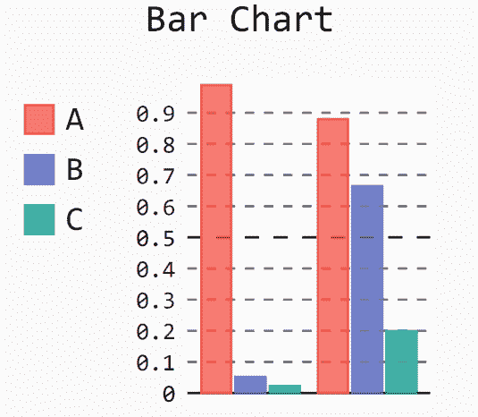
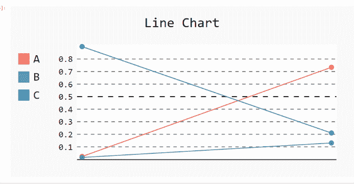
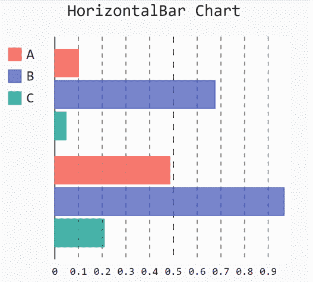

# 如何在 Pygal 中限制宽度和高度？

> 原文:[https://www . geesforgeks . org/如何限制 pygal 中的宽度和高度/](https://www.geeksforgeeks.org/how-to-limit-the-width-and-height-in-pygal/)

**先决条件:** [皮格尔](http://www.pygal.org/en/stable/)

Pygal 是 Python 的图形和用户界面库，提供设计和科学应用程序通常需要的功能。在制作一个情节时，优化它的大小对我们来说很重要。在本文中，我们将看到如何在 Pygal 模块中调整绘图窗口的大小。以下是根据我们的要求尺寸改变默认绘图大小或调整给定绘图大小的各种方法。

**进场:**

*   导入所需模块。
*   创建图表对象。
*   函数中的传递宽度/高度。
*   给图表贴上标签。
*   显示图形。

下面给出了上述概念的实现:

**例 1:**

## 蟒蛇 3

```py
# importing pygal
import pygal
import numpy

# creating the chart object
chart = pygal.Bar(width=200, height=200)

# naming the title
chart.title = 'Bar Chart'

# Random data
chart.add('A', numpy.random.rand(2))
chart.add('B', numpy.random.rand(2))
chart.add('C', numpy.random.rand(2))

chart.render_to_png('img.png')
```

**输出:**



**例 2:**

## 蟒蛇 3

```py
# importing pygal
import pygal
import numpy

# creating the chart object
chart = pygal.Line(width=400, height=200)

# naming the title
chart.title = 'Line Chart'

# Random data
chart.add('A', numpy.random.rand(2))
chart.add('B', numpy.random.rand(2))
chart.add('C', numpy.random.rand(2))

chart.render_to_png('img.png')
```

**输出:**



**例 3:**

## 蟒蛇 3

```py
# importing pygal
import pygal
import numpy

# creating the chart object
chart = pygal.HorizontalBar(width=300, height=300)

# naming the title
chart.title = 'HorizontalBar Chart'

# Random data
chart.add('A', numpy.random.rand(2))
chart.add('B', numpy.random.rand(2))
chart.add('C', numpy.random.rand(2))

chart.render_to_png('img.png')
```

**输出:**

