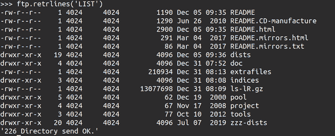
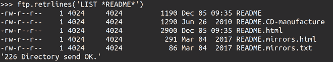
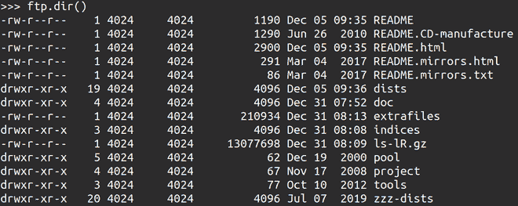
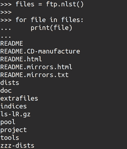

# 如何用 Python 列出 FTP 服务器中的所有文件和目录？

> 原文:[https://www . geesforgeks . org/如何使用 python 列出 ftp 服务器中的所有文件和目录/](https://www.geeksforgeeks.org/how-to-list-all-files-and-directories-in-ftp-server-using-python/)

**FTP(文件传输协议)**是计算机在计算机网络上传输文件时遵循的一组规则。它是基于 TCP/IP 的协议。FTP 允许客户端共享文件。文件传输协议不太安全，因为文件是以纯文本形式共享的，没有任何网络加密。

使用 python 可以使用其内置的 ftplib 模块从 FTP 服务器检索文件和目录列表。ftplib 是一个预装的 python 包，它使我们能够实现客户端 FTP 协议，为了使用它，我们只需像任何其他模块一样导入它。提取列表或目录的基本方法保持不变。

### 方法

*   导入模块
*   连接到默认端口上的主机

**语法:**

> FTP(主机=，用户=，密码=，帐户=，超时=无，源地址=无，*编码='utf-8 ')

*   使用 Log in()函数登录到服务器

**语法:**

> 登录()T2【用户= '匿名' 、*passwd =*、*acct =*)

*   相应地检索文件和目录。
*   紧密联系

**方法 1** :使用 retrlines()

可以使用 retrlines()函数列出文件和目录。它返回文件名、修改时间、文件大小、所有者、文件类型、权限和模式。

**语法:**

> retrlines(*cmd*、 *回调=None* )

在这个函数中传递‘LIST’会检索文件和关于这些文件的信息。

**程序:**

## 蟒蛇 3

```py
from ftplib import FTP

ftp = FTP('ftp.us.debian.org')

ftp.login()

# changing directory
ftp.cwd('debian')

ftp.retrlines('LIST')

ftp.quit()
```

**输出:**



图 2

该功能也可以被用户用来搜索文件或目录。搜索查询可以在星号(*)之间输入。

**语法:**

> ftp.retrlines('LIST *query* ')

**程序**:列出以“README”开头的文件名。

## 蟒蛇 3

```py
from ftplib import FTP

ftp = FTP('ftp.us.debian.org')

ftp.login()

# changing directory
ftp.cwd('debian')

ftp.retrlines('LIST *README*')

ftp.quit()
```

**输出:**



图 3

**方法 2:** 使用 dir()

文件和目录可以用 dir()列出。它返回文件名、修改时间、文件大小、所有者、文件类型、权限和模式。

**语法:**

```py
ftp.dir()
```

**程序:**

## 蟒蛇 3

```py
from ftplib import FTP

ftp = FTP('ftp.us.debian.org')

ftp.login()

# changing directory
ftp.cwd('debian')

ftp.dir()

ftp.quit()
```

**输出:**



图 4

**方法 3:** 使用 nlst()

文件和目录可以用 nlst()列出。它返回列表类型的文件和目录的名称。

**语法:**

```py
ftp.nlst()
```

**程序:**

## 蟒蛇 3

```py
from ftplib import FTP

ftp = FTP('ftp.us.debian.org')

ftp.login()

# changing directory
ftp.cwd('debian')

ftp.nlst()

ftp.quit()
```

**输出:**



图 5