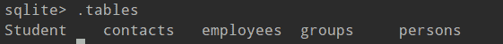
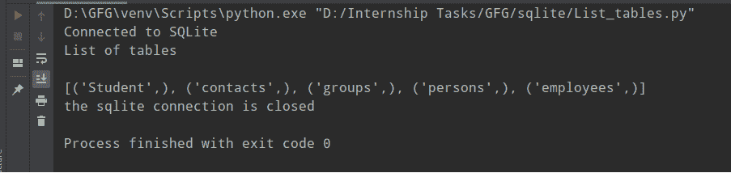

# 如何在 Python 中使用 SQLite3 列出表格？

> 原文:[https://www . geesforgeks . org/如何使用 python 中的-sqlite3 列出表/](https://www.geeksforgeeks.org/how-to-list-tables-using-sqlite3-in-python/)

在本文中，我们将讨论如何使用 Python 列出 SQLite 数据库中的所有表。

**使用的数据库:**



我们数据库中的所有表

### 逐步实施:

1.使用 connect()方法创建连接对象，

```py
sqliteConnection = sqlite3.connect('SQLite_Retrieving_data.db')
```

2.创建了一个 SQL 查询，我们将使用它来搜索 sqlite3 数据库中存在的所有表的列表。

```py
sql_query = """SELECT name FROM sqlite_master  
  WHERE type='table';"""
```

3.使用连接对象，我们正在创建一个光标对象。

```py
cursor = sqliteConnection.cursor()
```

4.使用 execute()方法，我们将执行上面的 SQL 查询。

```py
cursor.execute(sql_query)
```

5.最后，我们将打印 sqlite3 数据库中存在的所有表的列表。

```py
print(cursor.fetchall())
```

下面是实现。

## 蟒蛇 3

```py
# Importing Sqlite3 Module
import sqlite3

try:

    # Making a connection between sqlite3 
    # database and Python Program
    sqliteConnection = sqlite3.connect('SQLite_Retrieving_data.db')

    # If sqlite3 makes a connection with python
    # program then it will print "Connected to SQLite"
    # Otherwise it will show errors
    print("Connected to SQLite")

    # Getting all tables from sqlite_master
    sql_query = """SELECT name FROM sqlite_master 
    WHERE type='table';"""

    # Creating cursor object using connection object
    cursor = sqliteConnection.cursor()

    # executing our sql query
    cursor.execute(sql_query)
    print("List of tables\n")

    # printing all tables list
    print(cursor.fetchall())

except sqlite3.Error as error:
    print("Failed to execute the above query", error)

finally:

    # Inside Finally Block, If connection is
    # open, we need to close it
    if sqliteConnection:

        # using close() method, we will close 
        # the connection
        sqliteConnection.close()

        # After closing connection object, we 
        # will print "the sqlite connection is 
        # closed"
        print("the sqlite connection is closed")
```

**输出:**



最终输出