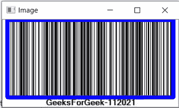

# 如何用 Python 制作条形码阅读器？

> 原文:[https://www . geesforgeks . org/如何制作 python 条形码阅读器/](https://www.geeksforgeeks.org/how-to-make-a-barcode-reader-in-python/)

条形码以图形表示和机器可读的方式表示数据。为了用 Python 制作条形码阅读器，我们使用了 **pyzbar** 库。使用 pyzbar，我们可以解码一维条形码和二维码。

**这个 pyzbar 可以根据条码对象返回 3 个字段:**

*   **类型:**有几种条形码可供选择。它们由独特的代码名称区分，如代码-128、代码-11、代码-39 等。如果 pyzabr 检测到的符号是二维码，则该类型的符号是二维码。
*   **数据:**这是嵌入在条形码内部的数据。这些数据有各种类型(字母数字、数字、二进制等)..)取决于条形码的类型。
*   **位置:**这是位于代码中的点的集合。对于条形码，这些点是开始和结束线边界。而对于二维码，则是对应二维码四角的四个点的列表。

对于安装:

```
pip install pyzbar
```

pyzbar 提供了在图像中定位条形码的 rect 方法。Rect 代表一个矩形，它会给出条形码的坐标。我们还可以解码一张图像中包含的多个条形码。使用以下步骤，我们将制作一个条形码记录器。(确保安装了两个库)

**进场:**

*   导入 cv2。
*   从 pyzbar 导入解码函数。
*   从用户那里获取图像。
*   使用 pyzbar 解码图像
*   在给定图像中找到条形码
*   打印数据和图像类型
*   显示定位的条形码。

**以下是实施情况**

## 蟒蛇 3

```
# Importing library
import cv2
from pyzbar.pyzbar import decode

# Make one method to decode the barcode
def BarcodeReader(image):

    # read the image in numpy array using cv2
    img = cv2.imread(image)

    # Decode the barcode image
    detectedBarcodes = decode(img)

    # If not detected then print the message
    if not detectedBarcodes:
        print("Barcode Not Detected or your barcode is blank/corrupted!")
    else:

          # Traverse through all the detected barcodes in image
        for barcode in detectedBarcodes: 

            # Locate the barcode position in image
            (x, y, w, h) = barcode.rect

            # Put the rectangle in image using
            # cv2 to heighlight the barcode
            cv2.rectangle(img, (x-10, y-10),
                          (x + w+10, y + h+10),
                          (255, 0, 0), 2)

            if barcode.data!="":

            # Print the barcode data
                print(barcode.data)
                print(barcode.type)

    #Display the image
    cv2.imshow("Image", img)
    cv2.waitKey(0)
    cv2.destroyAllWindows()

if __name__ == "__main__":
  # Take the image from user
    image="Img.jpg"
    BarcodeReader(image)
```

**输出:**

```
b'GeeksForGeek-112021'
CODE128
```

