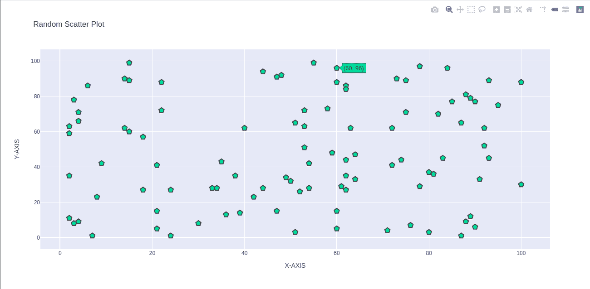

# 如何用 Python-Plotly 制作一个基本的散点图？

> 原文:[https://www . geeksforgeeks . org/如何使用 python-plotly 制作基本散点图/](https://www.geeksforgeeks.org/how-to-make-a-basic-scatterplot-using-python-plotly/)

[**【Plotly】**](https://www.geeksforgeeks.org/getting-started-with-plotly-python/)是一个制作高质量交互图形和图表的图形库。这是一个用于数据可视化的开源库。这个库可以和三种编程语言一起使用，即 Python、R 和 Javascript。使用 Plotly 非常容易，您可以使用这个库制作任何类型的图形。它可以生成统计图表、财务图表、科学图表、地图、三维图表、支线剧情等。

但是也有很多其他的库，像 seaborn，matplotlib，bokeh，可以用于数据可视化。那么，为什么选择 Plotly 呢？

## Plotly 的优势

*   它提供了大量的函数来可视化任何类型的数据。
*   它非常简单，用户友好但灵活。
*   它允许您使用 HTML 在项目中嵌入交互图。
*   兼容多种编程语言，如 ruby、python、javascript、matlab 等。
*   Plotly 还拥有 Plotly Chart Studio，您可以直接编辑您的绘图，而无需编写单行代码。

## 如何用 Plotly 和 Python 制作一个基本的散点图？

我们先来做一个非常基本的图，叫做散点图。散点图有助于找到两个变量之间的关系。它告诉我们这两个变量是正相关、负相关还是完全不相关。

**示例:**

## 蟒蛇 3

```py
import plotly.offline as pyo
import plotly.graph_objs as go
import numpy as np

# creating random data through randomint
# function of numpy.random
np.random.seed(42)

random_x= np.random.randint(1,101,100)
random_y= np.random.randint(1,101,100)

# create variable data which holds the data
data=[go.Scatter(x=random_x,
                 y=random_y,
                 mode='markers',
                 marker= dict(size= 12,
                               color= 'rgb(51,204,153)',
                               symbol= 'pentagon',
                               line= {'width':2}
                               ) )]

# create layout of scatter plot
layout=go.Layout(title='Random Scatter Plot',
                 xaxis= {'title':'X-AXIS'}  ,
                 yaxis= dict(title='Y-AXIS'),
                 hovermode= 'closest' )

# create figure variable to pass the
# data and Layout
fig= go.Figure(data=data , layout=layout)

# call plot function using plotly offline
pyo.plot(fig, filename='scatterplot-1.html')
```

**输出:-**



**注意:**最后一行代码会生成一个名为 scatterplot-1.html 的文件。然后在网络浏览器中打开该文件。您将在那里看到相同的输出。