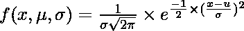

# 如何用 Python 制作钟形曲线？

> 原文:[https://www . geesforgeks . org/如何用 python 制作钟形曲线/](https://www.geeksforgeeks.org/how-to-make-a-bell-curve-in-python/)

统计学中的钟形曲线对应于正态分布或高斯分布，高斯分布是以德国数学家卡尔·弗里德里希·高斯的名字命名的。在正态分布中，点集中在平均值上，大多数点位于平均值附近。钟形曲线的方向取决于一组给定输入点的平均值和标准偏差值。通过改变平均值，我们可以改变曲线在轴上的位置，并且可以通过改变标准偏差值来控制曲线的形状。在本文中，我们将学习用 Python 绘制钟形曲线。

在正态分布中，平均值、中值和模都相等，钟形曲线关于平均值即 y 轴对称。正态分布的概率密度函数使用以下公式计算:



其中:

x =输入点，

 =平均值

 =输入值组的标准偏差

**例 1:创建简单的钟形曲线。**

**方法:**我们将列出 x 轴上的点，并将这些点传递到我们的自定义 pdf 函数中，以生成概率分布函数，从而生成对应于 x 中每个点的 y 值。现在，我们使用 matplotlib 库中可用的**绘图()**和**散射()**方法绘制曲线。plot()方法用于制作线图，而散点图()方法用于在图形内部创建点状点。

**代码:**

## 计算机编程语言

```py
# Importing libraries
import numpy as np
import matplotlib.pyplot as plt

# A custom function to calculate
# probability distribution function
def pdf(x):
    mean = np.mean(x)
    std = np.std(x)
    y_out = 1/(std * np.sqrt(2 * np.pi)) * np.exp( - (x - mean)**2 / (2 * std**2))
    return y_out

# To generate an array of x-values
x = np.arange(-2, 2, 0.1)

# To generate an array of
# y-values using corresponding x-values
y = pdf(x)

# Plotting the bell-shaped curve
plt.style.use('seaborn')
plt.figure(figsize = (6, 6))
plt.plot(x, y, color = 'black',
         linestyle = 'dashed')

plt.scatter( x, y, marker = 'o', s = 25, color = 'red')
plt.show()
```