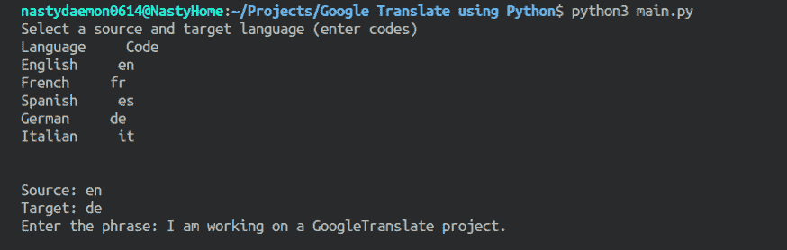
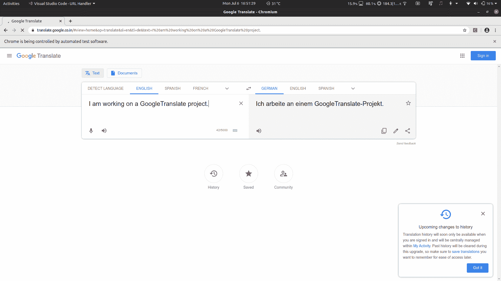
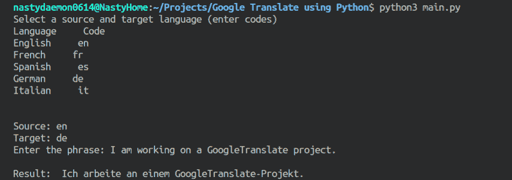

# 如何用 Python 做一个谷歌翻译 API？

> 原文:[https://www . geesforgeks . org/how-make-a-Google-translation-API-using-python/](https://www.geeksforgeeks.org/how-to-make-a-google-translation-api-using-python/)

谷歌翻译是一项免费的多语言翻译服务，基于统计和神经机器翻译，由谷歌开发。它被广泛用于将完整的网站或网页从一种语言翻译成另一种语言。

我们将创建一个 python 终端应用程序，它将采用源语言、目标语言、短语来翻译和返回翻译文本。我们将在 python 中使用 selenium 实现单元测试和网页抓取技术。网络废弃是一个从网站获取所需数据的概念。Selenium 是一个工业级库，用于各种软件的网页抓取和单元测试。作为先决条件，我们将要求在我们的系统中安装以下工具。

*   **Python 3.x:** 应该安装 python 3.0 或更高版本。
*   **硒库:**报废网站所需的 python 库。复制以下语句，在您的系统上安装 selenium。
    安装:python3 -m pip 安装硒
*   **web driver:**selenium 打开网页所需的 web 浏览器实例。从下面的链接下载最新版本的 Chrome Webdriver，并将其保存在主程序所在的文件夹中。
    链接:[https://chromedriver.chromium.org/downloads](https://chromedriver.chromium.org/downloads)

我们将把代码部分分成三个部分:

*   设置硒和铬网络驱动程序工具。
*   获取输入并测试输入中的错误。
*   使用谷歌翻译进行翻译。

**第 1 部分:设置 selenium 工具和网络驱动程序设置。**

```py
from selenium import webdriver
from selenium.webdriver.common.keys import Keys
from selenium.common.exceptions import NoSuchElementException
from selenium.common.exceptions import JavascriptException

# local variables
from selenium.webdriver.chrome.options import Options as ChromeOptions
chrome_op = ChromeOptions()
chrome_op.add_argument('--headless')
browser = webdriver.Chrome(executable_path ='chromedriver', options = chrome_op)
```

*   导入 webdriver 对象以连接到 chrome 浏览器实例。
*   导入键盘库以将基本键盘命令连接到浏览器实例。
*   为浏览器实例导入异常处理程序。
*   导入浏览器选项并设置“–headless”属性，以便在后台运行浏览器实例。注释“chrome _ op . add _ argument('–headless ')”语句，将 webdriver 带到前台进程。

**第 2 部分:输入和测试输入。**

```py
def takeInput():
    languages = {"English": 'en', "French": 'fr',
                 "Spanish": 'es', "German": 'de', "Italian": 'it'}

    print("Select a source and target language (enter codes)")
    print("Language", "   ", "Code")

    for x in languages:
        print(x, "   ", languages[x])

    print("\n\nSource: ", end ="")
    src = input()
    sflag = 0

    for x in languages:
        if(languages[x] == src and not sflag):
            sflag = 1
            break
    if(not sflag):
        print("Source code not from the list, Exiting....")
        exit()

    print("Target: ", end ="")
    trg = input()
    tflag = 0

    for x in languages:
        if(languages[x] == trg and not tflag):
            tflag = 1
            break

    if(not tflag):
        print("Target code not from the list, Exiting....")
        exit()

    if(src == trg):
        print("Source and Target cannot be same, Exiting...")
        exit()

    print("Enter the phrase: ", end ="")
    phrase = input()

    return src, trg, phrase
```

这是一个演示代码，因此语言代码仅限于{英语、西班牙语、德语、意大利语、法语}。您可以稍后添加更多语言及其代码。

*   获取源语言和目标语言代码的输入。
*   检查输入的代码是否受支持。
*   源语言和目标语言代码不应相同。

**第 3 部分:使用谷歌翻译进行翻译:**

```py
def makeCall(url, script, default):
    response = default
    try:
        browser.get(url)
        while(response == default):
            response = browser.execute_script(script)

    except JavascriptException:
        print(JavascriptException.args)

    except NoSuchElementException:
        print(NoSuchElementException.args)

    if(response != default):
        return response
    else:
        return 'Not Available'

def googleTranslate(src, trg, phrase):
    url = 'https://translate.google.co.in/# view = home&op = translate&sl =' + \
        src + '&tl =' + trg+'&text ='+phrase
    script = 'return document.getElementsByClassName("tlid-translation")[0].textContent'
    return makeCall(url, script, None)
```

*   googleTranslate()函数接收三个参数，即源代码、目标代码和短语。它生成浏览器请求的网址。
*   脚本包含一个 javascript 语句，该语句搜索带有 class = "tlid-translation "的 HTML 元素，并返回其文本内容。
*   makeCall()函数用创建的 URL 发出请求，当网页准备好时执行脚本并返回提取的文本。

**结合以上三个部分。**

```py
if __name__ == "__main__":
    src, trg, phrase = takeInput()
    print("\nResult: ", googleTranslate(src, trg, phrase))
```

将上面显示的所有部分粘贴在一个。py 文件并使用 Python3 执行它。

**执行:python 3<filename . py>T1】**

**输出:**

输入部分:



如果您对“–headless”属性语句进行了注释，则会出现如下所示的浏览器窗口:



结果将出现在终端窗口上，如下所示:



**注意:**这是演示项目，所以支持的语言有限。您可以通过在声明中添加更多的语言代码来增加语言支持。