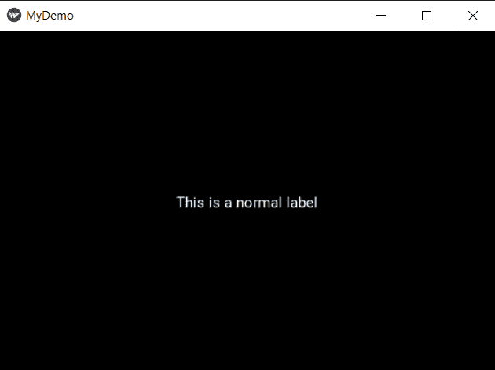

# 如何制作 kivy 标签多行文字？

> 原文:[https://www . geesforgeks . org/how-make-a-kivy-label-multiline-text/](https://www.geeksforgeeks.org/how-to-make-a-kivy-label-multiline-text/)

Kivy 是一个开源软件库，用于快速开发配备了新颖用户界面的应用程序，例如多点触控应用程序。使用电脑上的 Kivy，您可以创建运行在以下设备上的应用程序:

*   台式电脑:OS X、Linux、Windows。
*   IOS 设备:iPad、iPhone。
*   安卓设备:平板电脑、手机。
*   支持 TUIO(有形用户界面对象)的任何其他支持触摸的专业/家庭酿造设备。

## **基维标签**

标签小部件用于呈现文本。它支持 ascii 和 unicode 字符串。标签是我们想要添加到窗口上的文本，给按钮等等。在标签上，我们也可以应用样式，即增加文本、大小、颜色等。

**程序**

1.  使用 cmd 命令“pip install kivy”在您的电脑上安装 kivy
2.  导入 kivy 及其 App 模块，如下例所示
3.  创建继承应用程序模块的类
4.  在类中定义一个构建方法，并定义要在该方法中创建的标签，然后返回该标签
5.  为类创建一个对象
6.  最后对该对象使用 run()命令

**正常标签代码**

## 蟒蛇 3

```py
# make sure you have installed kivy for this to work
import kivy

# base Class of your App inherits from the App class.
# app:always refers to the instance of your application
from kivy.app import App

# if you not import label and use it it through error
from kivy.uix.label import Label

# defining the App class

class MyDemoApp(App):
    def build(self):
        # label display the text on screen
        ll = Label(text="This is a normal label")
        return ll

# creating the object
label = MyDemoApp()
# run the window
label.run()
```

**输出:**



**多行标签代码**

您可以使用每行末尾的“\n”轻松地使文本多行。

**例 1 :**

## 蟒蛇 3

```py
import kivy
from kivy.app import App
from kivy.uix.label import Label

class MyDemoApp(App):
    def build(self):
        ll = Label(text="This is a\nmultiline\nlabel")
        return ll

label = MyDemoApp()

label.run()
```