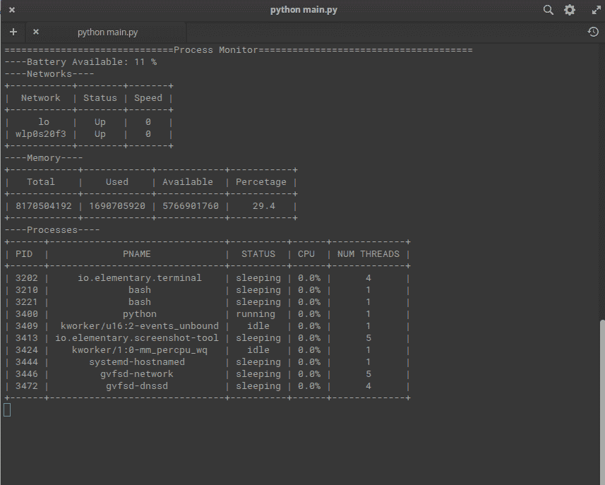

# 如何用 Python 制作过程监视器？

> 原文:[https://www . geesforgeks . org/如何用 python 制作进程监视器/](https://www.geeksforgeeks.org/how-to-make-a-process-monitor-in-python/)

进程监视器是一种显示系统信息的工具，如进程、内存、网络和其他东西。有很多可用的工具，但是我们可以使用 Python 制作自己的过程监视器。在 Python 中，有一个名为 **psutil** 的模块，我们可以用它来获取关于我们系统的各种信息

## 需要的模块

*   **psutil** :在终端输入以下命令，安装该模块。

```
python3 -m pip install psutil 
```

*   **可修改:**要在控制台上打印数据，我们可以使用格式化模块**可修改**:

```
python3 -m pip install prettytable
```

## 使用 psutil

**psutil** 提供了许多监控系统的功能。我们将简要地看到其中的一些:

*   **首先，我们需要导入 psutil:**

```
import psutil
```

*   **列出流程标识:**

```
psutil.pids()  # [1,2,.....4352]
```

*   **获取流程信息:**

```
process_id = 1
psutil.Process(process_id)  
# psutil.Process(pid=1, name='systemd', status='sleeping', started='19:49:25')
```

*   **我们可以访问这个过程的各种按键:**

```
process = psutil.Process(process_id)
process.name()
process.status()
```

*   **访问电池状态:**

```
psutil.sensors_battery()    
psutil.sensors_battery().percent
```

*   **访问网络接口:**

```
psutil.net_if_stats()  
psutil.net_if_stats()['wlo1'].isup    # True
```

*   **我们也可以检查一下记忆:**

```
psutil.virtual_memory()
psutil.virtual_memory().total    # 8180498432 (In Bytes)
psutil.virtual_memory().used    # 2155720704
psutil.virtual_memory().available   # 5563060224
```

既然我们知道了一些基本特性，我们就可以实现过程监视器了。创建一个新的 python 文件，并在其中添加以下代码。下面的代码适用于 Linux 发行版。对于其他操作系统，某些功能可能略有不同。

**进场:**

*   导入所需的包。
*   使用子流程模块的 call()函数清除控制台。我们可以根据操作系统使用“清除”或“cls”命令。
*   获取电池信息
*   获取网络信息并将其打印为可打印
*   获取内存信息
*   获取过程信息
*   制造延迟。我们用时间创造了 1 秒钟的延迟
*   按 CTRL+C 停止程序。

**下面是实现:**

## 蟒蛇 3

```
# Import the required libraries
import psutil
import time
from subprocess import call
from prettytable import PrettyTable

# Run an infinite loop to constantly monitor the system
while True:

    # Clear the screen using a bash command
    call('clear')

    print("==============================Process Monitor\
    ======================================")

    # Fetch the battery information
    battery = psutil.sensors_battery().percent 
    print("----Battery Available: %d "%(battery,) + "%")

    # We have used PrettyTable to print the data on console.
    # t = PrettyTable(<list of headings>)
    # t.add_row(<list of cells in row>)

    # Fetch the Network information
    print("----Networks----")
    table = PrettyTable(['Network', 'Status', 'Speed'])
    for key in psutil.net_if_stats().keys():
        name = key
        up = "Up" if psutil.net_if_stats()[key].isup else "Down"
        speed = psutil.net_if_stats()[key].speed
        table.add_row([name, up, speed])
    print(table)

    # Fetch the memory information
    print("----Memory----")
    memory_table = PrettyTable(["Total", "Used",
                                "Available", "Percentage"])
    vm = psutil.virtual_memory()
    memory_table.add_row([
        vm.total,
        vm.used,
        vm.available,
        vm.percent
    ])
    print(memory_table)

    # Fetch the last 10 processes from available processes
    print("----Processes----")
    process_table = PrettyTable(['PID', 'PNAME', 'STATUS',
                                 'CPU', 'NUM THREADS'])

    for process in psutil.pids()[-10:]:

        # While fetching the processes, some of the subprocesses may exit
        # Hence we need to put this code in try-except block
        try:
            p = psutil.Process(process)
            process_table.add_row([
                str(process),
                p.name(),
                p.status(),
                str(p.cpu_percent())+"%",
                p.num_threads()
                ])

        except Exception as e:
            pass
    print(process_table)

    # Create a 1 second delay
    time.sleep(1)
```

**输出:**

