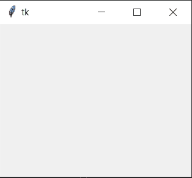
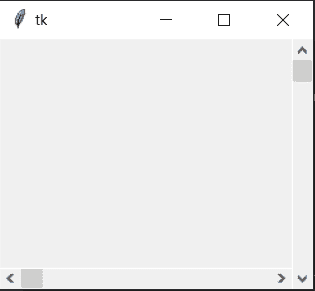
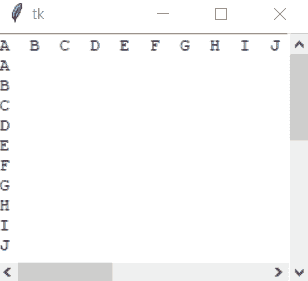

# 如何在 Tkinter 中制作合适的双滚动条框架

> 原文:[https://www . geesforgeks . org/how-to-make-a-professional-double-scroll bar-frame-in-tkinter/](https://www.geeksforgeeks.org/how-to-make-a-proper-double-scrollbar-frame-in-tkinter/)

**Tkinter** 是一个绑定到 Tk GUI(图形用户界面)工具包的 Python。它是 Tcl/Tk 之上的一个面向对象的薄层。当与 Python 结合时，它有助于创建快速高效的图形用户界面应用程序。

**注意:**更多信息请参考 [Python GUI-tkinter](https://www.geeksforgeeks.org/python-gui-tkinter/)

#### 在 Tkinter 中创建双滚动条框架的步骤

**1)** 首先，模块 Tkinter 将导入为:

```
import tkinter as tk 
```

所以， **tkinter** 在这里缩写为 **tk** ，这样可以让代码看起来更干净高效。

现在，将创建一个窗口来显示:

```
import tkinter as tk 

window = tk.Tk()
window.geometry("250x200")
```

**输出:**


**要理解的功能:**

*   **几何():**该方法用于设置 Tkinter 窗口的尺寸，也用于设置主窗口在用户桌面上的位置。

**2)** 下一个代码是分配给滚动条的水平和垂直。

```
SVBar = tk.Scrollbar(window)
SVBar.pack (side = tk.RIGHT,
            fill = "y")

SHBar = tk.Scrollbar(window, 
                     orient = tk.HORIZONTAL)
SHBar.pack (side = tk.BOTTOM, 
            fill = "x")
```

**输出:**



**要理解的功能:**

*   **滚动条()** =它是分配给窗口侧面的滚动条。
*   **pack()** 方法:它将小部件组织成块，然后放入父小部件中。

**3)** 现在，为窗口制作一个文本框:

```
TBox = tk.Text(window,
               height = 500,
               width = 500,
               yscrollcommand = SVBar.set,
               xscrollcommand = SHBar.set, 
               wrap = "none")

TBox = tk.Text(window, 
               height = 500,
               width = 500, 
               yscrollcommand = SVBar.set, 
               xscrollcommand = SHBar.set, 
               wrap = "none")

TBox.pack(expand = 0, fill = tk.BOTH)
```

**要理解的功能:**

*   **Text()** =它是一个标准 Tkinter 小部件的文本框小部件，用于显示文本。
*   **pack()** =它是一个几何管理器，用于在将小部件放入父小部件之前将它们组织成块。函数中使用了填充、扩展和侧边等选项。

```
SHBar.config(command = TBox.xview)
SVBar.config(command = TBox.yview)
```

这里，在函数`config()`的参数中，滚动条被分配在它们特定的 x 轴和 y 轴上，并且能够起作用。

现在，插入一些要显示的文本:

> num _ vertical =(" \ na \ nb \ NC \ nd \ n \ nf \ ng \ NH \ ni \ NJ \ NK \ nl \ nm \ nn \ no \ NP \ NQ \ NR \ ns \ n \ nu \ NV \ NW \ NX \ ny \ NZ ")
> num _ horizontal = "[阿、中、英、法、俄、西 k l m n o p q s t u v w x y z ")

要在窗口中插入文本进行显示，请执行以下代码:

```
TBox.insert(tk.END, Num_Horizontal)
TBox.insert(tk.END, Num_Vertical)
```

**完整代码:**

```
import tkinter as tk

Num_Vertical = ("\nA\nB\nC\nD\nE\nF\nG\n\
H\nI\nJ\nK\nL\nM\nN\nO\nP\nQ\nR\nS\nT\n\
U\nV\nW\nX\nY\nZ")
Num_Horizontal = ("A  B  C  D  E  F  G  H \
I  J  K  L  M  N  O  P  Q  R  S  T  U  V \
W  X  Y  Z")

window = tk.Tk()
window.geometry("250x200")

SVBar = tk.Scrollbar(window)
SVBar.pack (side = tk.RIGHT, 
            fill = "y")

SHBar = tk.Scrollbar(window, 
                     orient = tk.HORIZONTAL)
SHBar.pack (side = tk.BOTTOM, 
            fill = "x")

TBox = tk.Text(window, 
               height = 500, 
               width = 500,
               yscrollcommand = SVBar.set,
               xscrollcommand = SHBar.set, 
               wrap = "none")

TBox = tk.Text(window,
               height = 500,
               width = 500,
               yscrollcommand = SVBar.set, 
               xscrollcommand = SHBar.set, 
               wrap = "none")

TBox.pack(expand = 0, fill = tk.BOTH)

TBox.insert(tk.END, Num_Horizontal)
TBox.insert(tk.END, Num_Vertical)

SHBar.config(command = TBox.xview)
SVBar.config(command = TBox.yview)

window.mainloop()
```

**输出:**

