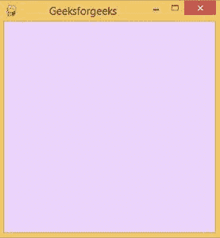

# 如何制作 PyGame 窗口？

> 原文:[https://www.geeksforgeeks.org/how-to-make-a-pygame-window/](https://www.geeksforgeeks.org/how-to-make-a-pygame-window/)

**PyGame** 是一个免费开源的跨平台库，用于 Python 中的游戏开发。它是由 Pete Shinners 正式编写的，以取代 PySDL。它适用于创建客户端应用程序，并充当独立的可执行文件。在本文中，我们将看到如何用 Python 制作 Pygame 窗口。

**在基于 Windows 的系统上安装 pygame 的命令:**

```
pip install pygame
```

**制作 pygame 窗口的步骤:**

*   导入 pygame 模块
*   使用 pygame.display.set_mode()方法创建 pygame 窗口对象。它需要两个参数来定义窗口的宽度和高度。
*   可以更改窗口属性，例如可以使用 set_caption()方法设置窗口的标题。背景颜色可以通过使用从 0 到 255 的三元组整数填充屏幕对象并分别表示 RGB 值来改变。
*   使用 flip()方法显示窗口。一旦这个方法被调用，代码到达它的末尾，程序终止。
*   为了保持窗口可见而不突然终止，可以在代码中添加一个无限循环。但是，即使用户想要，程序也不会退出。用户必须在命令行中使用 CTRL+C 来强制结束程序。
*   要在用户不选择关闭窗口的情况下显示窗口，请使用 pygame.event.get()方法。此方法返回事件列表。要停止窗口显示，必须循环并检查事件的类型是否为退出。如果被发现，人们可以很容易地退出循环。

**示例:**

## 蟒蛇 3

```
# import the pygame module
import pygame

# Define the background colour
# using RGB color coding.
background_colour = (234, 212, 252)

# Define the dimensions of
# screen object(width,height)
screen = pygame.display.set_mode((300, 300))

# Set the caption of the screen
pygame.display.set_caption('Geeksforgeeks')

# Fill the background colour to the screen
screen.fill(background_colour)

# Update the display using flip
pygame.display.flip()

# Variable to keep our game loop running
running = True

# game loop
while running:

# for loop through the event queue  
    for event in pygame.event.get():

        # Check for QUIT event      
        if event.type == pygame.QUIT:
            running = False
```

**输出:**

