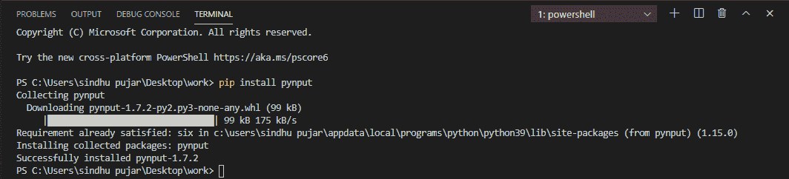
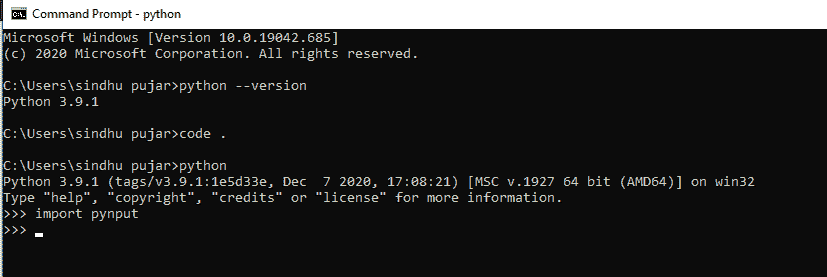

# 如何制作 Python 自动点击器？

> 原文:[https://www . geesforgeks . org/如何制作 python-自动点击器/](https://www.geeksforgeeks.org/how-to-make-a-python-auto-clicker/)

在本文中，我们将看到如何使用 Python 创建自动点击器。当用户点击开始键时，代码将从键盘获取输入，当用户点击退出键时，自动点击器终止，自动点击器开始点击屏幕上指针所在的位置。我们将在这里使用 **pynput** 模块。

## 什么是自动点击器？

自动点击器是一个脚本，您可以根据需要自动控制鼠标和键盘的次数。它使用用户定义的键来控制。它可以在各种平台上工作，如视窗、苹果和 Linux。 **pywin32 模块中存在自动点击器。**

### 方法:

在这个项目中，我们将使用跨平台模块 **pynput** 来控制鼠标，同时监控键盘，以创建简单的自动点击器。为了检查鼠标事件，我们将为此执行安装 **pynput 模块**(用于控制鼠标)， **pip 在 cmd 中安装 pynput** 。

**注意:**如果你对如何在你的系统上设置 python-pip 包有疑问，那么[点击这里](https://www.geeksforgeeks.org/how-to-install-pip-on-windows/)



pynput 模块的安装

验证 **pynput** 模块是否已成功安装到您的工作环境中。为此，请在系统上打开 IDLE，即 **cmd** 或 **Python Shell。**执行命令**导入 pynput，**执行此命令后，输出应为零错误，这意味着您的模块已成功安装。



验证模块安装

### 实施:

现在让我们继续使用 Python 构建**自动点击器**所需的代码。按照以下步骤创建自动点击器:

**第一步:**导入时间和线程，然后从 **pynput.mouse** 模块导入按钮和控制器。从 **pynput.keyboard 导入*监听器*和*键码***

## 蟒蛇 3

```
# importing time and threading
import time
import threading
from pynput.mouse import Button, Controller

# pynput.keyboard is used to watch events of
# keyboard for start and stop of auto-clicker
from pynput.keyboard import Listener, KeyCode
```

**步骤 2:** 如下所述创建四个变量，

*   **延迟**:每次点击之间的延迟(秒)
*   **按钮**:按钮是用来点击你想点击的任何方向。**按钮左|按钮中|按钮右**
*   **start_stop_key** :运行自动点击器执行程序时，用于点击开始和停止的键。它应该来自一个密钥类或使用*密钥代码*设置。
*   **退出 _ 键**:用于终止正在执行的自动点击器的键。这应该来自钥匙类或使用*钥匙代码*设置。

## 蟒蛇 3

```
# four variables are created to
# control the auto-clicker
delay = 0.001
button = Button.right
start_stop_key = KeyCode(char='a')
stop_key = KeyCode(char='b')
```

**步骤 3:** 创建一个扩展**线程的类。**将延迟和按钮传递给有两个标志的类，以检查程序是否执行。

## 蟒蛇 3

```
# threading.Thread is used 
# to control clicks
class ClickMouse(threading.Thread):

  # delay and button is passed in class 
  # to check execution of auto-clicker
    def __init__(self, delay, button):
        super(ClickMouse, self).__init__()
        self.delay = delay
        self.button = button
        self.running = False
        self.program_running = True
```

**第四步:**增加外部控制线程的方法。

## 蟒蛇 3

```
def start_clicking(self):
        self.running = True

def stop_clicking(self):
        self.running = False

def exit(self):
        self.stop_clicking()
        self.program_running = False
```

**步骤 5:** 当线程开始时，创建一个方法，*程序 _running* 在循环上运行，直到该值为真，并在现有循环内创建另一个循环，检查运行的**是否设置为真。在这种情况下，我们都在两个环路内，它会在设置按钮上*点击*，并休眠设置的延迟。**

## 蟒蛇 3

```
# method to check and run loop until 
# it is true another loop will check 
# if it is set to true or not, 
# for mouse click it set to button 
# and delay.
def run(self):
    while self.program_running:
        while self.running:
            mouse.click(self.button)
            time.sleep(self.delay)
        time.sleep(0.1)
```

**步骤 6:** 为鼠标控制器创建一个实例，然后创建**点击鼠标线程**。启动实例，进入 run 方法内部的循环。

## 蟒蛇 3

```
# instance of mouse controller is created
mouse = Controller()
click_thread = ClickMouse(delay, button)
click_thread.start()
```

**第七步:**创建一个方法 **on_press** ，该方法以一个键为参数，设置一个键盘监听器。执行时*启停键*与**启动键(a)** 匹配。那么当线程中的运行标志设置为真时，点击将被终止。如果执行**退出键(b)** 并停止监听器，则在方法中调用退出方法。

## 蟒蛇 3

```
# on_press method takes
# key as argument

def on_press(key):

  # start_stop_key will stop clicking
  # if running flag is set to true
    if key == start_stop_key:
        if click_thread.running:
            click_thread.stop_clicking()
        else:
            click_thread.start_clicking()

    # here exit method is called and when
    # key is pressed it terminates auto clicker
    elif key == stop_key:
        click_thread.exit()
        listener.stop()

with Listener(on_press=on_press) as listener:
    listener.join()
```

代码运行后，我们可以在如下所示的输出中看到，它显示了代码实现后自动点击器的点击次数。兼容 Windows、Mac、Linux。自动点击器是系统的有用软件，因为它让我们节省了重复点击的合理时间。

**下面是完整的程序:**

## 蟒蛇 3

```
# importing time and threading
import time
import threading
from pynput.mouse import Button, Controller

# pynput.keyboard is used to watch events of 
# keyboard for start and stop of auto-clicker
from pynput.keyboard import Listener, KeyCode

# four variables are created to 
# control the auto-clicker
delay = 0.001
button = Button.right
start_stop_key = KeyCode(char='a')
stop_key = KeyCode(char='b')

# threading.Thread is used 
# to control clicks
class ClickMouse(threading.Thread):

  # delay and button is passed in class 
  # to check execution of auto-clicker
    def __init__(self, delay, button):
        super(ClickMouse, self).__init__()
        self.delay = delay
        self.button = button
        self.running = False
        self.program_running = True

    def start_clicking(self):
        self.running = True

    def stop_clicking(self):
        self.running = False

    def exit(self):
        self.stop_clicking()
        self.program_running = False

    # method to check and run loop until 
    # it is true another loop will check 
    # if it is set to true or not, 
    # for mouse click it set to button 
    # and delay.
    def run(self):
        while self.program_running:
            while self.running:
                mouse.click(self.button)
                time.sleep(self.delay)
            time.sleep(0.1)

# instance of mouse controller is created
mouse = Controller()
click_thread = ClickMouse(delay, button)
click_thread.start()

# on_press method takes 
# key as argument
def on_press(key):

  # start_stop_key will stop clicking 
  # if running flag is set to true
    if key == start_stop_key:
        if click_thread.running:
            click_thread.stop_clicking()
        else:
            click_thread.start_clicking()

    # here exit method is called and when 
    # key is pressed it terminates auto clicker
    elif key == stop_key:
        click_thread.exit()
        listener.stop()

with Listener(on_press=on_press) as listener:
    listener.join()
```

现在让我们执行我们编写的 python 程序，然后按下 **start (a)** 和 **stop (a)** 键，以启动自动点击器。

**输出:**

<video class="wp-video-shortcode" id="video-543452-1" width="640" height="360" preload="metadata" controls=""><source type="video/mp4" src="https://media.geeksforgeeks.org/wp-content/uploads/20210118170728/bandicam-2021-01-18-17-05-46-930.mp4?_=1">[https://media.geeksforgeeks.org/wp-content/uploads/20210118170728/bandicam-2021-01-18-17-05-46-930.mp4](https://media.geeksforgeeks.org/wp-content/uploads/20210118170728/bandicam-2021-01-18-17-05-46-930.mp4)</video>