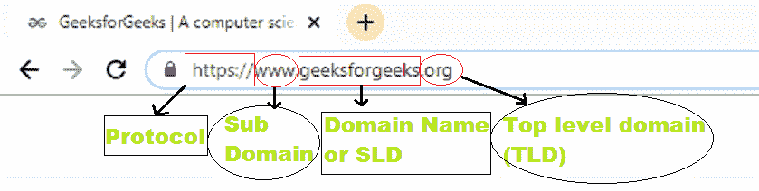
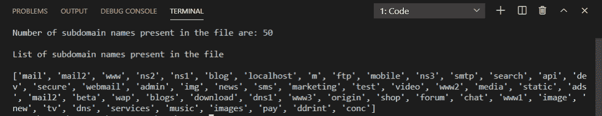
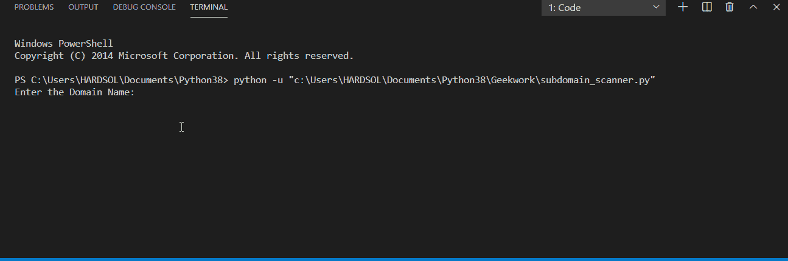

# 如何用 Python 制作子域扫描器？

> 原文:[https://www . geesforgeks . org/如何制作 python 中的子域扫描器/](https://www.geeksforgeeks.org/how-to-make-a-subdomain-scanner-in-python/)

在本文中，我们将使用 Python 中的 [requests](https://www.geeksforgeeks.org/python-requests-tutorial/#:~:text=Python%20requests%20module%20has%20several,a%20client%20and%20a%20server.) 模块来扫描子域，该模块允许我们轻松地发出 HTTPS 请求以从网站获取信息。要安装请求模块，请在命令提示符下编写以下命令。

```py
pip install requests
```

统一资源定位符主要由四部分组成:

*   草案
*   子域
*   域名或二级域名
*   顶级域名(TLD)

下图演示了网址的所有四个部分。



子域被定义为域名和域扩展名之前的域部分，即顶级域(TLD)。子域用于将网页内容组织或划分为不同的部分。子域帮助我们把我们的网站分成几个部分，子域被视为不同的网站。

**使用的子域文件:**

```py
mail
mail2
www
ns2
ns1
blog
localhost
m
ftp
mobile
ns3
smtp
search
api
dev
secure
webmail
admin
img
news
sms
marketing
test
video
www2
media
static
ads
mail2
beta
wap
blogs
download
dns1
www3
origin
shop
forum
chat
www1
image
new
tv
dns
services
music
images
pay
ddrint
conc
```

**进场:**

*   首先，我们在文本文件中有一个子域名称列表，通过输入网址来扫描这些子域，您可以从谷歌获得这个子域列表。
*   现在，我们必须通过将 f 字符串与协议、子域和域名连接或使用来创建 URL。
*   我们必须使用 for 循环将子域逐个放入 URL 中进行扫描。
*   为了避免程序在域名子域无效时崩溃，我们必须使用一个 try-catch 块来跳过那个无效的子域，并在 catch 块的帮助下传递它，并在 catch 块的帮助下扫描即将到来的子域，扫描应该在请求模块的帮助下完成，因为特定的网址获取请求应该根据服务器响应网址发送到服务器。
*   一旦子域被扫描并有效，网址就会被打印出来。

**所需步骤**

*   导入请求模块
*   创建一个扫描子域的函数，并将域名和子域列表作为参数传递。
*   为列表中的每个子域运行 for 循环，并将子域与 URL 序列中的协议和域名连接起来，并将其存储在名为“URL”的变量 let 中。
*   现在我们使用 requests.get()函数，在该过程中，通过使用给定的 URL 从给定的服务器中检索信息，如果我们能够从服务器中检索信息，这意味着该子域在该域名下是有效的，否则我们将传递它，因为我们在 try block 中使用了 try 和 catch block。我们将传递 requests . get()函数，扫描后，我们将打印该 URL，否则我们将在 catch block 中捕获并传递。
*   然后创建主功能，在取用户输入的域名。
*   然后以读取模式从存储器中打开子域文本文件列表，以扫描每个子域。
*   在读取模式下打开文件后，我们使用 splitlines()函数将拆分的字符串存储在名为“sub_dom”的变量 let 中。
*   现在调用我们创建的绕过域名和子 dom 扫描子域的函数。

**显示文本文件中存在的子域名称，并创建该子域的** **列表。**

## 计算机编程语言

```py
# opening the subdomain text file in the read mode
with open('subdomain_names.txt','r') as file:

    # reading the file
    name = file.read()

    # using spilitlines() function storing the list
    # of spitted strings
    sub_dom = name.splitlines()

    # printing number of subdomain names present in
    # the list
    print(f"Number of subdomain names present in the file are: {len(sub_dom)}\n")

    # printing list of subdomain names present in the 
    # text file
    print("List of subdomain names present in the file\n")
    print(sub_dom)
```

**输出:**



在上面的代码中，我们从存储中打开文本文件，其中存在我们必须扫描的子域名称，并且在读取模式下从存储中打开文件后，我们在该文件中列出内容，打印文件中存在的子域名称的数量，并打印子域名称列表。

文本文件只包含 50 个子域名进行演示，您可以根据需要选择任意数量的子域进行扫描。所以在上面的输出图像中，子域列表被打印出来，我们将在接下来的例子中扫描它。

我们将使用这段代码扫描子域。

**示例 1:使用 Python 的子域扫描器程序。**

## 计算机编程语言

```py
# importing module
import requests

# function for scanning subdomains
def domain_scanner(domain_name,sub_domnames):
    print('----URL after scanning subdomains----')

    # loop for getting URL's
    for subdomain in sub_domnames:

        # making url by putting subdomain one by one
        url = f"https://{subdomain}.{domain_name}"

        # using try catch block to avoid crash of the
        # program
        try:
            # sending get request to the url
            requests.get(url)

            # if after putting subdomain one by one url 
            # is valid then printing the url
            print(f'[+] {url}')

            # if url is invalid then pass it
        except requests.ConnectionError:
            pass

# main function
if __name__ == '__main__':

    # inputting the domain name
    dom_name = input("Enter the Domain Name:")

    # openning the subdomain text file
    with open('subdomain_names1.txt','r') as file:

        # reading the file
        name = file.read()

        # using spilitlines() function storing the list
        # of splitted strings
        sub_dom = name.splitlines()

    # calling the function for scanning the subdomains
    # and getting the url
    domain_scanner(dom_name,sub_dom)

```

**输出:**


扫描时间将取决于您正在扫描的子域的数量，为了演示，我在文本文件中有一些子域的名称，您可以添加任意数量的要扫描的子域。

**示例 2:使用 Python 的维基百科子域扫描器。**

## 计算机编程语言

```py
# importing library
import requests

# function for scanning subdomains
def domain_scanner(domain_name,sub_domnames):
    print('-----------Scanner Started-----------')
    print('----URL after scanning subdomains----')

    # loop for getting URL's
    for subdomain in sub_domnames:

        # making url by putting subdomain one by one
        url = f"https://{subdomain}.{domain_name}"

        # using try catch block to avoid crash of
        # the program
        try:

            # sending get request to the url
            requests.get(url)

            # if after putting subdomain one by one url 
            # is valid then printing the url
            print(f'[+] {url}')

        # if url is invalid then pass it
        except requests.ConnectionError:
            pass
    print('\n')
    print('----Scanning Finished----')
    print('-----Scanner Stopped-----')

# main function
if __name__ == '__main__':

    # inputting the domain name
    dom_name = input("Enter the Domain Name:")
    print('\n')

    # openning the subdomain text file
    with open('subdomain_names1.txt','r') as file:

        # reading the file
        name = file.read()

        # using spilitlines() function storing the 
        # list of splitted strings
        sub_dom = name.splitlines()

    # calling the function for scanning the subdomains
    # and getting the url
    domain_scanner(dom_name,sub_dom)
```

**输出:**

