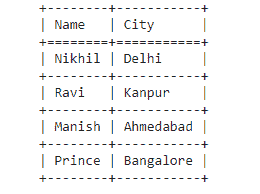
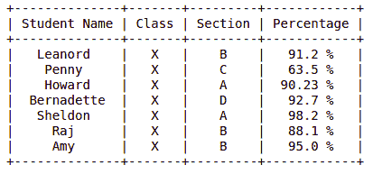

# 如何用 Python 制作表格？

> 原文:[https://www . geesforgeks . org/如何用 python 制作表格/](https://www.geeksforgeeks.org/how-to-make-a-table-in-python/)

在本文中，我们将讨论如何用 Python 制作表格。Python 为可用于创建不同目的的库提供了广泛的支持。在本文中，我们将讨论两个可以用来创建表的模块。

**方法 1:** 使用制表模块

***制表()*** 方法是 ***制表*** 模块中的一种方法，它使用任何给定的输入在 python 程序中创建基于文本的表格输出。可以使用以下命令安装它

```py
pip install tabulate
```

下面是一些描述如何用 python 创建表的例子:

**例 1**

## 蟒蛇 3

```py
# import module
from tabulate import tabulate

# assign data
mydata = [{"Nikhil", "Delhi"}, 
          {"Ravi", "Kanpur"}, 
          {"Manish", "Ahmedabad"}, 
          {"Prince", "Bangalore"}]

# create header
head = ["Name", "City"]

# display table
print(tabulate(mydata, headers=head, tablefmt="grid"))
```

**输出:**



**例 2**

## 蟒蛇 3

```py
# import module
from tabulate import tabulate

# assign data
mydata = [{'a', 'b', 'c'},
          {12, 34, 56},
          {'Geeks', 'for', 'geeks!'}]

# display table
print(tabulate(mydata))
```

**输出:**


**方法 2:** 使用[可修改模块](https://www.geeksforgeeks.org/creating-tables-with-prettytable-library-python/)

prettable 库中的 prettable 类用于在 Python 中创建关系表。可以使用下面的命令安装它。

```py
pip install prettytable 
```

**示例:**

## 蟒蛇 3

```py
from prettytable import PrettyTable 

# Specify the Column Names while initializing the Table 
myTable = PrettyTable(["Student Name", "Class", "Section", "Percentage"]) 

# Add rows 
myTable.add_row(["Leanord", "X", "B", "91.2 %"]) 
myTable.add_row(["Penny", "X", "C", "63.5 %"]) 
myTable.add_row(["Howard", "X", "A", "90.23 %"]) 
myTable.add_row(["Bernadette", "X", "D", "92.7 %"]) 
myTable.add_row(["Sheldon", "X", "A", "98.2 %"]) 
myTable.add_row(["Raj", "X", "B", "88.1 %"]) 
myTable.add_row(["Amy", "X", "B", "95.0 %"]) 

print(myTable)
```

**输出:**

