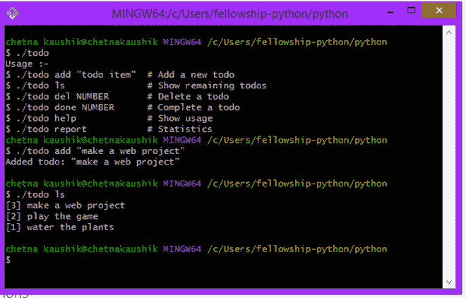
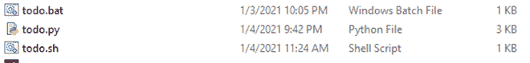
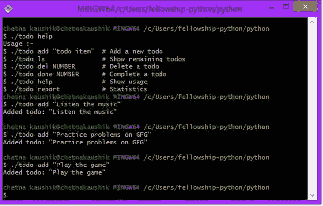
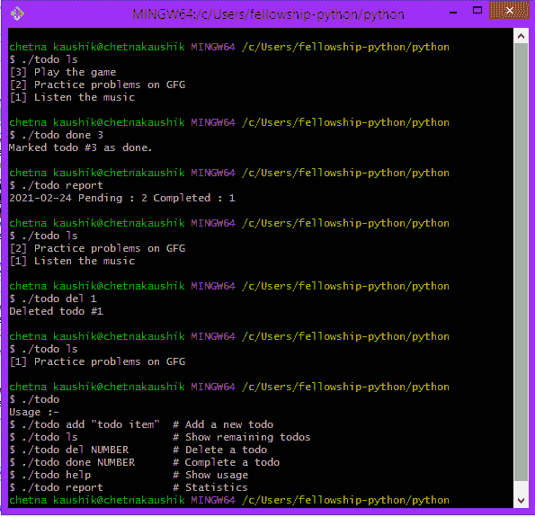

# 如何用 Python 做一个 Todo List CLI 应用？

> 原文:[https://www . geesforgeks . org/how-to-make-to-list-CLI-application-use-python/](https://www.geeksforgeeks.org/how-to-make-a-todo-list-cli-application-using-python/)

在本文中，我们将看到如何用 python 制作一个命令行应用程序待办事项列表。Todo 列表是一个用户可以添加项目的基本应用程序。它是你需要完成的任务或你想做的事情的列表。在待办事项中，列表任务按优先级顺序排列。你应该使用待办事项清单的一个最重要的原因是，它会帮助你保持条理。

在本文中，我们使用命令行制作一个待办事项列表。通过使用待办事项列表作为命令行应用程序，我们可以通过命令提示符来组织我们的待办事项列表，并且我们不需要显式运行任何脚本或程序。

**待办事项的基本功能有:**

*   添加新的待办事项
*   删除待办事项
*   完成任务
*   显示剩余待办事项
*   显示待办事项的统计数据



例子

**注意:**在 Windows 命令提示符下运行应用→键入 todo 或。\todo

```
In shell or git bash  -->     type ./todo
```

*   要创建待办事项列表应用程序，我们必须遵循以下步骤:
*   创建一个名为 todolist 的文件夹
*   在创建的文件夹中创建一个文件 todo.py
*   如果你是寡妇用户，那么创建另一个文件 todo.bat 文件。这是批处理文件。它用于运行 python 脚本
*   如果你是 Linux 用户，那么创建一个名为 todo.sh 的文件，用于运行 python 脚本。



全部。bat:

```
@echo off
python3 todo.py %1 %2
```

全部。sh:

```
python todo.py "$@"
```

**创建可执行文件的符号链接:**

在窗口中(在命令提示符或 Powershell 中)

要在 Windows 上创建符号链接，您需要以管理员权限**运行 Windows 命令提示符或 Windows Powershell * *。为此，右键单击命令提示符或 Powershell 的图标，然后选择 _“以管理员身份运行”选项。

```
mklink todo todo.bat
```

在 Linux 或 shell 中(作为 git bash)

```
$ ln -s todo.sh todo
```

**现在我们要对待办事项列表的功能进行编码。**

所以我们用 todo.py 编写代码

## 蟒蛇 3

```
# module required
import sys
import datetime
```

**帮助功能:**帮助功能用于提供用户如何使用待办事项列表的方式。而帮助功能就像 todo 应用程序的文档。

## 蟒蛇 3

```
# help function
def help():
    sa = """Usage :-
$ ./todo add "todo item"  # Add a new todo
$ ./todo ls               # Show remaining todos
$ ./todo del NUMBER       # Delete a todo
$ ./todo done NUMBER      # Complete a todo
$ ./todo help             # Show usage
$ ./todo report           # Statistics"""
    sys.stdout.buffer.write(sa.encode('utf8'))
```

**在待办事项列表中添加项目的功能**:添加功能用于在待办事项列表中添加新的项目

## 蟒蛇 3

```
# function to add item in todo list
def add(s):

    f = open('todo.txt', 'a')
    f.write(s)
    f.write("\n")
    f.close()
    s = '"'+s+'"'
    print(f"Added todo: {s}")
```

**打印待办事项功能用来打印我们的待办事项列表中存在的项目。待办事项按升序打印。**

## 蟒蛇 3

```
# Function to print the todo list items
def ls():

    try:

        nec()
        l = len(d)
        k = l

        for i in d:
            sys.stdout.buffer.write(f"[{l}] {d[l]}".encode('utf8'))
            sys.stdout.buffer.write("\n".encode('utf8'))
            l = l-1

    except Exception as e:
        raise e
```

**完成任务的函数:**函数定义已完成的任务，该已完成的任务被添加到 done.txt 中。

## 蟒蛇 3

```
# Function to Complete a todo
def done(no):
    try:

        nec()
        no = int(no)
        f = open('done.txt', 'a')
        st = 'x '+str(datetime.datetime.today()).split()[0]+' '+d[no]

        f.write(st)
        f.write("\n")
        f.close()
        print(f"Marked todo #{no} as done.")

        with open("todo.txt", "r+") as f:
            lines = f.readlines()
            f.seek(0)

            for i in lines:
                if i.strip('\n') != d[no]:
                    f.write(i)
            f.truncate()
    except:
        print(f"Error: todo #{no} does not exist.")
```

**显示 todolist 统计数据的功能:**使用“报表”功能显示完整的统计数据。它打印已完成任务的总数和待定任务的总数。

## 蟒蛇 3

```
# Function to show report/statistics of todo list
def report():
    nec()
    try:

        nf = open('done.txt', 'r')
        c = 1

        for line in nf:
            line = line.strip('\n')
            don.update({c: line})
            c = c+1
        print(
            f'{str(datetime.datetime.today()).split()[0]} Pending : {len(d)} Completed : {len(don)}')

    except:
        print(
            f'{str(datetime.datetime.today()).split()[0]} Pending : {len(d)} Completed : {len(don)}')
```

**从待办事项列表中删除项目的功能:** deL 功能用于从待办事项列表中删除项目。它根据项目编号删除待办事项

## 蟒蛇 3

```
# code
def deL(no):
    try:
        no = int(no)
        nec()

        # utility function defined in main
        with open("todo.txt", "r+") as f:
            lines = f.readlines()
            f.seek(0)

            for i in lines:
                if i.strip('\n') != d[no]:
                    f.write(i)
            f.truncate()
        print(f"Deleted todo #{no}")

    except Exception as e:

        print(f"Error: todo #{no} does not exist. Nothing deleted.")
```

**主要功能和效用功能**

## 蟒蛇 3

```
# code
def nec():

  # utility function used in done and report function
    try:
        f = open('todo.txt', 'r')
        c = 1
        for line in f:
            line = line.strip('\n')
            d.update({c: line})
            c = c+1
    except:
        sys.stdout.buffer.write("There are no pending todos!".encode('utf8'))

# Main program
if __name__ == '__main__':
    try:
        d = {}
        don = {}
        args = sys.argv

        if(args[1] == 'del'):
            args[1] = 'deL'

        if(args[1] == 'add' and len(args[2:]) == 0):
            sys.stdout.buffer.write(
                "Error: Missing todo string. Nothing added!".encode('utf8'))

        elif(args[1] == 'done' and len(args[2:]) == 0):
            sys.stdout.buffer.write(
                "Error: Missing NUMBER for marking todo as done.".encode('utf8'))

        elif(args[1] == 'deL' and len(args[2:]) == 0):
            sys.stdout.buffer.write(
                "Error: Missing NUMBER for deleting todo.".encode('utf8'))
        else:
            globals()[args[1]](*args[2:])

    except Exception as e:

        s = """Usage :-
$ ./todo add "todo item"  # Add a new todo
$ ./todo ls               # Show remaining todos
$ ./todo del NUMBER       # Delete a todo
$ ./todo done NUMBER      # Complete a todo
$ ./todo help             # Show usage
$ ./todo report           # Statistics"""
        sys.stdout.buffer.write(s.encode('utf8'))
```

**下面是实现:**

## 蟒蛇 3

```
# Complete code
import sys
import datetime

def help():
    sa = """Usage :-
$ ./todo add "todo item"  # Add a new todo
$ ./todo ls               # Show remaining todos
$ ./todo del NUMBER       # Delete a todo
$ ./todo done NUMBER      # Complete a todo
$ ./todo help             # Show usage
$ ./todo report           # Statistics"""
    sys.stdout.buffer.write(sa.encode('utf8'))

def add(s):
    f = open('todo.txt', 'a')
    f.write(s)
    f.write("\n")
    f.close()
    s = '"'+s+'"'
    print(f"Added todo: {s}")

def ls():
    try:

        nec()
        l = len(d)
        k = l

        for i in d:
            sys.stdout.buffer.write(f"[{l}] {d[l]}".encode('utf8'))
            sys.stdout.buffer.write("\n".encode('utf8'))
            l = l-1

    except Exception as e:
        raise e

def deL(no):
    try:
        no = int(no)
        nec()
        with open("todo.txt", "r+") as f:
            lines = f.readlines()
            f.seek(0)
            for i in lines:
                if i.strip('\n') != d[no]:
                    f.write(i)
            f.truncate()
        print(f"Deleted todo #{no}")

    except Exception as e:
        print(f"Error: todo #{no} does not exist. Nothing deleted.")

def done(no):
    try:

        nec()
        no = int(no)
        f = open('done.txt', 'a')
        st = 'x '+str(datetime.datetime.today()).split()[0]+' '+d[no]
        f.write(st)
        f.write("\n")
        f.close()
        print(f"Marked todo #{no} as done.")

        with open("todo.txt", "r+") as f:
            lines = f.readlines()
            f.seek(0)
            for i in lines:
                if i.strip('\n') != d[no]:
                    f.write(i)
            f.truncate()
    except:
        print(f"Error: todo #{no} does not exist.")

def report():
    nec()
    try:

        nf = open('done.txt', 'r')
        c = 1
        for line in nf:
            line = line.strip('\n')
            don.update({c: line})
            c = c+1
        print(
            f'{str(datetime.datetime.today()).split()[0]} Pending : {len(d)} Completed : {len(don)}')
    except:
        print(
            f'{str(datetime.datetime.today()).split()[0]} Pending : {len(d)} Completed : {len(don)}')

def nec():
    try:
        f = open('todo.txt', 'r')
        c = 1
        for line in f:
            line = line.strip('\n')
            d.update({c: line})
            c = c+1
    except:
        sys.stdout.buffer.write("There are no pending todos!".encode('utf8'))

if __name__ == '__main__':
    try:
        d = {}
        don = {}
        args = sys.argv
        if(args[1] == 'del'):
            args[1] = 'deL'
        if(args[1] == 'add' and len(args[2:]) == 0):
            sys.stdout.buffer.write(
                "Error: Missing todo string. Nothing added!".encode('utf8'))

        elif(args[1] == 'done' and len(args[2:]) == 0):
            sys.stdout.buffer.write(
                "Error: Missing NUMBER for marking todo as done.".encode('utf8'))

        elif(args[1] == 'deL' and len(args[2:]) == 0):
            sys.stdout.buffer.write(
                "Error: Missing NUMBER for deleting todo.".encode('utf8'))
        else:
            globals()[args[1]](*args[2:])

    except Exception as e:

        s = """Usage :-
$ ./todo add "todo item"  # Add a new todo
$ ./todo ls               # Show remaining todos
$ ./todo del NUMBER       # Delete a todo
$ ./todo done NUMBER      # Complete a todo
$ ./todo help             # Show usage
$ ./todo report           # Statistics"""
        sys.stdout.buffer.write(s.encode('utf8'))
```

**输出:**

 