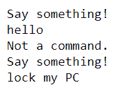

# 如何用 Python 制作语音解锁系统？

> 原文:[https://www . geesforgeks . org/如何用 python 制作语音解锁系统/](https://www.geeksforgeeks.org/how-to-make-a-voice-unlock-system-in-python/)

我们计算机的语音解锁系统将是一个应用程序，它将把我们的语音作为输入，并处理语音，将其转换为我们计算机的基于文本的指令，然后根据该指令执行操作。这一过程使用了最先进的语音到文本、自然语言理解和文本到语音的深度学习过程。

在我们的应用程序中构建基于语音的应用程序的第一步是不断聆听用户的语音，然后将该语音转录为基于文本的指令。

这很难创建具有更高准确性的语音到文本转录引擎，因为我们需要为此培训我们的数据模型。此外，还有许多行业领导者，如谷歌、微软、苹果，以及其他一些公司正在提供基于应用编程接口的服务，这些服务可以轻松地与应用程序集成。谷歌还提供语音动作，这是一种基于应用编程接口的服务，可以使用语音在应用程序中无缝执行动作。

如果您有兴趣开发自己的语音转文本应用程序，请仔细阅读。现在，为了构建您自己的基于 python 的应用程序，请执行以下步骤:

**1。导入库**

## 蟒蛇 3

```py
import sys
import ctypes
import speech_recognition as speech
```

*   Library ctypes 是 Python 的一个外来函数库。它提供 C 兼容的数据类型，并允许在 dll 或共享库中调用函数。它可以用来用纯 Python 包装这些库。
*   语音识别是家庭自动化、人工智能等应用中的一个重要特征。

**2。麦克风音频**

现在使用 python 语音识别模块的**识别器()**功能从麦克风获取音频。这样，我们就从我们的系统中捕获了语音命令。

## 蟒蛇 3

```py
voice = speech.Recognizer()
with speech.Microphone() as source:
    print("Say something!")
    voice_command = voice.listen(source)
```

**3。检查命令**

现在是使用**谷歌语音识别引擎**的时候了注意这一点不用这个 API 你可以用自己的语音识别系统。你需要通过你的代码处理一些来自谷歌引擎的异常错误。

## 蟒蛇 3

```py
try:
    command=voice.recognize_google(voice_command)

# handle the exceptions
except speech.UnknownValueError:
    print("Google Speech Recognition system could not understand your \
    instructions please give instructions carefully")

except speech.RequestError as e:
    print("Could not request results from Google Speech Recognition\
    service; {0}".format(e))
```

**4。验证命令**

现在是匹配和比较语音命令模式的时候了。并加载和执行命令锁定电脑。锁定电脑的这个功能在 windows 的默认库(user32.dll)中可用。您也可以使用 Linux，但是这个操作的命令会有所不同，默认库也可以在(cell.user32)上使用。

## 蟒蛇 3

```py
if command == "lock my PC":
    ctypes.windll.user32.LockWorkStation()

elif command == "stop":
    sys.exit(0)

else:
    print("Not a command.")
    fxn()
```

**下面是实现。**

在这里，我们将形成一个函数(方法)，它重复调用自己，直到所需的命令。

*   如果命令是锁定电脑，那么它锁定电脑。
*   如果命令是停止程序，那么它停止程序。
*   否则，它说不是一个编码的命令，并再次运行。

## 蟒蛇 3

```py
# importing packages
import sys
import ctypes
import speech_recognition as speech

# define function
def fxn():

    # voice reconizer object
    voice = speech.Recognizer()

    # use microphone
    with speech.Microphone() as source:
        print("Say something!")
        voice_command = voice.listen(source)

    # check input
    try:
        command = voice.recognize_google(voice_command)
        print(command)

    # handle the exceptions
    except speech.UnknownValueError:
        print("Google Speech Recognition system could not\
        understand your instructions please give instructions carefully")

    except speech.RequestError as e:
        print(
            "Could not request results from Google Speech Recognition \
            service; {0}".format(e))

    # validate input
    if command == "lock my PC":
        ctypes.windll.user32.LockWorkStation()

    elif command == "stop":
        sys.exit(0)

    else:
        print("Not a command.")
        fxn()

# execute
fxn()
```

**输出:**

