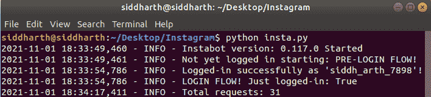
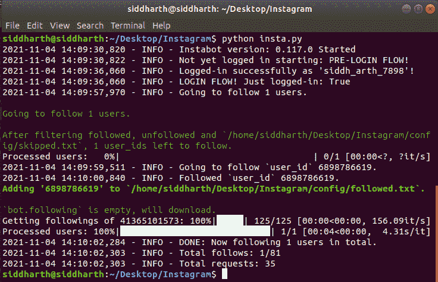
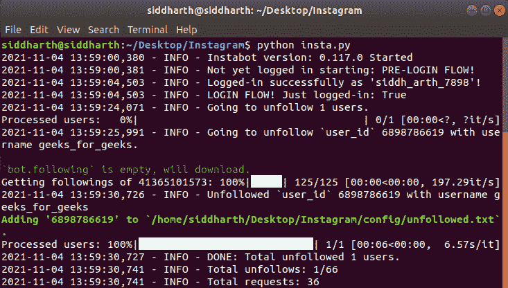
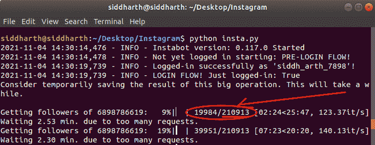
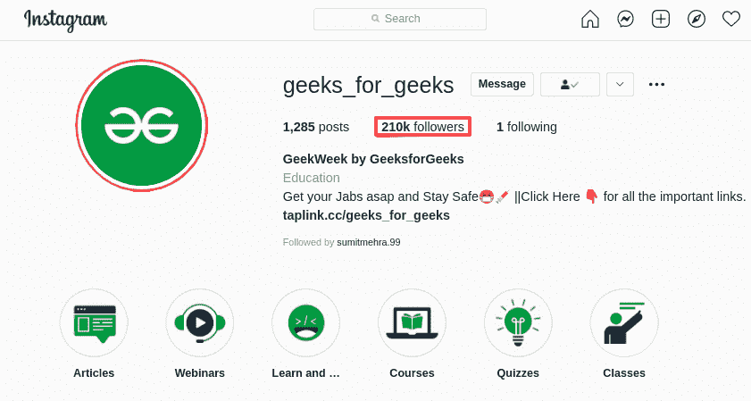
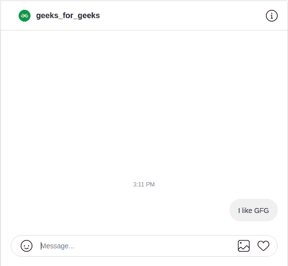
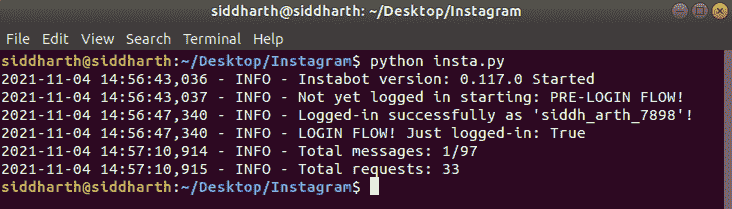
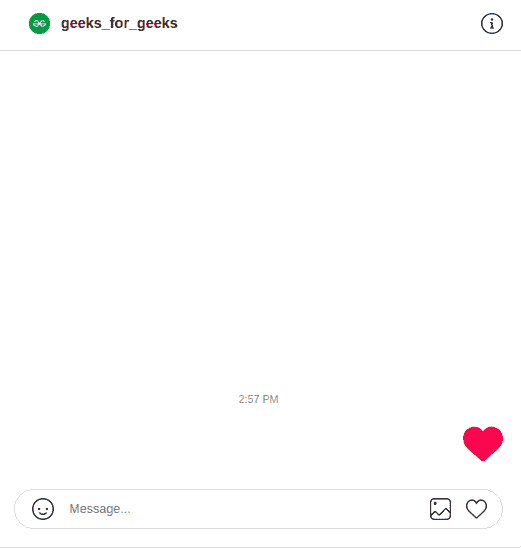
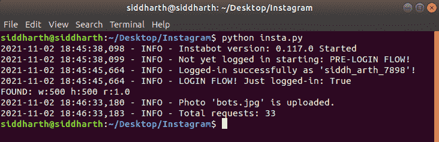
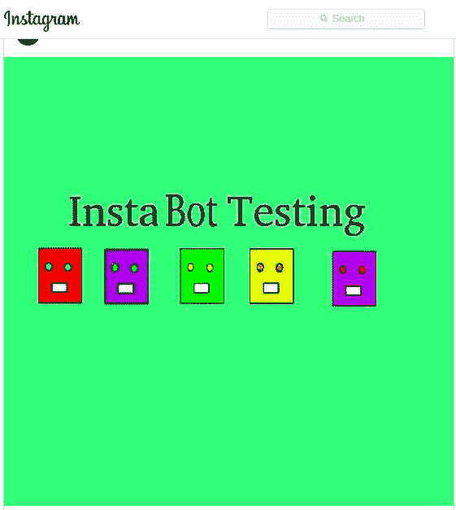

# 如何用 Python 和 InstaPy 制作 Instagram 机器人？

> 原文:[https://www . geeksforgeeks . org/如何用 python 和 instapy 制作 insta gram-bot/](https://www.geeksforgeeks.org/how-to-make-an-instagram-bot-with-python-and-instapy/)

在本文中，我们将看到如何使用 Python 和 InstaPy 制作 Instagram 机器人。

如今，机器人发送消息、上传照片、发送祝福以及其他许多事情真的很常见。机器人减少了我们的工作，节省了时间。今天，我们正在创建一个 Instagram 机器人，它可以做以下事情。

## 机器人执行的功能

*   跟随一个或多个朋友。
*   取消关注一个人或一份名单。
*   不要跟踪任何人。
*   统计任何用户的关注人数。
*   向关注者或关注者列表发送消息。
*   聊天时发送喜欢的内容。
*   发布照片。

**Instabot 库:**是 Instagram 的一个推广脚本和 API Python 包装器。

```py
pip install instabot
```

## 注册

在执行任何 login()函数之前，我们需要先导入 instabot 库并登录。

## 蟒蛇 3

```py
# Import instabot library
from instabot import Bot

# Create a variable bot.
bot = Bot()

# Login
bot.login(username="your_userid", 
          password="your_password")
```

**输出:**



## 跟随

要跟踪一个朋友，我们可以使用 follow()函数。

## 蟒蛇 3

```py
from instabot import Bot

bot = Bot()
bot.login(username="your_username",
          password="your_password")

# Follow

# To follow single person.
bot.follow("geeks_for_geeks")
```

**输出:**



要跟踪许多用户，我们需要先列出用户名，然后使用“follow_users”函数跟踪。

## 蟒蛇 3

```py
from instabot import Bot

bot = Bot()
bot.login(username="your_username", 
          password="your_password")

# Follow

# To follow more person.
list_of_user = ["user_id1", "user_id2", "user_id3", "...."]
bot.follow_users(list_of_user)
```

## 取消跟踪

要取消跟踪一个人，我们将使用 unfollow()函数。

## 蟒蛇 3

```py
from instabot import Bot

bot = Bot()
bot.login(username="your_username", 
          password="your_password")

# To unfollow a single person.
bot.unfollow("geeks_for_geeks")
```

**输出:**



要取消关注，许多人会创建一个取消关注列表，然后使用“取消关注用户”功能。

## 蟒蛇 3

```py
from instabot import Bot 

bot = Bot()
bot.login(username = "your_username",
          password = "your_password")

# To unfollow more person.
unfollow_list = ["user_id1", "user_id2", "user_id3", "..."]
bot.unfollow_users(unfollow_list)
```

## 不跟踪任何人

在这里，我们将使用 unfollow _ everyone()函数取消每个人在我们帐户中的关注。

**警告:**如果你真的想取消关注所有人，请使用这部分代码。

## 蟒蛇 3

```py
from instabot import Bot

bot = Bot()
bot.login(username="your_username", 
          password="your_password")

# Unfollow everyone!

# To unfollow everyone use:
# Please use this part very carefully.
bot.unfollow_everyone()
```

## 计算关注人数

我们可以使用“get_user_followers”函数来检查我们自己的关注者或任何关注者的数量。这个函数生成一个追随者 id 列表。

## 蟒蛇 3

```py
from instabot import Bot

bot = Bot()
bot.login(username="your_username", 
          password="your_password")

# Count number of followers
followers = bot.get_user_followers("geeks_for_geeks")
print("Total number of followers:")
print(len(followers))
```

**输出:**

 

## 发送消息

使用 send_message()函数向一个人发送消息很简单。

## 蟒蛇 3

```py
from instabot import Bot

bot = Bot()
bot.login(username="your_username",
          password="your_password")

# Message
# To send message to a single person.
message = "I like GFG"
bot.send_message(message, "geeks_for_geeks")
```

**输出:**



向许多人传递同样的信息。

## 蟒蛇 3

```py
from instabot import Bot

bot = Bot()
bot.login(username="your_username",
          password="your_password")

# Message
# To send same message to many follower.
message = "I like GFG"
list_of_userid = ["user_id1", "user_id2", "user_id3", "..."]
bot.send_messages(message, list_of_userid)
```

## 发送相似消息

要像发送一样发送，请列出用户，然后使用“像发送”功能。机器人根据聊天中的列表向朋友发送喜欢的内容。

## 蟒蛇 3

```py
from instabot import Bot

bot = Bot()
bot.login(username="your_username",
          password="your_password")

# Send like in messages
# To send like to one or more person.
send_like_list = ["user_id1", "user_id2", "user_id3", "..."]
bot.send_like(send_like_list)
```

**输出:**

 

## 发布照片

要在 Instagram 上发布照片，我们需要检查照片是否在给定的比例下。如果照片不是给定的比例，我们需要调整它的大小。最简单的比例是 1:1。

## 蟒蛇 3

```py
from instabot import Bot

bot = Bot()
bot.login(username="your_username", 
          password="your_password")

# Post photos
# Photos need be resized and, if not in ratio given below.
# jpg format works more better than others formats.
# Acceptable Ratio of image:-  90:47, 4:5, 1:1(square image).
# Keep image and program in same folder.
# -----------------------------------------------------------
bot.upload_photo("filename.jpg", caption="Write caption here.")
```

**输出:**

 