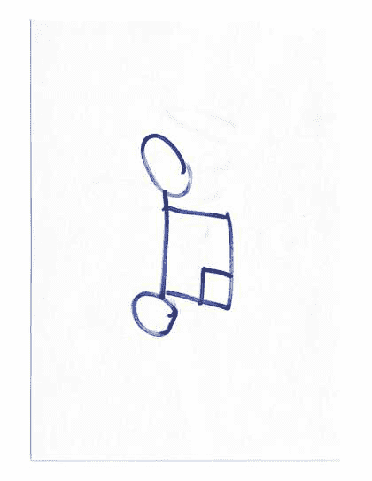
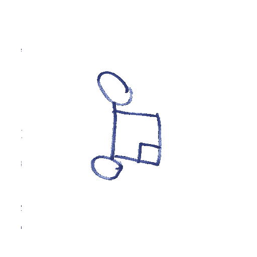

# 如何用 Python 使背景图像透明？

> 原文:[https://www . geesforgeks . org/how-to-make-background-image-transparent-use-python/](https://www.geeksforgeeks.org/how-to-make-background-image-transparent-using-python/)

在本文中，任务是在 Python 中创建图像的透明背景

**所需库:**

在继续之前，首先在您的 Python 应用程序上安装**枕头**库。Python 图像库是一个免费的开源 Python 编程语言附加库，增加了对打开、操作和保存许多图像文件格式的支持。**枕库**对于这个提到的程序是必要的。您可以使用代码在 Python 中安装枕头库

```py
pip install pillow
```

**方法:**

1.  阅读图片。
2.  将图像转换为 RGBA 格式。
3.  将图像的白色像素更改为透明形式
4.  保存新编辑的图像

**示例:**



## 蟒蛇 3

```py
from PIL import Image

def convertImage():
    img = Image.open("./image.png")
    img = img.convert("RGBA")

    datas = img.getdata()

    newData = []

    for items in datas:
        if item[0] == 255 and item[1] == 255 and item[2] == 255:
            newData.append((255, 255, 255, 0))
        else:
            newData.append(item)

    img.putdata(newData)
    img.save("./New.png", "PNG")
    print("Successful")

convertImage()
```

**输出:**

