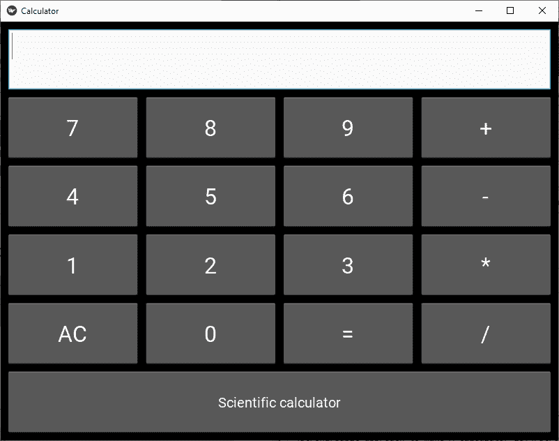

# 如何用 kivy | Python 制作计算器

> 原文:[https://www . geeksforgeeks . org/如何使用-kivy-python 制作计算器/](https://www.geeksforgeeks.org/how-to-make-calculator-using-kivy-python/)

Kivy 是 Python 中独立于平台的 GUI 工具。因为它可以在安卓、IOS、linux 和 Windows 等平台上运行。它基本上是用来开发安卓应用程序的，但并不意味着它不能在桌面应用程序上使用。

> ？？？？？？？？ [Kivy 教程–通过示例学习 Kivy](https://www.geeksforgeeks.org/kivy-tutorial/)。

在本文中，我们将学习如何使用 Kivy 制作一个简单的计算器。

> 先决条件:
> 1)数学基础知识
> 2)Python
> 3)Kivy
> 4)Kivy 的小部件和代码理解

```
Basic approach to make A calculator:

1) import kivy
2) import kivyApp
3) import Gridlayout
4) import config(to configure/adjust the window size)
5) Set minimum version(optional)
6) Create Layout class :
      define Calculator function in it
         : In this i am using try-catch because if any arithmetic 
            exception occur it will through the error  

7) create App class
8) create .kv file (name same as the app class):
        1) create buttons
        2) Add the style to the buttons
        3) Add functionalities of the button 
9) return Layout/widget/Class(according to requirement)
10) Run an instance of the class
```

**实施方法:**
**main.py**

## 蟒蛇 3

```
# Program to create a calculator

# Program to Show how to create a switch
# import kivy module   
import kivy 

# base Class of your App inherits from the App class.   
# app:always refers to the instance of your application  
from kivy.app import App

# this restrict the kivy version i.e 
# below this kivy version you cannot 
# use the app or software 
kivy.require('1.9.0')

# for making multiple bttons to arranging
# them we are using this
from kivy.uix.gridlayout import GridLayout

# for the size of window
from kivy.config import Config

# Setting size to resizable
Config.set('graphics', 'resizable', 1)
## Config.set('graphics', 'width', '400')
## Config.set('graphics', 'height', '400')

# Creating Layout class
class CalcGridLayout(GridLayout):

    # Function called when equals is pressed
    def calculate(self, calculation):
        if calculation:
            try:
                # Solve formula and display it in entry
                # which is pointed at by display
                self.display.text = str(eval(calculation))
            except Exception:
                self.display.text = "Error"

 # Creating App class
class CalculatorApp(App):

    def build(self):
        return CalcGridLayout()

# creating object and running it
calcApp = CalculatorApp()
calcApp.run()
```

**计算器**千伏

## 蟒蛇 3

```
# Custom button
<CustButton@Button>:
    font_size: 32

# Define id so I can refer to the CalcGridLayout
# class functions
# Display points to the entry widget
<CalcGridLayout>:
    id: calculator
    display: entry
    rows: 6
    padding: 10
    spacing: 10

    # Where input is displayed
    BoxLayout:
        TextInput:
            id: entry
            font_size: 32
            multiline: False

    # When buttons are pressed update the entry
    BoxLayout:
        spacing: 10
        CustButton:
            text: "7"
            on_press: entry.text += self.text
        CustButton:
            text: "8"
            on_press: entry.text += self.text
        CustButton:
            text: "9"
            on_press: entry.text += self.text
        CustButton:
            text: "+"
            on_press: entry.text += self.text

    BoxLayout:
        spacing: 10
        CustButton:
            text: "4"
            on_press: entry.text += self.text
        CustButton:
            text: "5"
            on_press: entry.text += self.text
        CustButton:
            text: "6"
            on_press: entry.text += self.text
        CustButton:
            text: "-"
            on_press: entry.text += self.text

    BoxLayout:
        spacing: 10
        CustButton:
            text: "1"
            on_press: entry.text += self.text
        CustButton:
            text: "2"
            on_press: entry.text += self.text
        CustButton:
            text: "3"
            on_press: entry.text += self.text
        CustButton:
            text: "*"
            on_press: entry.text += self.text

    # When equals is pressed pass text in the entry
    # to the calculate function
    BoxLayout:
        spacing: 10
        CustButton:
            text: "AC"
            on_press: entry.text = ""
        CustButton:
            text: "0"
            on_press: entry.text += self.text
        CustButton:
            text: "="
            on_press: calculator.calculate(entry.text)
        CustButton:
            text: "/"
            on_press: entry.text += self.text
    BoxLayout:
        CustButton:
            font_size: 20
            text: "Scientific calculator"
            on_press: entry.text = ""       
```

**输出:**

