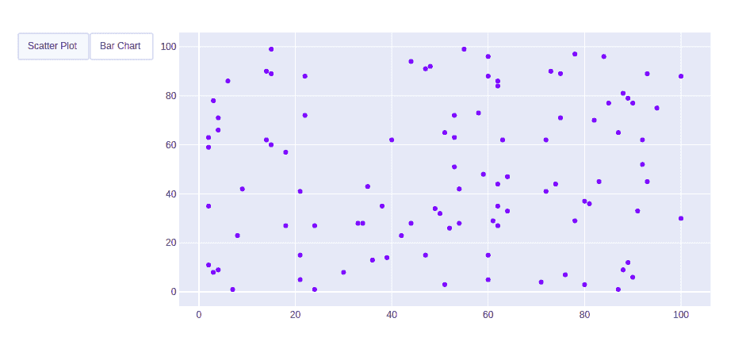
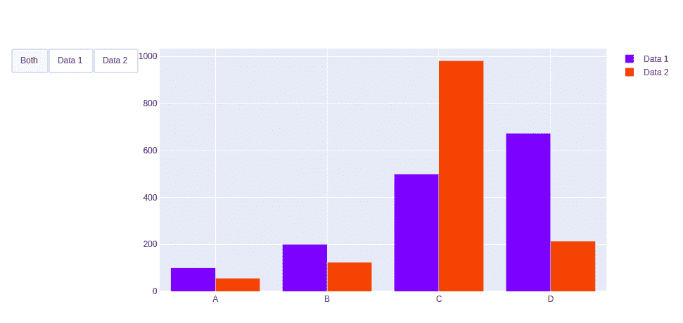

# 如何在 Plotly 中制作自定义按钮？

> 原文:[https://www . geeksforgeeks . org/如何制作自定义按钮-in-plotly/](https://www.geeksforgeeks.org/how-to-make-custom-buttons-in-plotly/)

Plotly 是一个 Python 库，用于设计图形，尤其是交互式图形。它可以绘制各种图形和图表，如直方图、条形图、箱线图、展开图等。它主要用于数据分析以及财务分析。plotly 是一个交互式可视化库。

## 制作自定义按钮

在情节中，动作自定义按钮用于直接从记录中快速做出动作。自定义按钮可以添加到客户关系管理、市场营销和自定义应用程序的页面布局中。有 4 种可能的方法可以应用于自定义按钮:

*   **重新样式:**修改数据或数据属性
*   **重新布局:**修改布局属性
*   **更新:**修改数据和布局属性
*   **动画制作:**开始或暂停动画

**示例 1:使用重新造型方法**

## 蟒蛇 3

```py
import plotly.graph_objects as px
import numpy as np

# creating random data through randomint
# function of numpy.random
np.random.seed(42)

random_x = np.random.randint(1, 101, 100)
random_y = np.random.randint(1, 101, 100)

plot = px.Figure(data=[px.Scatter(
    x=random_x,
    y=random_y,
    mode='markers',)
])

# Add dropdown
plot.update_layout(
    updatemenus=[
        dict(
            type="buttons",
            direction="left",
            buttons=list([
                dict(
                    args=["type", "scatter"],
                    label="Scatter Plot",
                    method="restyle"
                ),
                dict(
                    args=["type", "bar"],
                    label="Bar Chart",
                    method="restyle"
                )
            ]),
        ),
    ]
)

plot.show()
```

**输出:**



**例 2:使用更新方法**

## 蟒蛇 3

```py
import plotly.graph_objects as px
import numpy

# creating random data through randomint
# function of numpy.random
np.random.seed(42)

random_x = np.random.randint(1, 101, 100)
random_y = np.random.randint(1, 101, 100)

x = ['A', 'B', 'C', 'D']

plot = px.Figure(data=[go.Bar(
    name='Data 1',
    x=x,
    y=[100, 200, 500, 673]
),
    go.Bar(
    name='Data 2',
    x=x,
    y=[56, 123, 982, 213]
)
])

# Add dropdown
plot.update_layout(
    updatemenus=[
        dict(
            type="buttons",
            direction="left",
            buttons=list([
                dict(label="Both",
                     method="update",
                     args=[{"visible": [True, True]},
                           {"title": "Both"}]),
                dict(label="Data 1",
                     method="update",
                     args=[{"visible": [True, False]},
                           {"title": "Data 1",
                            }]),
                dict(label="Data 2",
                     method="update",
                     args=[{"visible": [False, True]},
                           {"title": "Data 2",
                            }]),
            ]),
        )
    ])

plot.show()
```

**输出:**

