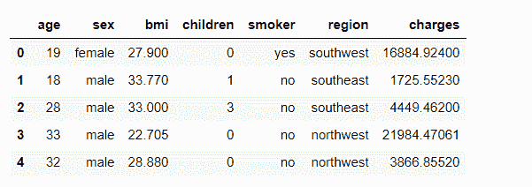
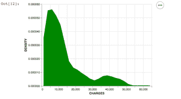

# 如何用牛郎星在 Python 中制作密度图？

> 原文:[https://www . geeksforgeeks . org/如何用牛郎星制作 python 密度图/](https://www.geeksforgeeks.org/how-to-make-density-plot-in-python-with-altair/)

密度图是直方图的变体，用于观察连续时间间隔或时间段内数据集中变量的分布。密度图的峰值表示数值在一个区间内的集中位置。

与直方图相比，密度图在确定分布形状方面更好，因为它们不受面元数量的影响。

## 使用牛郎星绘制 Python 中的密度图

我们可以使用库熊猫和牛郎星用 python 制作密度图。

*   [牛郎星](https://altair-viz.github.io/)-是基于 Vega 和 Vega-lite 的统计可视化库。
*   [Pandas](https://www.geeksforgeeks.org/pandas-tutorial/)-是 Python 中的开源数据分析和操纵工具。

注:我们将使用“insurance.csv”数据集，该数据集可从[谷歌驱动](https://drive.google.com/drive/folders/1Dddv1l9hpEPVWh_uuK9Iv1A1xUNy55v7?usp=sharing)下载。

**首先，让我们使用-** 导入这些库

## 蟒蛇 3

```py
import pandas as p  # loading pandas library
import altair as a  # loading altair library
```

**接下来，我们加载需要使用密度图的数据集。**

## 蟒蛇 3

```py
data_set = 'insurance.csv'  # dataset name
d = p.read_csv(data_set)  # reading the datasaet
d.head()  # printing the first 5 data entries
```

**输出:**



如您所见，数据集中有七列。我们将使用“电荷”绘制密度图。为此，我们必须首先将数据转换为密度。这是通过使用 transform_density()函数来完成的。参数是感兴趣的变量和表示转换变量的名称，转换变量写成“as_=['电荷'，'密度']”。把它放在一起-

## 蟒蛇 3

```py
# loading a single column into
# the data frame object
d = d[["charges"]]

a.Chart(d).transform_density('charges', as_=['CHARGES', 'DENSITY'],
                             ).mark_area(color='green').encode(
    x="CHARGES:Q",
    y='DENSITY:Q',

)
```

**输出:**



输出

**完整脚本:**这里是所有步骤都在一个地方的代码-

## 蟒蛇 3

```py
import pandas as p  # loading pandas library
import altair as a  # loading altair library

# download dataset from https://drive.google.com/drive/folders/1Dddv1l9hpEPVWh_uuK9Iv1A1xUNy55v7?usp=sharing
# OR replace name with your own dataset.
data_set = 'insurance.csv'
d = p.read_csv(data_set)
d = d[["charges"]]

a.Chart(d).transform_density('charges', as_=['CHARGES', 'DENSITY'],
                             ).mark_area(color='green').encode(
    x="CHARGES:Q",
    y='DENSITY:Q',
)
```

**输出:**


输出