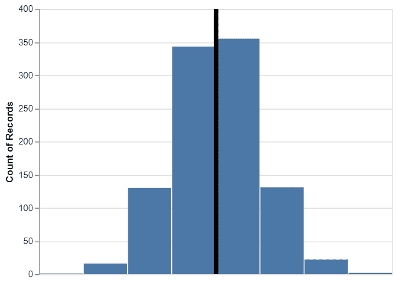

# 如何用 Python 中的牛郎星制作带中线的直方图？

> 原文:[https://www . geesforgeks . org/如何使用 python 中的牛郎星制作带中线的直方图/](https://www.geeksforgeeks.org/how-to-make-histogram-with-median-line-using-altair-in-python/)

在本文中，我们将学习如何使用 python 中的**牛郎星**制作带有中线的直方图。这篇文章也是牛郎星图形语法的一个很好的例子。

阿尔泰是 python 中最新的交互式**数据可视化**库之一。《牛郎星》基于 vega 和 vegalite——一种交互式图形语法。这里我们将使用 import 关键字使用阿尔泰库来使用它。

## 用中线说明直方图

首先，我们将使用牛郎星加载 python 包，这些包用于制作带有平均值和中线的直方图。

## 蟒蛇 3

```py
# import required modules
import altair as alt
import numpy as np
import pandas as pd
```

现在，我们将生成数据，用中线制作直方图。这里，我们将使用 Numpy 从正态分布生成随机数，并创建熊猫数据帧。

## 蟒蛇 3

```py
# generating data
np.random.seed(42)
df = pd.DataFrame({'height': np.random.normal(150, 10, 1000)})
```

基本上在这里我们倾向于用中线建立条形图，它可以产生两层双星图像对象，并将它们组合起来。利用牛郎星的图表功能，我们创建了数据的数据帧的基本图。

## 蟒蛇 3

```py
# initialize chart
base=alt.Chart(df)
```

现在我们使用牛郎星的 **mark_bar()** 函数并创建基础对象来制作直方图。此外，这里我们提到了我们感兴趣的制作直方图的变量。

## 蟒蛇 3

```py
# generate histogram
hist = base.mark_bar().encode(
    x=alt.X('height:Q', bin=alt.BinParams(), axis=None), y='count()')
```

使用阿尔泰库中的 **mark_rule()** 函数，我们再次使用带有数据的基础对象来创建中线。

## 蟒蛇 3

```py
# generate median line
median_line = base.mark_rule().encode(
    x=alt.X('mean(height):Q', title='Height'), size=alt.value(5))
```

现在，为了形成带有中线的基本直方图，我们倾向于将条形图对象和中线对象组合如下:

## 蟒蛇 3

```py
# depict illustration
hist+median_line
```

**输出:**



因此，这里我们使用 python 中的 Altair 获得了带有中线的直方图。

现在让我们了解如何获得定制直方图。

## **使用牛郎星**自定义带中线的直方图

在带有中线的基本直方图中，阿尔泰库使用默认参数绘制直方图。就像，牛郎星为我们选择了蓝色作为直方图和箱数。同样，牛郎星选择黑色作为中线。但是我们可以使用牛郎星轻松定制带有中线的直方图。

首先，我们将增加直方图中的箱数，然后将中线的颜色更改为红色。

我们将在坐标轴参数内使用 **maxbins=100** 参数，形成包含 100 个 bin 的直方图。然后我们可以使用 **mark_rule()** 功能内的 **color=red** 将中线的颜色改为红色。最后，让我们结合直方图和中线对象。然后我们将在阿尔泰改进带有中线的直方图版本。

## 蟒蛇 3

```py
# import required modules
import altair as alt
import numpy as np
import pandas as pd

# generating data
np.random.seed(42)
df = pd.DataFrame({'height': np.random.normal(150, 10, 1000)})

# initialize chart
base = alt.Chart(df)

# generate histogram
hist = base.mark_bar().encode(
    x=alt.X('height:Q', bin=alt.BinParams(maxbins=100), axis=None), y='count()')

# generate median line
red_median_line = base.mark_rule(color='red').encode(
    x=alt.X('mean(height):Q', title='Height'), size=alt.value(5))

# depict illustration
hist+red_median_line
```

**输出:**


因此，上图使用 python 中的 Altair 显示了包含 100 个面元和一条红色中线的直方图。