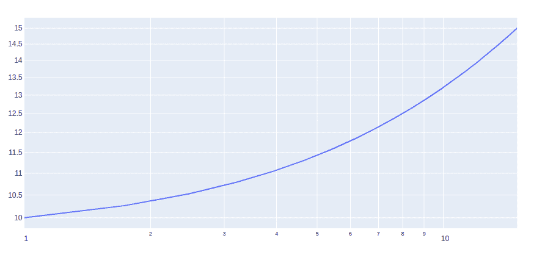
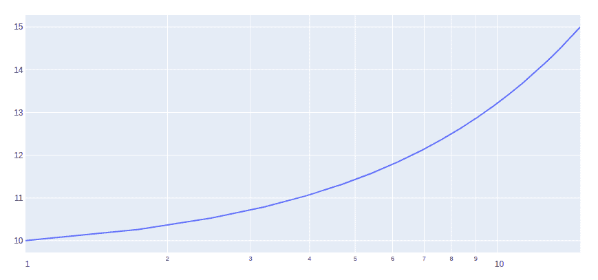

# 如何用 Plotly-Python 制作原木图？

> 原文:[https://www . geeksforgeeks . org/如何制作 log-plot-in-plot-python/](https://www.geeksforgeeks.org/how-to-make-log-plots-in-plotly-python/)

Plotly 是一个 Python 库，用于设计图形，尤其是交互式图形。它可以绘制各种图形和图表，如直方图、条形图、箱线图、展开图等。它主要用于数据分析以及财务分析。plotly 是一个交互式可视化库。

## 什么是对数图？

对数图是一种以紧凑的方式在很大范围内显示数值数据的方法。有两种类型的图:

*   **对数-对数图:**如果一个图的纵轴和横轴都按对数缩放，则该图称为对数-对数图。
*   **半对数图:**如果只有纵坐标或横坐标按对数缩放，则该图称为半对数图。

### 使用绘图创建日志图

没有提供用于创建日志图的特定功能。但是，可以使用 graph_objects 类的[散点()](https://www.geeksforgeeks.org/scatter-plot-in-plotly-using-graph_objects-class/)方法创建。我们将不得不改变 xaxis_type 和 yaxis_type 来记录。

**示例 1:对数曲线图**

## 蟒蛇 3

```py
import plotly.graph_objects as go
import numpy as np

x = np.linspace(1, 15, 20)
y = np.linspace(10, 15, 20)

fig = go.Figure()

fig.add_trace(go.Scatter(
    x=x,
    y=y
))

fig.update_layout(xaxis_type="log", yaxis_type="log")
fig.show()
```

**输出:**



**例 2:半对数图**

## 蟒蛇 3

```py
import plotly.graph_objects as go
import numpy as np

x = np.linspace(1, 15, 20)
y = np.linspace(10, 15, 20)

fig = go.Figure()

fig.add_trace(go.Scatter(
    x=x,
    y=y
))

fig.update_layout(xaxis_type="log")
fig.show()
```

**输出:**

