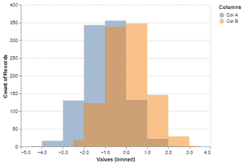
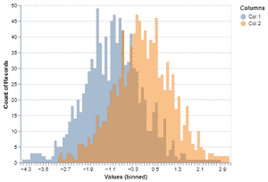

# 如何用牛郎星制作 Python 中的重叠直方图？

> 原文:[https://www . geeksforgeeks . org/如何用牛郎星制作重叠的 python 直方图/](https://www.geeksforgeeks.org/how-to-make-overlapping-histograms-in-python-with-altair/)

**先决条件:** [牛郎星](https://www.geeksforgeeks.org/introduction-to-altair-in-python/)

直方图表示在某种分组过程中提供的数据。这是一种用图形表示数值数据分布的精确方法。这是一种条形图，其中 X 轴表示面元范围，而 Y 轴给出频率信息。

使用牛郎星，我们可以从宽形式或长整洁形式的数据中制作重叠直方图或分层直方图。

## 程序

这将是两种形式所共有的:

*   导入库
*   导入或创建数据。
*   根据方法使数据变长/变宽。
*   绘制直方图。

**方法 1:** 整齐的形态

*   用牛郎星做直方图，我们用的是 mark_area()函数。这里我们用不透明度参数指定透明度级别，因此创建直方图的关键参数是 interpolate = ' step '。如果没有这些，柱状图将显示为牛郎星的面积图。
*   然后我们指定变量，从而指定箱的数量。区分不同的地块。Color()用于特定变量，如多个直方图。

**示例:**

## 蟒蛇 3

```py
# importing libraries
import pandas as pd
import altair as alt
import numpy as np

np.random.seed(42)

# creating data
df = pd.DataFrame({'Col A': np.random.normal(-1, 1, 1000),
                   'Col B': np.random.normal(0, 1, 1000)})

# Overlapping Histograms
alt.Chart(pd.melt(df,
                  id_vars=df.index.name,
                  value_vars=df.columns,
                  var_name='Columns',
                  value_name='Values')
          ).mark_area(opacity=0.5,
                      interpolate='step'
                      ).encode(
    alt.X('Values', bin=alt.Bin(maxbins=10)),
    alt.Y('count()', stack=None),
    alt.Color('Columns')
).add_selection(alt.selection_interval(encodings=['x']))
```

**输出:**



**方法二:**宽形

*   通常，您可能会从各种形式的数据开始。阿尔泰有 transform_fold()功能，可以将宽格式的数据转换成整齐的长格式。这允许我们不使用熊猫的融化()功能，让我们在牛郎星内部传递信息。
*   我们在整洁的数据中指定重塑所需的变量名称和品牌跨越新变量的名称。

**示例:**

## 蟒蛇 3

```py
# importing libraries
import pandas as pd
import altair as alt
import numpy as np

np.random.seed(42)

# creating data
df = pd.DataFrame({'Col 1': np.random.normal(-1, 1, 1000),
                   'Col 2': np.random.normal(0, 1, 1000)})

# Overlapping Histograms
alt.Chart(df).transform_fold(
    ['Col 1', 'Col 2'],
    as_=['Columns', 'Values']
).mark_area(
    opacity=0.5,
    interpolate='step'
).encode(
    alt.X('Values:Q', bin=alt.Bin(maxbins=100)),
    alt.Y('count()', stack=None),
    alt.Color('Columns:N')
)
```

**输出:**

