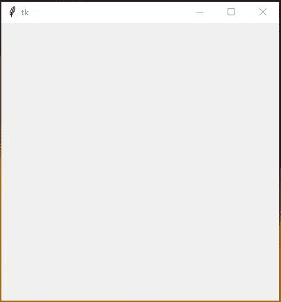
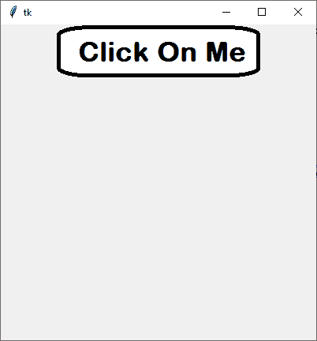

# 如何在 Tkinter

中制作圆角按钮

> 原文:[https://www . geesforgeks . org/如何制作圆形按钮 in-tkinter/](https://www.geeksforgeeks.org/how-to-make-rounded-buttons-in-tkinter/)

[Tkinter](https://www.geeksforgeeks.org/python-gui-tkinter/) 是一个 Python 模块，用于在各种小部件和功能的帮助下创建 GUI(图形用户界面)应用程序。像任何其他图形用户界面模块一样，它也支持图像，即您可以在应用程序中使用图像来使其更具吸引力。

在本文中，我们将讨论如何在 Tkinter 中制作圆角按钮，在 Tkinter 中没有内置的方法来制作圆角按钮。为了使按钮变圆，我们将定义**边界值**为零

**边框宽度:**它将代表标签周围边框的大小。默认情况下，borderwidth 为 2 像素。“bd”也可以作为 borderwidth 的简写。

**分步实施:**

**第 1 步:**创建一个正常的 Tkinter 窗口。

## 蟒蛇 3

```
# Import module
from tkinter import *

# Create object
root = Tk()

# Adjust size
root.geometry("400x400")

# Execute tkinter
root.mainloop()
```

**输出:**



**第二步:**添加按钮和图像。

## 蟒蛇 3

```
# Add Image
login_btn = PhotoImage(file = "Image Path")

# Create button and image
img = Button(root, image = login_btn,
             borderwidth = 0)

img.pack()
```

**输出:**



**以下是完整实现:**

## 蟒蛇 3

```
# Import Module
from tkinter import *

# Create Object
root = Tk()

# Set geometry
root.geometry("400x400")

# Add Image
login_btn = PhotoImage(file = "Image Path")

# Create button and image
img = Button(root, image = login_btn,
             borderwidth = 0)

img.pack()

# Execute Tkinter
root.mainloop()
```

**输出:**

