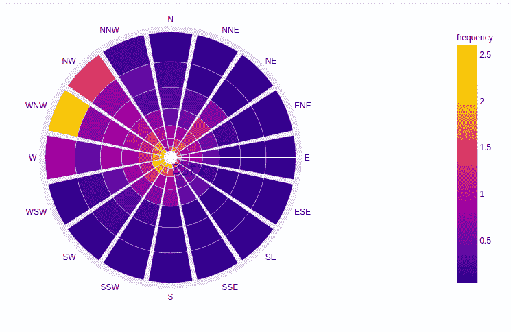
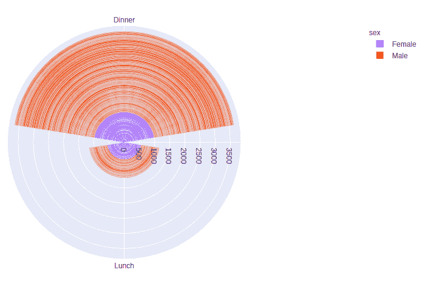
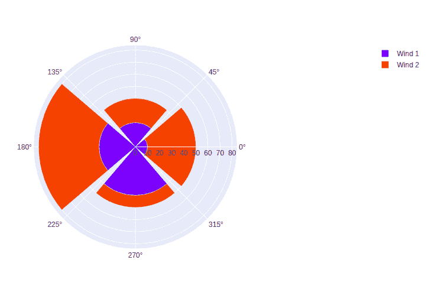

# 如何用 Plotly-Python 制作风玫瑰图和极坐标图？

> 原文:[https://www . geeksforgeeks . org/如何制作风玫瑰和极地条形图-in-plotly-python/](https://www.geeksforgeeks.org/how-to-make-wind-rose-and-polar-bar-charts-in-plotly-python/)

Plotly 是一个 Python 库，用于设计图形，尤其是交互式图形。它可以绘制各种图形和图表，如直方图、条形图、箱线图、展开图等。它主要用于数据分析以及财务分析。plotly 是一个交互式可视化库。

## 什么是风玫瑰图和极地条形图？

风玫瑰图是显示一段时间内某一地点风速和风向的图表。这张图表用圆形表示，圆形表示风从特定方向吹来的时间。风玫瑰图也被称为极地条形图。

### 创建风玫瑰图

在剧情中，可以使用 **go 制作风玫瑰图。**图形对象类**的 Barpolar()** 方法或通过 **px.bar_polar()** 方法的**表示类**。

> **语法:** plotly.graph_objects。barpolar(arg =无，dr =无，dtheta =无，r =无，θ=无)
> 
> **语法:**plot . express . bar _ polar(*data _ frame = None*， *r=None* ， *theta=None* ， *color=None* ，)

**例 1:**

## 蟒蛇 3

```py
import plotly.express as px

# using the wind dataset
df = px.data.wind()

fig = px.bar_polar(df, r="strength", theta="direction",
                   color="frequency",)
fig.show()
```

**输出:**



**例 2:**

## 蟒蛇 3

```py
import plotly.express as px

df = px.data.tips()

fig = px.bar_polar(df, r="total_bill", theta="time",
                   color="sex",)

fig.show()
```

**输出:**



**例 3:**

## 蟒蛇 3

```py
import plotly.graph_objects as go

fig = go.Figure()

fig.add_trace(go.Barpolar(
    r=[10, 20, 30, 40],
    name='Wind 1',
))

fig.add_trace(go.Barpolar(
    r=[40, 20, 50, 10],
    name='Wind 2',
))

fig.show()
```

**输出:**

