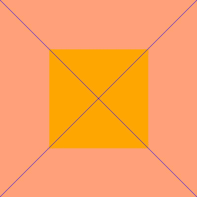

# 如何使用 Python 操作图像的像素值？

> 原文:[https://www . geeksforgeeks . org/如何使用 python 操作图像的像素值/](https://www.geeksforgeeks.org/how-to-manipulate-the-pixel-values-of-an-image-using-python/)

众所周知，彩色图像是各种像素的集合。如果我们改变像素值，图像将变成不同颜色的图像。手动完成这项繁琐的任务是可怕的，因为一幅图像可能包含数百万像素。因此，我们将编写一个 Python 脚本来轻松完成这项任务。

在开发图像数据的预测模型时，我们有时需要处理图像。而为此 python 有一个惊人的库名为 [**Python 成像库(PIL)**](https://www.geeksforgeeks.org/python-pillow-a-fork-of-pil/) **<u>。</u>** 这个库包含一些方法，我们可以用它来提取图像的像素点，简单地借助循环，我们可以迭代它的每个像素，并根据我们的需要改变它的像素值。一个**像素**是一幅图像的最小基本成分，类似地，**像素图**可以被认为是代表一幅图像的像素矩阵。

### 方法

1.  首先，我们需要一个图像文件作为输入。该图像文件可以通过[**image . new()**](https://www.geeksforgeeks.org/python-pil-image-new-method/)**方法创建，也可以通过[**image . open()**](https://www.geeksforgeeks.org/python-pil-image-open-method/)**方法**从本地机器导入。**这两种情况都已在下面的示例中显示。(不是强制性的，但为了方便起见，我们保存了名为**“input . png”**的图片，特别是为了看区别。)****
2.  ****其次，我们需要借助 **Image.load()方法**提取输入图像的像素图(像素值矩阵)，这样我们就可以操纵我们想要的像素。 **Image.size** **方法**返回图像(像素或矩阵)的宽度和高度(列和行)。然后在循环的帮助下，我们将迭代并改变我们想要的像素值。****
3.  ****最后，在更新或改变像素值后，我们将获得输出图像。(同样不是强制性的，但为了方便起见，我们将借助 [**Image.save()**](https://www.geeksforgeeks.org/python-pil-image-save-method/) 方法保存名为**【output . png】**的输出图像。我们也可以使用[**image . show()**](https://www.geeksforgeeks.org/python-pil-image-show-method/)**方法在输出屏幕上看到图像。******

******示例 1:使用本地机器的图像，将其一半变成灰度图像******

****将图像转换为灰度图像的平均公式:****

```py
**G = (R+G+B) / 3**
```

****上述公式在理论上是正确的，但一个更改进的公式(加权法，也称为光度法，根据红色、绿色和蓝色的波长对它们进行加权)如下:****

```py
**G = (0.299R + 0.587G + 0.114B)**
```

******输入图像:******

****

输入图像**** 

## ****蟒蛇 3****

```py
**from PIL import Image

# Import an image from directory:
input_image = Image.open("gfg.png")

# Extracting pixel map:
pixel_map = input_image.load()

# Extracting the width and height 
# of the image:
width, height = input_image.size

# taking half of the width:
for i in range(width//2):
    for j in range(height):

        # getting the RGB pixel value.
        r, g, b, p = input_image.getpixel((i, j))

        # Apply formula of grayscale:
        grayscale = (0.299*r + 0.587*g + 0.114*b)

        # setting the pixel value.
        pixel_map[i, j] = (int(grayscale), int(grayscale), int(grayscale))

# Saving the final output
# as "grayscale.png":
input_image.save("grayscale", format="png")

# use input_image.show() to see the image on the
# output screen.**
```

******输出:******

****

输出图像。**** 

******注意:**这里图像的一半已经转换为灰度，但是完整的可以使用相同的代码，只需将**(宽度//2)更改为(宽度)**。要了解更多信息，请参考[](https://www.geeksforgeeks.org/python-pil-getpixel-method/)****方法。********

******示例 2:操纵像素值******

******输入图像:******

****

输入图像。**** 

## ****蟒蛇 3****

```py
**from PIL import Image

# Create an image as input:
input_image = Image.new(mode="RGB", size=(400, 400),
                        color="blue")

# save the image as "input.png"
#(not mandatory)
input_image.save("input", format="png")

# Extracting pixel map:
pixel_map = input_image.load()

# Extracting the width and height
# of the image:
width, height = input_image.size
z = 100
for i in range(width):
    for j in range(height):

        # the following if part will create
        # a square with color orange
        if((i >= z and i <= width-z) and (j >= z and j <= height-z)):

            # RGB value of orange.
            pixel_map[i, j] = (255, 165, 0)

        # the following else part will fill the
        # rest part with color light salmon.
        else:

            # RGB value of light salmon.
            pixel_map[i, j] = (255, 160, 122)

# The following loop will create a cross
# of color blue.
for i in range(width):

    # RGB value of Blue.
    pixel_map[i, i] = (0, 0, 255)
    pixel_map[i, width-i-1] = (0, 0, 255)

# Saving the final output
# as "output.png":
input_image.save("output", format="png")

# use input_image.show() to see the image on the
# output screen.**
```

******输出:******

****

输出图像****