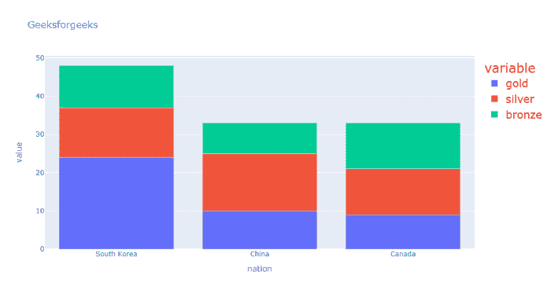

# 如何在 Python 中对一个情节图手动添加图例颜色和图例字号？

> 原文:[https://www . geesforgeks . org/如何手动添加图例-颜色和图例-字体大小-在 python 中绘制图形/](https://www.geeksforgeeks.org/how-to-manually-add-a-legend-color-and-legend-font-size-on-a-plotly-figure-in-python/)

在本文中，我们将学习如何在 Python 中手动添加图例颜色和图例字体大小。图例是描述图形元素的区域。在剧情中，图例用于在轴上放置图例。

这里我们将讨论在 plotly express 中手动添加图例颜色和图例字体大小的不同方法，每种方法使用两个不同的示例来使其更加清晰。

**示例 1:** 在此条形图中，我们使用**图 update_layout()** 方法、**legend _ font _ color = " red "–**此参数允许您设置字体颜色，而**legend _ font _ size = 19**–此参数允许您设置字体大小。

## 蟒蛇 3

```
# importing packages
import plotly.express as px

# using medals_wide dataset
wide_df = px.data.medals_wide()

# plotting the bar chart
fig = px.bar(wide_df, x="nation", y=[
             "gold", "silver", "bronze"],
             title="Geeksforgeeks")

# set legend color
fig.update_layout(legend_font_color="red")

# set font size
fig.update_layout(legend_font_size=19)

# showing figure.
fig.show()
```

**输出:**



**示例 2:** 在此散点图中，我们使用**图 update_layout()** 方法、**legend _ font _ color = " gold "**–此参数允许您设置字体颜色，而**legend _ font _ size = 10**–此参数允许您设置字体大小。

## 蟒蛇 3

```
# importing packages
import plotly.express as px

# using the gapminder dataset
df = px.data.tips()
fig = px.scatter(df, x="total_bill", y="tip", color="sex",
                 symbol="smoker", facet_col="time",
                 labels={"sex": "Gender", "smoker": "Smokes"})

# set legend color
fig.update_layout(legend_font_color="gold")

# set font size
fig.update_layout(legend_font_size=10)

fig.show()
```

**输出:**

