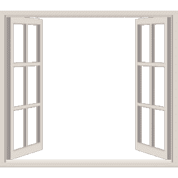
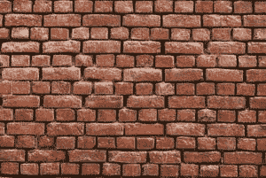
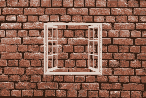

# 如何使用 PIL 将一张透明的 PNG 图片与另一张图片合并？

> 原文:[https://www . geeksforgeeks . org/如何使用-pil/](https://www.geeksforgeeks.org/how-to-merge-a-transparent-png-image-with-another-image-using-pil/) 将一个透明的-png-image-与另一个-image-合并

本文讨论如何将一个透明的 PNG 图像与另一个图像放在一起。这是对图像非常常见的操作。它有很多不同的应用。例如，在图像上添加水印或徽标。为此，我们使用 Python 中的 PIL 模块。其中我们使用了一些内置的方法，并以看起来像粘贴的方式组合图像。

*   [**打开功能**](https://www.geeksforgeeks.org/python-pil-image-open-method/)**–**用于打开一个图像。
*   [**转换功能**](https://www.geeksforgeeks.org/python-pil-image-convert-method/)**–**返回给定图像的转换副本。它使用透明遮罩将图像转换为其真实颜色。
*   [**粘贴功能**](https://www.geeksforgeeks.org/python-pil-paste-and-rotate-method/)**–**用于将一张图片粘贴到另一张图片上。

> **语法:** PIL。图像。图像。粘贴(图像 _1，图像 _2，框=无，遮罩=无)
> 或
> 图像 _ 对象。粘贴(图像 _2，框=无，遮罩=无)
> 
> **参数:**
> 
> *   **image_1/image_object** :是要粘贴其他图像的图像。
> *   **image_2:** 源图像或像素值(整数或元组)。
> *   **框:**一个可选的 4 元组，给出要粘贴的区域。如果改为使用二元组，它将被视为左上角。如果省略或无，源将粘贴到左上角。
> *   **蒙版:**将用于粘贴图像的蒙版。如果您传递一个带有透明度的图像，那么 alpha 通道将用作遮罩。

**进场:**

*   使用 Image.open()函数打开正面和背景图像。
*   将两个图像都转换为 RGBA。
*   计算要粘贴图像的位置。
*   使用粘贴功能合并两幅图像。
*   保存图像。

**输入数据:**

为了输入数据，我们使用了两个图像:

*   正面图像:像徽标一样的透明图像



*   背景图片:像任何壁纸图片一样的背景



**实施:**

## 蟒蛇 3

```
# import PIL module
from PIL import Image

# Front Image
filename = 'front.png'

# Back Image
filename1 = 'back.jpg'

# Open Front Image
frontImage = Image.open(filename)

# Open Background Image
background = Image.open(filename1)

# Convert image to RGBA
frontImage = frontImage.convert("RGBA")

# Convert image to RGBA
background = background.convert("RGBA")

# Calculate width to be at the center
width = (background.width - frontImage.width) // 2

# Calculate height to be at the center
height = (background.height - frontImage.height) // 2

# Paste the frontImage at (width, height)
background.paste(frontImage, (width, height), frontImage)

# Save this image
background.save("new.png", format="png")
```

**输出:**

