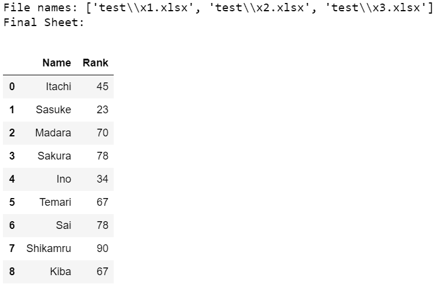

# 如何用 Python 合并一个文件夹中的所有 excel 文件？

> 原文:[https://www . geesforgeks . org/如何使用 python 合并文件夹中的所有 excel 文件/](https://www.geeksforgeeks.org/how-to-merge-all-excel-files-in-a-folder-using-python/)

在本文中，我们将看到如何将文件夹中的所有 Excel 文件组合成一个文件。

### 使用的模块:

使用的 python 库有:

*   [**Pandas**](https://www.geeksforgeeks.org/introduction-to-pandas-in-python/)**:**Pandas 是一个为 python 编程语言开发的python 库，用于操纵数据和分析数据。它被广泛用于数据科学和数据分析。
*   [**Glob**](https://www.geeksforgeeks.org/glob-filename-pattern-matching/)**:**Glob 模块根据 Unix Shell 使用的规则匹配所有匹配指定模式的路径名。

### 使用的 Excel 文件:

将使用三个 Excel 文件，这些文件将使用 python 合并到一个文件夹中的一个 Excel 文件中。三个 Excel 文件分别是 **x1.xlsx** 、 **x2.xlsx** 、 **x3.xlsx** :


### 逐步方法:

*   首先，我们必须导入库和模块

## 蟒蛇 3

```
# importing pandas libraries and 
# glob module
import pandas as pd
import glob
```

*   设置存储文件的文件夹的路径。这一行代码将获取存储文件的文件夹。

## 蟒蛇 3

```
# path of the folder
path = r'test'
```

*   使用 Glob 模块显示文件夹中的文件名。 [glob.glob( )](https://www.geeksforgeeks.org/how-to-use-glob-function-to-find-files-recursively-in-python/) 函数将使用搜索给定路径中的所有文件。xlsx 扩展。print(文件名)显示所有扩展名为 xlsx 的文件的名称。

## 蟒蛇 3

```
# reading all the excel files
filenames = glob.glob(path + "\*.xlsx")
print('File names:', filenames)
```

*   初始化空数据帧。数据框是 python 中用于分析和操作数据的表数据结构。在这里，我们必须初始化一个空的数据帧，用于存储三个文件中的组合数据

## 蟒蛇 3

```
# Initializing empty data frame
finalexcelsheet = pd.DataFrame()
```

*   逐一遍历文件夹中的所有文件。我们必须使用 for 循环遍历每个文件。 [pd.concat()](https://www.geeksforgeeks.org/pandas-concat-function-in-python/) 函数将连接 excel 文件中存在的所有多张工作表，如本例中第三个 excel 文件的情况，并将存储在一个名为 df 的变量中。finalexcelsheet.append()函数将把 df 变量中存在的数据逐个追加到 finalexcelsheet 中。因此，有了这段代码，您将能够轻松地组合 Excel 文件

## 蟒蛇 3

```
# to iterate excel file one by one 
# inside the folder
for file in filenames:

    # combining multiple excel worksheets 
    # into single data frames
    df = pd.concat(pd.read_excel(file, sheet_name=None),
                   ignore_index=True, sort=False)

    # Appending excel files one by one
    finalexcelsheet = finalexcelsheet.append(
      df, ignore_index=True)
```

*   显示组合数据。要显示组合文件，只需编写 print(finalexcelsheet)。

## 蟒蛇 3

```
# to print the combined data
print('Final Sheet:')
display(finalexcelsheet)
```

*   将合并的数据插入新的 Excel 文件。

## 蟒蛇 3

```
# save combined data
finalexcelsheet.to_excel(r'Final.xlsx',index=False)
```

下面是基于上述方法的完整 python 程序:

## 蟒蛇 3

```
#import modules
import pandas as pd
import glob

# path of the folder
path = r'test'

# reading all the excel files
filenames = glob.glob(path + "\*.xlsx")
print('File names:', filenames)

# initializing empty data frame
finalexcelsheet = pd.DataFrame()

# to iterate excel file one by one 
# inside the folder
for file in filenames:

    # combining multiple excel worksheets
    # into single data frames
    df = pd.concat(pd.read_excel(
      file, sheet_name=None), ignore_index=True, sort=False)

    # appending excel files one by one
    finalexcelsheet = finalexcelsheet.append(
      df, ignore_index=True)

# to print the combined data
print('Final Sheet:')
display(finalexcelsheet)

finalexcelsheet.to_excel(r'Final.xlsx', index=False)
```

**输出:**



**最终 Excel:**

