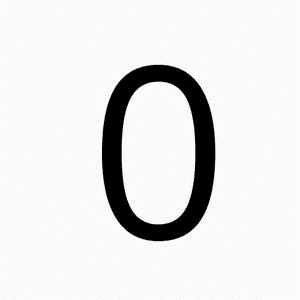
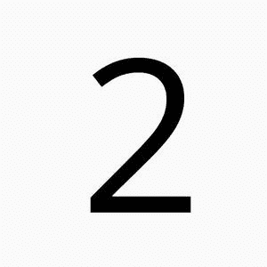
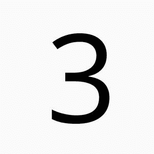
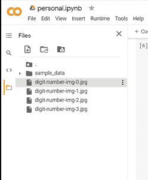
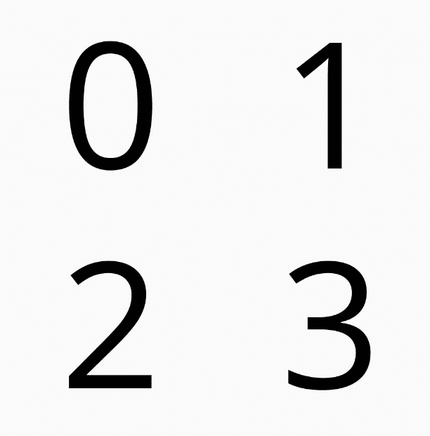

# 如何使用 Python 3 模块抱枕合并相同大小的图像？

> 原文:[https://www . geeksforgeeks . org/如何使用 python-3-module-pizzle 合并相同大小的图像/](https://www.geeksforgeeks.org/how-to-merge-images-with-same-size-using-the-python-3-module-pillow/)

在本文中，任务是使用 python 3 中的模块枕来合并图像和大小。

**Python 3 模块抱枕:**

这是 Python 映像库的更新。它是 Python 编程语言的免费开源附加库，增加了对打开、操作和保存许多不同图像文件格式的支持。要合并相同大小的图像，我们可以使用枕头。真的很酷，非常有趣的图书馆。

**第一步:**

在我们开始编码之前，让我们将 4 张图片保存到您的本地计算机中。

   

右键单击上面的图像并将图像保存到本地计算机。

**第二步:**

使用谷歌合作进行编码，因为它很容易编码，我们不需要单独安装枕头。如果你想在本地电脑上安装枕头，你可以使用链接[https://pypi.org/project/Pillow/](https://pypi.org/project/Pillow/)

在谷歌合作实验室中，您可以使用+符号添加 jpg，如图所示。下面。



**第三步:**

上传图片到谷歌后，让我们开始编码。

```py
from PIL import Image
```

**第四步:**

使用枕头打开图像

```py
img_01 = Image.open("digit-number-img-0.jpg")
img_02 = Image.open("digit-number-img-1.jpg")
img_03 = Image.open("digit-number-img-2.jpg")
img_04 = Image.open("digit-number-img-3.jpg")
```

**第五步:**

获取图像大小。

```py
img_01_size = img_01.size
img_02_size = img_02.size
img_03_size = img_02.size
img_02_size = img_02.size

print('img 1 size: ', img_01_size)
print('img 2 size: ', img_02_size)
print('img 3 size: ', img_03_size)
print('img 4 size: ', img_03_size)
```

**第六步:**

创建一个空白的白色图像:

```py
new_im = Image.new('RGB', (2*img_01_size[0],2*img_01_size[1]), (250,250,250))
```

**第七步:**

粘贴图像

```py
new_im.paste(img_01, (0,0))
new_im.paste(img_02, (img_01_size[0],0))
new_im.paste(img_03, (0,img_01_size[1]))
new_im.paste(img_04, (img_01_size[0],img_01_size[1]))
```

**第八步:**

保存新图像。

```py
new_im.save("merged_images.png", "PNG")
new_im.show()
```

## 蟒蛇 3

```py
from PIL import Image

img_01 = Image.open("digit-number-img-0.jpg")
img_02 = Image.open("digit-number-img-1.jpg")
img_03 = Image.open("digit-number-img-2.jpg")
img_04 = Image.open("digit-number-img-3.jpg")

img_01_size = img_01.size
img_02_size = img_02.size
img_03_size = img_02.size
img_02_size = img_02.size

print('img 1 size: ', img_01_size)
print('img 2 size: ', img_02_size)
print('img 3 size: ', img_03_size)
print('img 4 size: ', img_03_size)

new_im = Image.new('RGB', (2*img_01_size[0],2*img_01_size[1]), (250,250,250))

new_im.paste(img_01, (0,0))
new_im.paste(img_02, (img_01_size[0],0))
new_im.paste(img_03, (0,img_01_size[1]))
new_im.paste(img_04, (img_01_size[0],img_01_size[1]))

new_im.save("merged_images.png", "PNG")
new_im.show()
```

**输出:**

