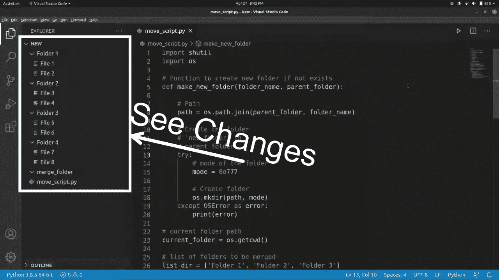

# 如何用 Python 将多个文件夹合并成一个文件夹？

> 原文:[https://www . geesforgeks . org/如何使用 python 将多个文件夹合并为一个文件夹/](https://www.geeksforgeeks.org/how-to-merge-multiple-folders-into-one-folder-using-python/)

在本文中，我们将讨论如何将多个文件夹移动到一个文件夹中。这可以使用 Python 的[**【OS】**](https://www.geeksforgeeks.org/os-module-python-examples/)和 [**Shutil**](https://www.geeksforgeeks.org/shutil-module-in-python/) 模块来完成。

### **进场:**

1.  获取当前目录和要合并的文件夹列表。
2.  循环浏览文件夹列表，并将它们的内容存储在列表中。这里，我们将它们存储在字典中，这样我们就可以将文件夹的名称作为关键字，将其内容作为值列表。
3.  指定要合并所有其他文件夹的文件夹。如果文件夹存在，那么我们可以走了，但是如果文件夹不存在，那么创建一个新的文件夹。
4.  遍历字典，并将所有列出的文件夹中的所有内容移到合并文件夹中。

**让我们一步一步地实现这个方法:**

**步骤 1:** 下面的代码执行以下操作:

*   获取当前目录。
*   列出所有要合并的文件夹。
*   将所有列出的文件夹的内容存储在字典中，文件夹名称作为关键字，其内容作为值列表。

## 蟒蛇 3

```
# current folder path
current_folder = os.getcwd() 

# list of folders to be merged
list_dir = ['Folder 1', 'Folder 2', 'Folder 3']

# enumerate on list_dir to get the 
# content of all the folders ans store it in a dictionary
content_list = {}
for index, val in enumerate(list_dir):
    path = os.path.join(current_folder, val)
    content_list[ list_dir[index] ] = os.listdir(path)
```

**步骤 2:** 如果合并文件夹尚不存在，则创建合并文件夹。

## 蟒蛇 3

```
# Function to create new folder if not exists
def make_new_folder(folder_name, parent_folder_path):

    # Path
    path = os.path.join(parent_folder_path, folder_name)

    # Create the folder
    # 'new_folder' in
    # parent_folder
    try: 

        # mode of the folder
        mode = 0o777

        # Create folder
        os.mkdir(path, mode) 

    except OSError as error: 
        print(error)

# folder in which all the content 
# will be merged
merge_folder = "merge_folder"

# merge_folder path - current_folder 
# + merge_folder
merge_folder_path = os.path.join(current_folder, merge_folder) 

# create merge_folder if not exists
make_new_folder(merge_folder, current_folder)
```

**步骤 3:** 下面的代码执行以下操作:

*   用所有的文件夹在字典中循环。
*   现在循环浏览每个文件夹的内容，并将它们一个接一个地移动到合并文件夹。

## 蟒蛇 3

```
# loop through the list of folders
for sub_dir in content_list:

    # loop through the contents of the
    # list of folders
    for contents in content_list[sub_dir]:

        # make the path of the content to move 
        path_to_content = sub_dir + "/" + contents  

        # make the path with the current folder
        dir_to_move = os.path.join(current_folder, path_to_content )

        # move the file
        shutil.move(dir_to_move, merge_folder_path)
```

**完整代码:**

## 蟒蛇 3

```
import shutil
import os

# Function to create new folder if not exists
def make_new_folder(folder_name, parent_folder):

    # Path
    path = os.path.join(parent_folder, folder_name)

    # Create the folder
    # 'new_folder' in
    # parent_folder
    try: 
        # mode of the folder
        mode = 0o777

        # Create folder
        os.mkdir(path, mode) 
    except OSError as error: 
        print(error)

# current folder path
current_folder = os.getcwd() 

# list of folders to be merged
list_dir = ['Folder 1', 'Folder 2', 'Folder 3']

# enumerate on list_dir to get the 
# content of all the folders ans store 
# it in a dictionary
content_list = {}
for index, val in enumerate(list_dir):
    path = os.path.join(current_folder, val)
    content_list[ list_dir[index] ] = os.listdir(path)

# folder in which all the content will
# be merged
merge_folder = "merge_folder"

# merge_folder path - current_folder 
# + merge_folder
merge_folder_path = os.path.join(current_folder, merge_folder) 

# create merge_folder if not exists
make_new_folder(merge_folder, current_folder)

# loop through the list of folders
for sub_dir in content_list:

    # loop through the contents of the 
    # list of folders
    for contents in content_list[sub_dir]:

        # make the path of the content to move 
        path_to_content = sub_dir + "/" + contents  

        # make the path with the current folder
        dir_to_move = os.path.join(current_folder, path_to_content )

        # move the file
        shutil.move(dir_to_move, merge_folder_path)
```

**运行上述程序前的文件夹结构。**

```
Folder 1
    File 1
    File 2
Folder 2
    File 3
    File 4
Folder 3
    File 5
    File 6
Folder 4
    File 7
    File 8
merge_folder (Empty)
move_script.py
```

**运行上述程序后的文件夹结构。**

```
Folder 1 (Empty)
Folder 2 (Empty)
Folder 3 (Empty)
Folder 4 (Untouched)
    File 7
    File 8
merge_folder
    File 1
    File 2
    File 3
    File 4
    File 5
    File 6
move_script.py
```

**工作中的程序:**

