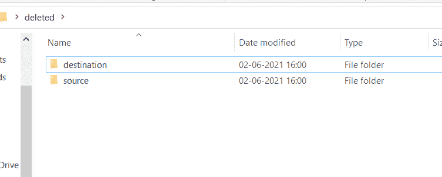
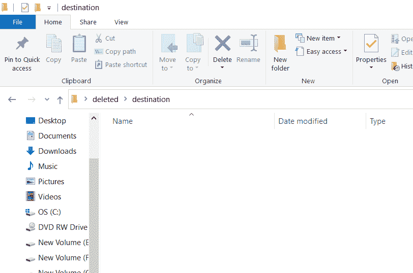

# 如何使用 Python 将所有文件从一个目录移动到另一个目录？

> 原文:[https://www . geeksforgeeks . org/如何使用 python 将所有文件从一个目录移动到另一个目录/](https://www.geeksforgeeks.org/how-to-move-all-files-from-one-directory-to-another-using-python/)

在本文中，我们将看到如何使用 Python 将所有文件从一个目录移动到另一个目录。在日常的计算机使用中，我们通常会将文件从一个文件夹复制或移动到另一个文件夹，现在让我们使用 python 做同样的事情。

**这可以通过两种方式完成:**

*   使用操作系统模块。
*   使用 shutil 模块。

源和目标文件夹



源文件夹和目标文件夹


源文件夹



目标文件夹–之前

**方法 1:** 使用[操作系统模块](https://www.geeksforgeeks.org/os-module-python-examples/)中的[重命名()](https://www.geeksforgeeks.org/python-os-rename-method/)方法

rename()方法接受两个参数，第一个是源路径，第二个是目标路径，rename 函数会将源路径的文件移动到提供的目标。

首先导入 os 模块，存储源目录的路径和目的目录的路径，使用 os 模块中的 [listdir()](https://www.geeksforgeeks.org/python-os-listdir-method/) 方法，将源目录中的所有文件做一个列表。现在使用 rename()方法逐个移动列表中的所有文件。

**代码:**

## 蟒蛇 3

```
import os

source = 'C:/Users/sai mohan pulamolu/Desktop/deleted/source/'
destination = 'C:/Users/sai mohan pulamolu/Desktop/deleted/destination/'

allfiles = os.listdir(source)

for f in allfiles:
    os.rename(source + f, destination + f)
```

**方法 2:** 使用 [shutil 模块](https://www.geeksforgeeks.org/shutil-module-in-python/)的 move()方法

shutil.move()方法接受两个参数，第一个是源路径，第二个是目标路径，move 函数会将源路径的文件移动到提供的目标。

首先导入 shutil 模块，存储源目录的路径和目的目录的路径。使用 os 模块中的 listdir()方法列出源目录中的所有文件。现在使用 shutil.move()方法逐个移动列表中的所有文件。

## 蟒蛇 3

```
import os
import shutil

source = 'C:/Users/sai mohan pulamolu/Desktop/deleted/source/'
destination = 'C:/Users/sai mohan pulamolu/Desktop/deleted/destination/'

allfiles = os.listdir(source)

for f in allfiles:
    shutil.move(source + f, destination + f)
```

**两个输出都是** **相同:**


目标文件夹–之后