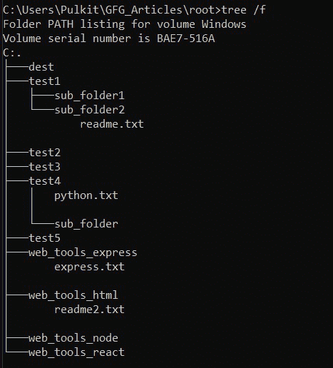
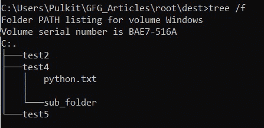

# 如何用 Python 移动带子文件夹的文件夹列表？

> 原文:[https://www . geeksforgeeks . org/如何使用 python 移动带有子文件夹的文件夹列表/](https://www.geeksforgeeks.org/how-to-move-list-of-folders-with-subfolders-using-python/)

有时，我们需要移动整个目录，或者可能有一个这样的目录列表，比如 A，连同它的子内容、文件和子文件夹，到另一个目标目录 b。虽然这可以通过“剪切”和“粘贴”手动完成，但是如果有数百或数千个目录，你想移动，更不用说人为错误了！让我们看看如何使用 shutil 模块，用几行代码在 python 中轻松地做到这一点。

### **关闭模块**

[shutil](https://www.geeksforgeeks.org/shutil-module-in-python/) 提供了许多高级功能，有助于自动化文件或目录的复制、移动或删除过程，而与所使用的平台无关。它属于 Python 的标准实用程序模块，因此不需要单独安装。

它有一个 [**shutil.move()**](https://www.geeksforgeeks.org/python-shutil-move-method/) 方法，递归地将文件或目录(源)及其子内容移动到另一个位置(目标)并返回目标。如果目标目录已经存在，那么源将被移动到该目录中，否则在移动之前会创建一个新目录。如果目标已经存在，但不是目录，则根据 [os.rename()](https://www.geeksforgeeks.org/python-os-rename-method/) 规范，它可能会被覆盖或引发错误。

> **语法:** shutil.move(源，目标，copy_function = copy2)

假设目录的结构如下所示–



其中**‘dest’**是我们的目的文件夹。

**示例#1:** 基于目录列表

在这里，我们列出了想要移动的目录。为了简单起见，所有的目录都在同一个文件夹中，您也可以从不同的基本目录中移动。

## 蟒蛇 3

```
# import shutil module
import shutil

# import os module
import os

# base path
base_path = 'C:/Users/Pulkit/GFG_Articles/root'

# list of directories we want to move.
dir_list = ['test2', 'test4', 'test5', 'does_not_exist']

# path to destination directory
dest = os.path.join(base_path, 'dest')

print("Before moving directories:")
print(os.listdir(base_path))

# traverse each directory in dir_list
for dir_ in dir_list:

    # create path to the directory in the
    # dir_list.
    source = os.path.join(base_path, dir_)

    # check if it is an existing directory
    if os.path.isdir(source):

        # move to destination path
        shutil.move(source, dest)

print("After moving directories:")
print(os.listdir(base_path))
```

**输出:**

> 移动目录之前:
> 
> ['dest '，' test1 '，' test2 '，' test3 '，' test4 '，' test5 '，' web_tools_express '，' web_tools_html '，' web_tools_node '，' web_tools_react']
> 
> 移动目录后:
> 
> ['dest '，' test1 '，' test3 '，' web_tools_express '，' web_tools_html '，' web_tools_node '，' web_tools_react']

让我们检查目标文件夹，如下所示:



如您所见，我们将整个目录及其内容移动到目标目录(绝对路径指向“目标”目录)。

**示例#2:** 基于模式

假设我们想要将遵循特定名称模式的目录移动到我们的目的地。让我们移动所有以“web”开头的目录。您可以根据需要使用任何图案。这将是一个更实际的使用案例，我们有数百个目录。

## 蟒蛇 3

```
# import shutil module
import shutil

# import os module
import os

# base path
base_path = 'C:/Users/Pulkit/GFG_Articles/root'

# get all directories in our base path.
all_dir = os.listdir(base_path)

# path to destination directory
dest = os.path.join(base_path, 'dest')

print("Before moving directories:")
print(os.listdir(base_path))

for dir_ in all_dir:

    # check if the dir_ follows the required
    # pattern.
    if dir_.startswith('web'):

        # create path to this directory.
        source = os.path.join(base_path, dir_)

        # move to destination path
        shutil.move(source, dest)

print("After moving directories:")
print(os.listdir(base_path))
```