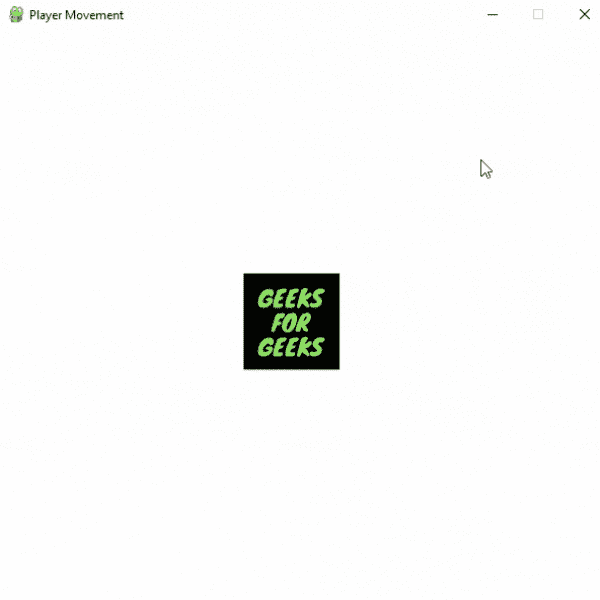
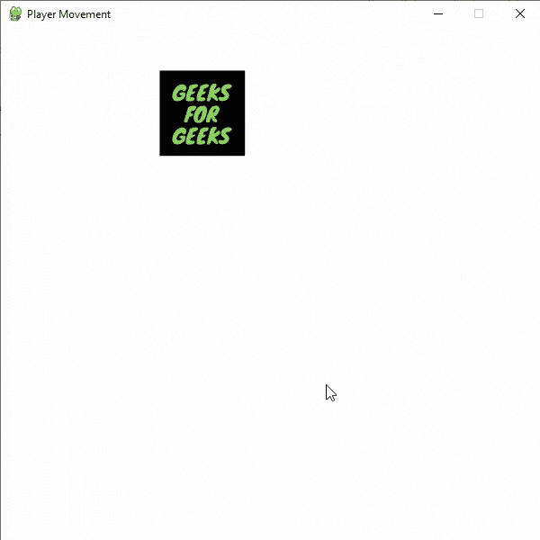
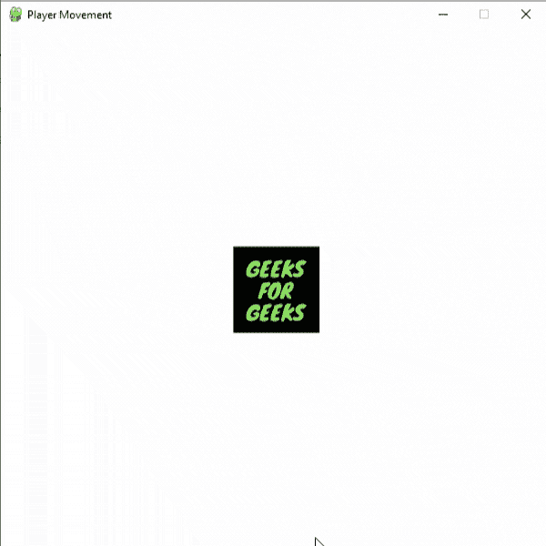
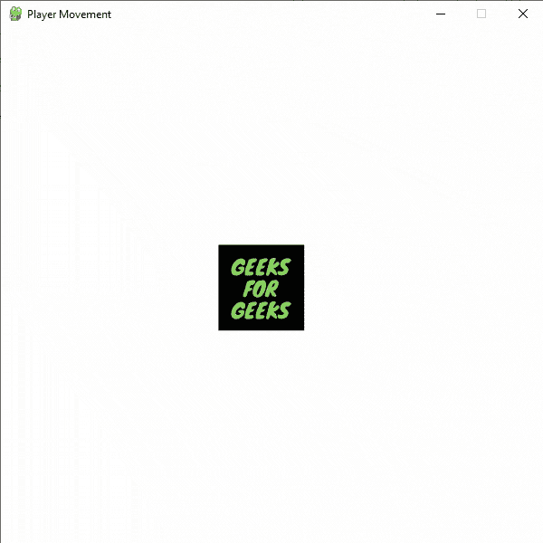

# 如何在 Pygame

中移动你的游戏角色

> 原文:[https://www . geesforgeks . org/如何在游戏中移动游戏角色/](https://www.geeksforgeeks.org/how-to-move-your-game-character-around-in-pygame/)

**先决条件:** [皮游戏](https://www.geeksforgeeks.org/introduction-to-pygame/)

**Pygame** 是一套跨平台的 Python 模块，专为编写视频游戏而设计。它包括设计用于 Python 编程语言的计算机图形和声音库。您可以使用 pygame 创建不同类型的游戏，包括街机游戏、平台游戏等。

**使用中的图像:**

 

你可以控制你的**玩家的移动。**首先使用 pygame 的 display.set_mode()方法创建一个显示面对象，然后使用 pygame 的 image.load()方法添加玩家的精灵。set_mode()函数用于初始化显示表面或窗口。size 参数是一对代表宽度和高度的数字。flags 参数是附加选项的集合。深度参数表示用于颜色的位数。

**语法:**

> set_mode(大小=(0，0)，标志=0，深度=0，显示=0，vsync=0)

创建一个变量来存储玩家的速度。设置玩家的初始坐标。现在，根据键盘事件改变播放器的 x 和 y 坐标，即当按键状态改变时发生的事件。

blit(surface，surfacerect)函数用于在屏幕上绘制图像。

**语法:**

> 表面

为了从队列中收集所有事件，使用了事件模块的 get()函数，然后我们使用 For 循环对所有事件进行迭代。

**语法:**

> get(eventtype=None)

使用显示模块的 update()功能更新屏幕。

**语法:**

> 更新(矩形=无)

下面是实现。

**示例:**玩家移动程序

## 蟒蛇 3

```py
# Importing pygame module
import pygame
from pygame.locals import *

# initiate pygame and give permission
# to use pygame's functionality.
pygame.init()

# create the display surface object
# of specific dimension.
window = pygame.display.set_mode((600, 600))

# Add caption in the window
pygame.display.set_caption('Player Movement')

# Add player sprite
image = pygame.image.load(r'Player_image.png')

# Store the initial
# coordinates of the player in
# two variables i.e. x and y.
x = 100
y = 100

# Create a variable to store the
# velocity of player's movement
velocity = 12

# Creating an Infinite loop
run = True
while run:

    # Filling the background with
    # white color
    window.fill((255, 255, 255))

    # Display the player sprite at x
    # and y coordinates
    window.blit(image, (x, y))

    # iterate over the list of Event objects
    # that was returned by pygame.event.get()
    # method.
    for event in pygame.event.get():

        # Closing the window and program if the
        # type of the event is QUIT
        if event.type == pygame.QUIT:
            run = False
            pygame.quit()
            quit()

        # Checking event key if the type
        # of the event is KEYDOWN i.e.
        # keyboard button is pressed
        if event.type == pygame.KEYDOWN:

            # Decreasing the x coordinate
            # if the button pressed is
            # Left arrow key
            if event.key == pygame.K_LEFT:
                x -= velocity

            # Increasing the x coordinate
            # if the button pressed is
            # Right arrow key
            if event.key == pygame.K_RIGHT:
                x += velocity

            # Decreasing the y coordinate
            # if the button pressed is
            # Up arrow key
            if event.key == pygame.K_UP:
                y -= velocity

            # Increasing the y coordinate
            # if the button pressed is
            # Down arrow key
            if event.key == pygame.K_DOWN:
                y += velocity

        # Draws the surface object to the screen.
        pygame.display.update()
```

**输出:**



玩家也可以连续移动。为此，除了要做一些改变之外，其他一切都保持不变。这里我们创建一个新的时钟对象，使用 clock()来控制游戏的帧速率。

**语法:**

> 时钟()

创建一个新的变量(名为 key_pressed_is)来存储用户按下的键。为此，我们使用按键模块的 get_pressed()函数。

**语法:**

> get _ pressed()

它返回一系列布尔值，代表键盘上每个键的状态。

**举例:**连续移动玩家

## 蟒蛇 3

```py
# Importing pygame module
import pygame
from pygame.locals import *

# initiate pygame and give permission
# to use pygame's functionality.
pygame.init()

# create the display surface object
# of specific dimension.
window = pygame.display.set_mode((600, 600))

# Add caption in the window
pygame.display.set_caption('Player Movement')

# Initializing the clock
# Clocks are used to track and
# control the frame-rate of a game
clock = pygame.time.Clock()

# Add player sprite
image = pygame.image.load(r'Player_image.png')

# Store the initial
# coordinates of the player in
# two variables i.e. x and y.
x = 100
y = 100

# Create a variable to store the
# velocity of player's movement
velocity = 12

# Creating an Infinite loop
run = True
while run:

    # Set the frame rates to 60 fps
    clock.tick(60)

    # Filling the background with
    # white color
    window.fill((255, 255, 255))

    # Display the player sprite at x
    # and y coordinates
    window.blit(image, (x, y))

    # iterate over the list of Event objects
    # that was returned by pygame.event.get() method.
    for event in pygame.event.get():

        # Closing the window and program if the
        # type of the event is QUIT
        if event.type == pygame.QUIT:
            run = False
            pygame.quit()
            quit()

    # Storing the key pressed in a
    # new variable using key.get_pressed()
    # method
    key_pressed_is = pygame.key.get_pressed()

    # Changing the coordinates
    # of the player
    if key_pressed_is[K_LEFT]:
        x -= 8
    if key_pressed_is[K_RIGHT]:
        x += 8
    if key_pressed_is[K_UP]:
        y -= 8
    if key_pressed_is[K_DOWN]:
        y += 8

    # Draws the surface object to the screen.
    pygame.display.update()
```

**输出:**



## 翻转播放器精灵

您可以使用 pygame 转换模块的 flip()函数轻松翻转任何精灵。例如，如果我们想在玩家改变移动方向时翻转精灵，那么我们可以使用下面的线

> window . blit(pygame . transform . flip(image，False，True)，(x，y))

**翻转()** f 功能 u sed 水平、垂直翻转表面物体。或者两者都有。该函数有三个参数:

*   要翻转的图像
*   用于水平翻转的布尔值
*   用于垂直翻转的布尔值

下面是实现。

**示例:**翻转玩家形象

## 蟒蛇 3

```py
# Importing pygame module
import pygame
from pygame.locals import *

# initiate pygame and give permission
# to use pygame's functionality.
pygame.init()

# create the display surface object
# of specific dimension.
window = pygame.display.set_mode((600, 600))

# Add caption in the window
pygame.display.set_caption('Player Movement')

# Initializing the clock
# Clocks are used to track and
# control the frame-rate of a game
clock = pygame.time.Clock()

# creating a variable to check the direction
# of movement
# We will change its value whenever
# the player changes its direction
direction = True

# Add player sprite
image = pygame.image.load(r'Player_image.png')

# Store the initial
# coordinates of the player in
# two variables i.e. x and y.
x = 100
y = 100

# Create a variable to store the
# velocity of player's movement
velocity = 12

# Creating an Infinite loop
run = True
while run:

    # Set the frame rates to 60 fps
    clock.tick(60)

    # Filling the background with
    # white color
    window.fill((255, 255, 255))

    # Display the player sprite at x
    # and y coordinates
    # Flipping the player sprite if player
    # changes the direction
    if direction == True:
        window.blit(image, (x, y))
    if direction == False:
        window.blit(pygame.transform.flip(image, True, False), (x, y))

    # iterate over the list of Event objects
    # that was returned by pygame.event.get() method.
    for event in pygame.event.get():

        # Closing the window and program if the
        # type of the event is QUIT
        if event.type == pygame.QUIT:
            run = False
            pygame.quit()
            quit()

        # Changing the value of the
        # direction variable
        if event.type == pygame.KEYDOWN:
            if event.key == pygame.K_RIGHT:
                direction = True
            elif event.key == pygame.K_LEFT:
                direction = False

    # Storing the key pressed in a
    # new variable using key.get_pressed()
    # method
    key_pressed_is = pygame.key.get_pressed()

    # Changing the coordinates
    # of the player
    if key_pressed_is[K_LEFT]:
        x -= 5
    if key_pressed_is[K_RIGHT]:
        x += 5
    if key_pressed_is[K_UP]:
        y -= 5
    if key_pressed_is[K_DOWN]:
        y += 5

    # Draws the surface object to the screen.
    pygame.display.update()
```

**输出:**



我们还可以通过创建精灵列表来轻松更新玩家精灵。

> 图像=[pygame . image . load(r ' player _ image 1 . png ')，
> 
> pygame . image . load(r ' player _ image 2 . png ')]

**示例:**更新精灵

## 蟒蛇 3

```py
# Importing pygame module
import pygame
from pygame.locals import *

# initiate pygame and give permission
# to use pygame's functionality.
pygame.init()

# create the display surface object
# of specific dimension.
window = pygame.display.set_mode((600, 600))

# Add caption in the window
pygame.display.set_caption('Player Movement')

# Initializing the clock
# Clocks are used to track and
# control the frame-rate of a game
clock = pygame.time.Clock()

# creating a variable to check the direction
# of movement
# We will change its value whenever
# the player changes its direction
direction = True

# Add player sprites in a list
image = [pygame.image.load(r'Player_image1.png'),
         pygame.image.load(r'Player_image2.png')]

# Store the initial
# coordinates of the player in
# two variables i.e. x and y.
x = 100
y = 100

# Create a variable to store the
# velocity of player's movement
velocity = 12

# Creating an Infinite loop
run = True
while run:

    # Set the frame rates to 60 fps
    clock.tick(60)

    # Filling the background with
    # white color
    window.fill((255, 255, 255))

    # Display the player sprite at x
    # and y coordinates
    # Changing the player sprite if player
    # changes the direction
    if direction == True:
        window.blit(image[0], (x, y))
    if direction == False:
        window.blit(image[1], (x, y))

    # iterate over the list of Event objects
    # that was returned by pygame.event.get() method.
    for event in pygame.event.get():

        # Closing the window and program if the
        # type of the event is QUIT
        if event.type == pygame.QUIT:
            run = False
            pygame.quit()
            quit()

        # Changing the value of the
        # direction variable
        if event.type == pygame.KEYDOWN:
            if event.key == pygame.K_RIGHT:
                direction = True
            elif event.key == pygame.K_LEFT:
                direction = False

    # Storing the key pressed in a
    # new variable using key.get_pressed()
    # method
    key_pressed_is = pygame.key.get_pressed()

    # Changing the coordinates
    # of the player
    if key_pressed_is[K_LEFT]:
        x -= 5
    if key_pressed_is[K_RIGHT]:
        x += 5
    if key_pressed_is[K_UP]:
        y -= 5
    if key_pressed_is[K_DOWN]:
        y += 5

    # Draws the surface object to the screen.
    pygame.display.update()
```

**输出:**

