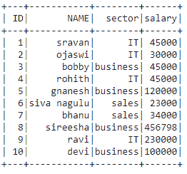
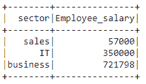
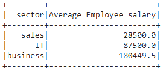
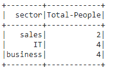

# 如何命名 PySpark DataFrame 中的聚合列？

> 原文:[https://www . geesforgeks . org/how-to-name-aggregate-columns-in-py spark-data frame/](https://www.geeksforgeeks.org/how-to-name-aggregate-columns-in-pyspark-dataframe/)

在本文中，我们将看到如何命名 Pyspark 数据框中的聚合列。

我们可以通过在 groupBy()之后使用别名来实现这一点。groupBy()用于连接两个列，并用于聚合列，alias 用于更改通过对列中的数据进行分组而形成的新列的名称。

> **语法**:data frame . group by(“column _ name 1”)。agg(agg _ function(" column _ name 2 ")。别名(“new_column_name”)
> 
> **其中**
> 
> *   数据帧是输入数据帧
> *   聚合函数用于对列进行分组，如 sum()、avg()、count()
> *   new_column_name 是新聚合数据列的名称
> *   alias 是用于获取新列名的关键字

**创建用于演示的数据框:**

## 蟒蛇 3

```
# importing module
import pyspark

# importing sparksession from pyspark.sql module
from pyspark.sql import SparkSession

# creating sparksession and giving an app name
spark = SparkSession.builder.appName('sparkdf').getOrCreate()

# list  of employee data with 10 row values
data =[["1","sravan","IT",45000],
       ["2","ojaswi","IT",30000],
       ["3","bobby","business",45000],
       ["4","rohith","IT",45000],
       ["5","gnanesh","business",120000],
       ["6","siva nagulu","sales",23000],
       ["7","bhanu","sales",34000],
       ["8","sireesha","business",456798],
       ["9","ravi","IT",230000],
       ["10","devi","business",100000],
       ]

# specify column names
columns=['ID','NAME','sector','salary']

# creating a dataframe from the lists of data
dataframe = spark.createDataFrame(data,columns)

# display dataframe
dataframe.show()
```

**输出:**



**示例 1:** Python 程序，通过总和聚合将薪资在不同部门之间分组，并命名为 Employee_salary。sum()函数在 pyspark.sql.functions 包中可用，因此我们需要导入它。

## 蟒蛇 3

```
# importing sum function
from pyspark.sql.functions import sum

# group the salary among different sectors
# and name  as Employee_salary by sum aggregation
dataframe.groupBy(
  "sector").agg(sum("salary").alias("Employee_salary")).show()
```

**输出:**



**示例 2:** Python 程序，用于在不同部门之间对薪资进行分组，并通过平均聚合将其命名为 Average _ Employee _ paypal

> **语法**:平均值(“列名”)

## 蟒蛇 3

```
# importing avg function
from pyspark.sql.functions import avg

# group the salary among different sectors
# and name  as Average_Employee_salary
# by average aggregation
dataframe.groupBy("sector") 
.agg(avg(
  "salary").alias("Average_Employee_salary")).show()
```

**输出:**



**示例 3:** 将不同部门的薪资分组，并命名为总计-按计数汇总的人员

## 蟒蛇 3

```
# importing count function
from pyspark.sql.functions import count

# group the salary among different 
# sectors and name  as Total-People
# by count aggregation
dataframe.groupBy("sector") 
.agg(count(
  "salary").alias("Total-People")).show()
```

**输出:**

