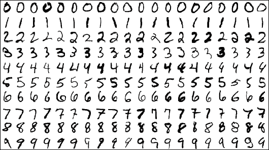
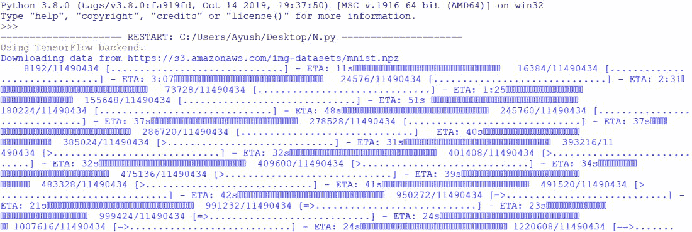
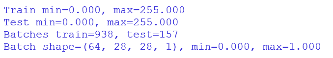
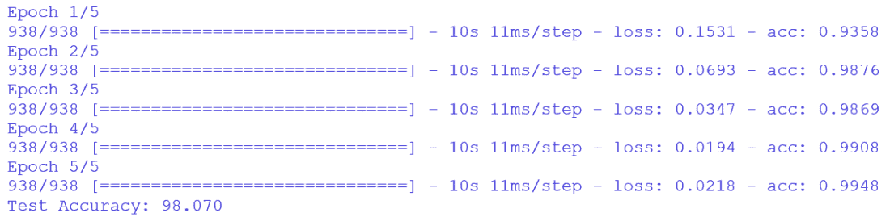
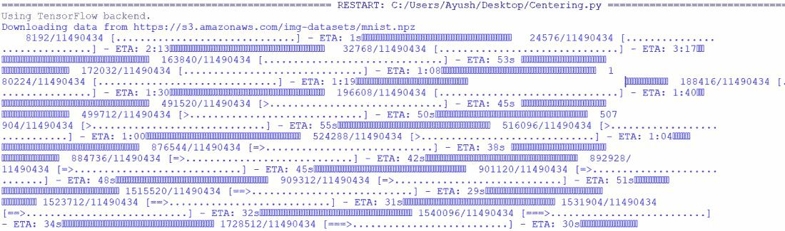
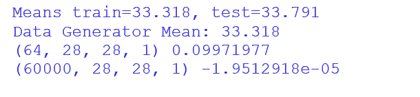
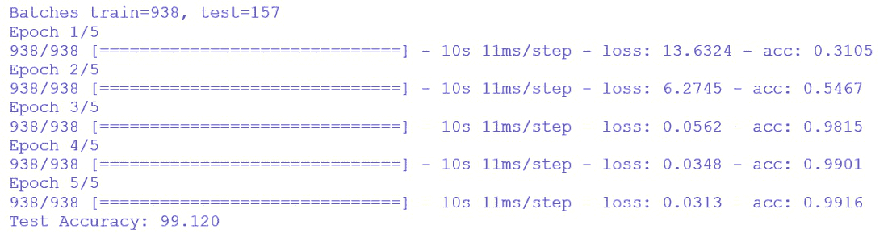
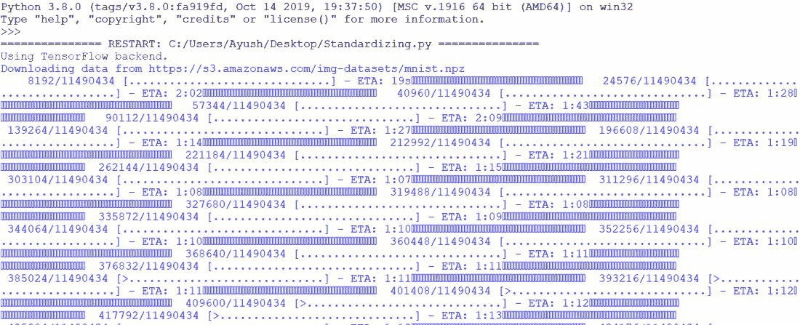
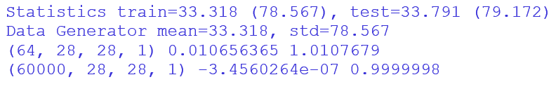
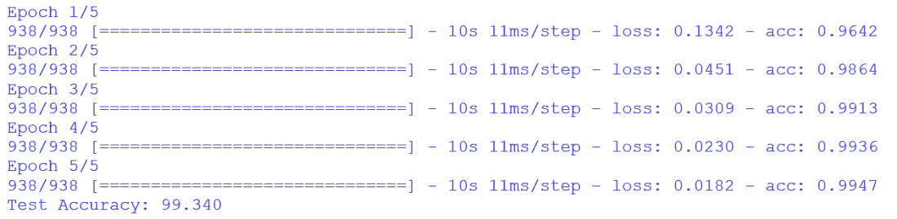

# 如何对 Keras 中的图像像素进行归一化、居中和标准化？

> 原文:[https://www . geeksforgeeks . org/如何标准化-中心-和-标准化-图像像素-in-keras/](https://www.geeksforgeeks.org/how-to-normalize-center-and-standardize-image-pixels-in-keras/)

深度学习神经网络模型最关键的部分是“数据集”，如果模型用于对象/图像检测等，则直接是数据集中的*图像*。在开发神经网络模型之前，图像中的像素值必须适当缩放。

**Keras** 是 Python 中的深度学习库，用于神经网络对模型进行训练。Keras 支持在模型训练期间缩放图像。在接下来的示例中，将使用“ImageDataGenerator”，这是 Keras 库中的一个类。它将提供一种在建模之前缩放图像像素值的技术。

像素缩放技术包括三种主要类型，由 ImageDataGenerator 类支持:

*   **像素归一化**–缩放 0-1 范围内的像素值。
*   **像素居中**–缩放像素值，使其平均值为 0。
*   **像素标准化**–缩放像素值，使其具有 0 平均值和单位(1)方差。

像素缩放是通过为图像数据生成器指定一些参数来完成的:

> datagen = imagedatagenerator(……)

计算训练数据集中的缩放统计:

> datagen.fit(trainX)

将神经网络拟合到数据生成器中:

> train _ iterator = datagen . flow(trainX，trainy)
> 
> model . fit _ generator(train _ iterator，…)

创建单独的批处理迭代器，用于在数据生成器上进行训练和验证，该数据生成器将执行相同的像素缩放:

> train _ iterator = datagen . flow(trainX，trainy)
> 
> val _ iterator = data gen . flow(val，val)
> 
> model . fit _ generator(train _ iterator，validation_data=val_iterator，…)

拟合模型后测试数据集的批处理迭代器:

> test _ iterator = datagen . flow(testX，testy)
> 
> loss = model . evaluate _ generator(test _ iterator，…)

#### **使用的数据集:**

在接下来的示例中，为了标准化、居中和标准化 Keras 库中的图像像素，将使用 **MSIST** 数据集。它由 60，000 个训练集灰度图像和另外 10，000 个测试集灰度图像组成，测试集由不同方向的“0-9”数字组成。链接到 [MNIST 数据集](http://yann.lecun.com/exdb/mnist/)。数据集中使用的图像类型:



## **归一化 K** 时代的图像像素

在将像素值从 0-255 范围重新缩放到 0-1 范围时，可以使用 ImageDataGenerator 类。0-1 比例范围称为**归一化**。需要采取以下步骤来标准化图像像素:

*   通过将像素的最大值除以像素的最小值:1/255 = 0.0039 来设置重新缩放参数，可以缩放 0-1 范围内的像素
*   使用测试和训练数据集的生成器创建迭代器。在这种情况下，将使用 64 的批量。这意味着每个时期将有 64 幅图像通过训练过程。
*   可以通过拍摄第一批缩放图像并检查像素的最小值和最大值来确认像素归一化。
*   为了使用数据生成器来拟合和评估模型，定义了卷积神经网络(CNN)模型，我们运行五个时期，每批有 60，000 个图像，相当于每个时期 938 个批次。
*   现在，在测试数据集上评估模型，测试数据集有 10，000 幅图像，分布在 64 个大小的批次中，相当于一个时期中的 157 个步骤。

#### 示例:

## 蟒蛇 3

```py
# import required modules
from keras.datasets import mnist
from keras.utils import to_categorical
from keras.models import Sequential
from keras.layers import Conv2D
from keras.layers import MaxPooling2D
from keras.layers import Dense
from keras.layers import Flatten
from keras.preprocessing.image import ImageDataGenerator

# loading the image dataset
(trainX, trainY), (testX, testY) = mnist.load_data()

# reshaping the dataset to have a single channel
width, height, channels = trainX.shape[1], trainX.shape[2], 1
trainX = trainX.reshape((trainX.shape[0], width, height, channels))
testX = testX.reshape((testX.shape[0], width, height, channels))
trainY = to_categorical(trainY)
testY = to_categorical(testY)

# confirming scale of pixel values
print('Train min=%.3f, max=%.3f' % (trainX.min(), trainX.max()))
print('Test min=%.3f, max=%.3f' % (testX.min(), testX.max()))

# creating the image data generator [1.0/255.0 = 0.00392156862]
datagen = ImageDataGenerator(rescale=1.0/255.0)

# preparing an iterator for scaling images
train_iterator = datagen.flow(trainX, trainY, batch_size=64)
test_iterator = datagen.flow(testX, testY, batch_size=64)
print('Batches train=%d, test=%d' % (len(train_iterator),
                                     len(test_iterator)))
# confirming- the scaling works
batchX, batchy = train_iterator.next()
print('Batch shape=%s, min=%.3f, max=%.3f' % (batchX.shape, batchX.min(),
                                              batchX.max()))
# defining the model
model = Sequential()
model.add(Conv2D(32, (3, 3), activation='relu', input_shape=(width, height,
                                                             channels)))
model.add(MaxPooling2D((2, 2)))
model.add(Conv2D(64, (3, 3), activation='relu'))
model.add(MaxPooling2D((2, 2)))
model.add(Flatten())
model.add(Dense(64, activation='relu'))
model.add(Dense(10, activation='softmax'))

# compiling the model
model.compile(optimizer='adam', loss='categorical_crossentropy',
              metrics=['accuracy'])

# fitting the model with generator
model.fit_generator(train_iterator, steps_per_epoch=len(train_iterator),
                    epochs=5)

# evaluating the model
_, acc = model.evaluate_generator(test_iterator, steps=len(test_iterator),
                                  verbose=0)
print('Test Accuracy: %.3f' % (acc * 100))
```

运行上述脚本后，它将从 amazon-AWS 网站下载 MNIST 数据集。下载数据集需要一些时间。



在检索第一批包含 64 幅大小为 28*28 且像素值在 0-1 范围内的图像时。



使用规范化技术，在测试数据集上评估模型。



神经网络模型的准确率为 **98.07%** 。

## 在 Keras 中居中图像像素

通过计算像素的平均值，然后从每个图像中减去它们，图像像素被居中。这种技术被称为**定心**。这具有将像素的分布值居中于零的效果，这意味着居中的图像将具有“零平均值”像素值。需要采取以下步骤来使图像像素居中:

*   使用统计方法计算训练数据集上 ImageDataGenerator 类中的平均像素值。
*   Keras 中的平均像素值不需要任何统计。在喀拉斯，这被称为样本定心。
*   统计数据计算完成后，将进行特征对中。
*   在批处理迭代器中计算一批图像的平均值。平均值的值接近于零，而不是完全为零。
*   设置训练数据集中的批处理大小。它可以是任何接近零的值。

#### 示例:

## 蟒蛇 3

```py
# import required modules
from keras.datasets import mnist
from keras.utils import to_categorical
from keras.models import Sequential
from keras.layers import Conv2D
from keras.layers import MaxPooling2D
from keras.layers import Dense
from keras.layers import Flatten
from keras.preprocessing.image import ImageDataGenerator

# loading the dataset
(trainX, trainY), (testX, testY) = mnist.load_data()

# reshaping the dataset to have a single channel
width, height, channels = trainX.shape[1], trainX.shape[2], 1
trainX = trainX.reshape((trainX.shape[0], width, height, channels))
testX = testX.reshape((testX.shape[0], width, height, channels))
trainY = to_categorical(trainY)
testY = to_categorical(testY)

# creating image data generator for centering images
datagen = ImageDataGenerator(featurewise_center=True)

# calculating the mean of the training dataset
datagen.fit(trainX)

# preparing iterators to scale images
train_iterator = datagen.flow(trainX, trainY, batch_size=64)
test_iterator = datagen.flow(testX, testY, batch_size=64)
print('Batches train=%d, test=%d' % (len(train_iterator),
                                     len(test_iterator)))

# defining the model
model = Sequential()
model.add(Conv2D(32, (3, 3), activation='relu', input_shape=(width, height,
                                                             channels)))
model.add(MaxPooling2D((2, 2)))
model.add(Conv2D(64, (3, 3), activation='relu'))
model.add(MaxPooling2D((2, 2)))
model.add(Flatten())
model.add(Dense(64, activation='relu'))
model.add(Dense(10, activation='softmax'))

# compiling the model
model.compile(optimizer='adam', loss='categorical_crossentropy',
              metrics=['accuracy'])

# fitting the model with the generator
model.fit_generator(train_iterator, steps_per_epoch=len(train_iterator),
                    epochs=5)

# evaluating the model
_, acc = model.evaluate_generator(test_iterator, steps=len(test_iterator),
                                  verbose=0)
print('Test Accuracy: %.3f' % (acc * 100))
```

运行上述脚本后，它将从 amazon-AWS 网站下载 MNIST 数据集。下载数据集需要一些时间。



检索单个批次的居中图像，我们可以清楚地看到平均像素值非常接近零。零平均像素值确认了所需的居中效果。



神经网络的性能开始很差，没有改善。居中值像素的范围从-277 到 277。神经网络通常以更小的输入进行更高效的训练。因此，为了获得更好的结果，应该在对中之前进行归一化。



神经网络模型的准确率为 **99.12%** 。

## Keras 中图像像素的标准化

**标准化**是一种对数据进行缩放的技术，假设数据的分布是高斯分布，并将数据的分布转换为“零均值”和“单位(1)标准差”。这种分布的数据称为标准高斯分布。当神经网络的数据集和为零并且具有在-3.0 到 3.0 范围内的较小输入值时，这种技术是有效的。

标准化图像是通过从它们各自的像素值中减去平均像素值，然后用像素值的标准偏差除以它们而得到的。需要采取以下步骤来标准化图像像素:

*   计算像素值的平均值和标准偏差。
*   使用统计数据来标准化每个图像。在 Keras 中，它被称为抽样标准化。
*   创建一批平均单位标准偏差为零的 64 幅图像，使样本接近标准高斯。
*   在整个数据集上运行测试，以确认平均值接近于零，标准偏差接近于 1。
*   在拟合和评估神经网络时应用像素缩放。

#### 示例:

## 蟒蛇 3

```py
# import required modules
from keras.datasets import mnist
from keras.utils import to_categorical
from keras.models import Sequential
from keras.layers import Conv2D
from keras.layers import MaxPooling2D
from keras.layers import Dense
from keras.layers import Flatten
from keras.preprocessing.image import ImageDataGenerator

# loading the dataset
(trainX, trainY), (testX, testY) = mnist.load_data()

# reshaping the dataset to have a single channel
width, height, channels = trainX.shape[1], trainX.shape[2], 1
trainX = trainX.reshape((trainX.shape[0], width, height, channels))
testX = testX.reshape((testX.shape[0], width, height, channels))
trainY = to_categorical(trainY)
testY = to_categorical(testY)

# creating the image data generator to standardize images
datagen = ImageDataGenerator(featurewise_center=True,
                             featurewise_std_normalization=True)

# calculating the mean on the training dataset
datagen.fit(trainX)

# preparing iterators to scale images
train_iterator = datagen.flow(trainX, trainY, batch_size=64)
test_iterator = datagen.flow(testX, testY, batch_size=64)
print('Batches train=%d, test=%d' % (len(train_iterator),
                                     len(test_iterator)))

# defining the model
model = Sequential()
model.add(Conv2D(32, (3, 3), activation='relu',
                 input_shape=(width, height, channels)))
model.add(MaxPooling2D((2, 2)))
model.add(Conv2D(64, (3, 3), activation='relu'))
model.add(MaxPooling2D((2, 2)))
model.add(Flatten())
model.add(Dense(64, activation='relu'))
model.add(Dense(10, activation='softmax'))

# compiling the  model
model.compile(optimizer='adam', loss='categorical_crossentropy',
              metrics=['accuracy'])

# fitting the model with the generator
model.fit_generator(train_iterator, steps_per_epoch=len(train_iterator),
                    epochs=5)

# evaluating the model
_, acc = model.evaluate_generator(test_iterator, steps=len(test_iterator),
                                  verbose=0)
print('Test Accuracy: %.3f' % (acc * 100))
```

运行上述脚本后，它将从 amazon-AWS 网站下载 MNIST 数据集。下载数据集需要一些时间。



检索由 64 幅标准化图像组成的单个批次，平均值和标准偏差分别接近 0.0 和 1.0 作为预期的标准高斯。



ImageDataGenerator 类对图像进行标准化，并计算训练集上的统计函数，从而拟合和评估模型。



神经网络模型的准确率为 **99.34%** 。

这些是使用 Keras 开源深度学习库来规范化、中心化和标准化图像像素值的技术。