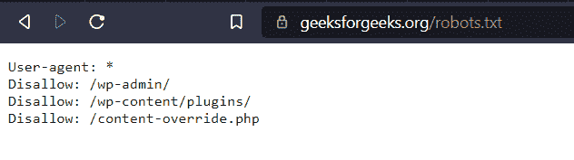

# 刮网时如何不被抓？

> 原文:[https://www . geeksforgeeks . org/如何在刮网时不被抓/](https://www.geeksforgeeks.org/how-to-not-get-caught-while-web-scraping/)

在这篇文章中，我们将讨论如何在刮网时不被抓住。让我们详细看看所有这些替代方案:

### Robots.txt

*   它是站长创建的一个文本文件，告诉搜索引擎爬虫机器人允许抓取哪些页面，所以在抓取之前最好尊重 robots.txt。
*   例子:这里 GFG 的 robot.txt 有“User-agent: *”意思是这个部分适用于所有的机器人，很少有网站不允许被任何网络爬虫抓取。



### **IP 旋转**

*   从单个 IP 地址发送太多请求清楚地表明您正在自动处理 HTTP/HTTPS 请求，网站管理员肯定会阻止您的 IP 地址以停止进一步的抓取
*   最好的替代方法是使用代理，并在单个代理发出一定数量的请求后轮换它们，这减少了 IP 阻塞的机会，刮板不受影响。
*   请务必获取高级代理，尤其是住宅 IP 地址，因为数据中心 IP 地址很可能被其他用户标记，并可能返回连接错误。

### **代理类型:**

*   **数据中心代理:**这些代理来自云服务提供商，有时会被标记为多人使用，但由于它们更便宜，可以为网页抓取活动带来一个代理池。
*   **住宅 IP 代理:**这些代理包含来自本地 ISP 的 IP 地址，因此网站管理员无法检测到它是一个刮刀还是一个真实的人在浏览网站。与数据中心代理相比，它们非常昂贵，可能会引起法律上的同意，因为所有者并不完全知道您是否将他们的 IP 用于网页抓取目的。
*   **移动 IP 代理:**这些代理是私有移动设备的 IP，工作方式类似于住宅 IP 代理。它们非常昂贵，可能会引起法律同意，因为设备所有者并不完全知道您是否正在使用他们的 GSM 网络进行网络抓取，因为它们是由移动网络运营商提供的。

**示例:**

*   创建一个代理服务器池，并循环或迭代它们。
*   导入**请求**模块，并与代理一起向“[https://www.geeksforgeeks.org/](https://www.geeksforgeeks.org/)发送**获取**请求。

**语法:**

> requests.get(url，proxy = {“http”:proxy，“https”:proxy })

*   发送 **GET** 请求后收到的响应，如果没有连接错误，就是当前代理服务器的 IP 地址。

**程序:**

## 蟒蛇 3

```py
# Import the required Modules
import requests

# Create a pool of proxies
proxies = {
           'http://114.121.248.251:8080', 
           'http://222.85.190.32:8090',
           'http://47.107.128.69:888', 
           'http://41.65.146.38:8080',
           'http://190.63.184.11:8080',
           'http://45.7.135.34:999',
           'http://141.94.104.25:8080',
           'http://222.74.202.229:8080',
           'http://141.94.106.43:8080',
           'http://191.101.39.96:80'
           }
url = 'https://www.geeksforgeeks.org/'

# Iterate the proxies and check if it is working.
for proxy in proxies:
    try:
        # https://ipecho.net/plain returns the ip address
        # of the current session if a GET request is sent.
        page = requests.get(url,
                proxies={"http": proxy, "https": proxy})

        # Prints Proxy server IP address if proxy is alive.
        print("Status OK, Output:", page.text)   
    except OSError as e:

        # Proxy returns Connection error
        print(e)
```

### 用户代理

*   用户代理请求头是一个字符串，它允许服务器和网络对等方识别请求用户代理的应用程序、操作系统、供应商和/或版本。
*   一些网站需要一个主要浏览器的用户代理，否则它将不允许查看内容，所以最好的方法是创建一个虚假用户代理列表并迭代它们，或者使用来自 ***虚假用户代理*** 模块的**用户代理**，并在请求网站时将其作为标题传递。

**示例:**

## 蟒蛇 3

```py
# Create a list of User-Agents
import requests 

header = {'User-Agent': 'Mozilla/5.0 (Windows NT 6.1) \
AppleWebKit/537.2 (KHTML, like Gecko) Chrome/22.0.1216.0 \
Safari/537.2'}
response = requests.get(url, headers=header)

# Use UserAgent from fake_useragent module
import requests
from fake_useragent import UserAgent

ua = UserAgent()
header = {'User-Agent':str(ua.chrome)}
response = requests.get(url, headers=header)
```

### 推荐人标题

*   引用头是一个 HTTP 请求头，它让站点知道你从哪个站点到达。
*   如果你是从谷歌来的，在发送 GET 请求时，在 referer 头中提供 [referer_url](https://www.google.com/) 。

**语法:**

> requests.get(url，headers={ '引用:引用 url})

### 无头浏览器

*   在无头模式下使用**Selenium/puppeter**要好得多，因为网站是通过自动化浏览器来抓取的。
*   它主要用于废弃动态网站和许多功能，如分页，认证可以在这里自动化。
*   JavaScript 命令也可以在这里执行。

**示例:**

## 蟒蛇 3

```py
# Using Selenium Chrome Webdriver to create
# a headless browser

from selenium import webdriver
options = webdriver.ChromeOptions()
options.add_argument('headless')
driver = webdriver.Chrome(executable_path="C:/chromedriver.exe", 
                          chrome_options=options)
driver.get(url)
```

### 时间间隔

*   最好使用代码中的时间模块应用一些随机时间间隔，以增加持续时间，从而减少阻塞的机会。

**示例:**

> 时间.睡眠(1) #睡眠 1 秒

### **验证码求解**

*   很少有网站通过一个验证码来检测网络爬虫，这可以通过实现验证码解决服务或者等待几个小时或者更改 IP 地址来恢复抓取来解决。
*   这些服务需要额外费用，可能会增加从网站上抓取数据的时间。如果您选择使用验证码解决服务，请考虑您可能需要承担的额外时间和费用。

**有一些验证码解决服务，比如:**

*   反验证码。
*   死亡密码

### 避免蜜罐陷阱

*   许多网站会尝试通过放入只有爬虫才会跟随的不可见链接来检测网络爬虫。
*   检测某个链接是否设置了**“显示:无”**或**“可见性:隐藏”** CSS 属性，应避免跟随该链接，否则会将你识别为刮刀。蜜罐是智能站长检测爬虫并阻止用户所有请求的最简单方法之一。

### 检测网站更改

*   许多网站出于多种原因改变布局，这通常会导致刮刀失效。
*   此外，有些网站在意想不到的地方会有不同的布局。
*   因此，应该有一个完美的监控系统来检测布局的变化，并发出警报来修复代码。

因此，这些方法可以避免在刮网过程中被抓住。