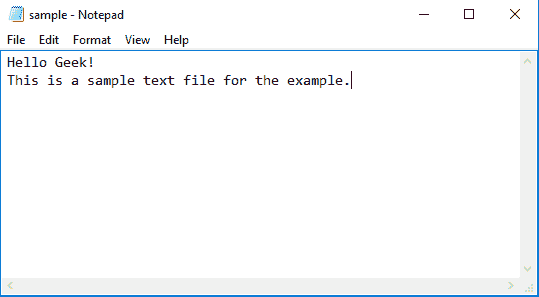

# 如何在 Python 中打开和关闭文件

> 原文:[https://www . geesforgeks . org/如何打开和关闭 python 中的文件/](https://www.geeksforgeeks.org/how-to-open-and-close-a-file-in-python/)

可能会出现需要用 [Python](https://www.geeksforgeeks.org/python-tutorial/) 与外部文件交互的情况。Python 提供了创建、写入和读取文件的内置功能。
在本文中，我们将讨论如何使用 Python 打开和关闭外部文件。
**用 python 打开文件:**
Python 中可以处理的文件有两种，普通文本文件和二进制文件(用二进制语言编写，0 和 1)。打开文件指的是准备好文件以供读取或写入。这可以使用 **open()** 功能来完成。这个函数返回一个文件对象，并接受两个参数，一个接受文件名，另一个接受模式(访问模式)。
**注意:**文件应该和 Python 脚本存在同一个目录下，否则应该写入文件的完整地址。

> **语法:**File _ object = open(“File _ Name”、“Access _ Mode”)
> **参数:**
> 
> *   **File_Name:** 是需要打开的文件的名称。
>     
> *   **访问模式:**访问模式控制打开文件中可能的操作类型。下表列出了 python 中所有可用的访问模式:
>     
> 
> <figure class="table">
> 
> | 操作 | 句法 | 描述 |
> | --- | --- | --- |
> | 只读 | r | 打开文本文件仅供阅读。 |
> | 直读式记录 | r+ | 打开文件进行读写。 |
> | 只写 | w | 打开文件进行写入。 |
> | 写和读 | w+ | 打开文件进行读写。与“r+”不同，如果文件不存在，is 不会引发 I/O 错误。 |
> | 仅附加 | a | 打开文件进行写入，如果文件不存在，则创建新文件。所有的添加都是在文件的末尾进行的，不能修改现有的数据。 |
> | 追加并读取 | a+ | 打开文件进行读写，如果文件不存在，则创建新文件。所有的添加都是在文件的末尾进行的，不能修改现有的数据。 |
> 
> </figure>

**示例 1:**
在本例中，我们将打开一个只读文件。初始文件如下所示:



**代码:**

## 蟒蛇 3

```py
# open the file using open() function
file = open("sample.txt")

# Reading from file
print(file.read())
```

这里我们已经打开了文件并打印了它的内容。
**输出:**

```py
Hello Geek!
This is a sample text file for the example.
```

**示例 2:**
在本例中，我们将向现有文件追加新内容。所以初始文件如下所示:


**代码:**

## 蟒蛇 3

```py
# open the file using open() function
file = open("sample.txt", 'a')

# Add content in the file
file.write(" This text has been newly appended on the sample file")
```